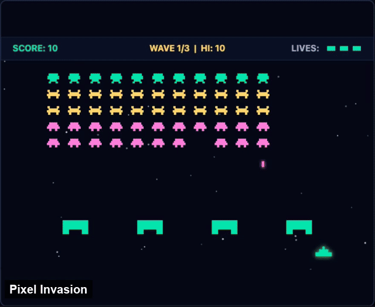

# gamedev.pl

**Describe a game. An AI agent builds it. Everyone plays it in the browser.**

[**Play now → www.gamedev.pl**](https://www.gamedev.pl) · closed beta




You write a few sentences about a game you want. The app asks what it needs to know, then you
can hand the brief to the platform builder or connect your own coding agent over MCP. The
agent builds actual code, not a template with the numbers changed. After review, the game
appears in the catalog and runs in a browser. Bring friends — some games turn phones into
controllers around one shared screen.

_Every game above was built this way._

This repository is the platform that does all of that, and it is open source.

## Watch an AI dev team ship in public

Most of this codebase was written by coding agents, and the pipeline that builds the games is
itself run by agents. That is unusual enough to be worth watching rather than just reading
about:

- A creator's description becomes a spec, and a **QA gate** asks real clarifying questions
  before any code is written.
- A creator chooses the hosted platform builder or connects their own Cursor, VS Code,
  Claude Code, Codex, or other MCP-capable agent.
- The agent reports progress, screenshots, and playable drafts to Creator Studio while it
  works; creator notes return over the same live channel.
- Revisions start a new task from the exact stored version the creator played, rather than
  relying on a stale branch or pull request.
- Every game passes the validation gate and human review before publication to the separate,
  agent-maintained games repository.

**One guarantee that CI enforces:** every game in the catalog is playable with a thumb. Touch
support is _derived from each game's source_, not declared in its spec, so a game cannot claim
playability it does not have.

The interesting engineering is written up in [`docs/`](./docs) — start with
[`docs/README.md`](./docs/README.md).

## Connect your agent (MCP or the `gamedev` CLI)

Two doors, same games. The on-site page is
[`https://www.gamedev.pl/connect`](https://www.gamedev.pl/connect) (also `/mcp`). It lives
in the header menu, not on `/create` or public game pages.

**MCP.** The server is remote and needs no install: point an MCP-capable client at
`https://www.gamedev.pl/api/mcp` and sign in with OAuth. Claude users can install it as a
plugin instead — [`listings/mcp/claude-plugin/README.md`](./listings/mcp/claude-plugin/README.md)
has the exact sequence, including the connector approval that installing does not do on its
own. The official registry entry is `pl.gamedev/creator`.

The tools cover one build round: opening or rejoining it, reading the brief and the engine
kit, asking the kit and docs a question, staging and delivering source files, checking the
quality gate, and exchanging progress, screenshots and messages with the creator. Several
more exist and are deliberately never advertised, so an agent will not discover them.
[`listings/mcp/README.md`](./listings/mcp/README.md) lists every tool with its annotations,
what each destructive one actually consumes, and why the rest are hidden.

**CLI.** `apps/cli` is the `gamedev` terminal client (no local model). With no verb it
opens a REPL: describe a game, then iterate. `gamedev checkout <slug>` is the own-editor
path. Installers (`/install.sh`) stay 404 until the `CLI_SURFACE` deploy flag is on and a
`cli-v*` release exists; until then `npm run bundle -w @gamedevpl/cli`. Details:
[`apps/cli/README.md`](./apps/cli/README.md).

> **Creating games is in closed beta.** The tools load for anyone; the calls need an
> approved creator account. That is the gate, not an outage —
> [join the waitlist](https://www.gamedev.pl).

## Try it locally in five minutes

```bash
npm install
npm run dev
```

This project requires **Node.js 20.19 or newer**. Open **http://localhost:5173** (not
`127.0.0.1`). You get a browsable arcade, playable games, a development sign-in, and an
in-memory submission flow — with **no API keys, no GitHub token, and no cloud project**.
Game content comes from a sibling games checkout or `GAMES_LOCAL_DIR` if available, and from
bundled fixture games otherwise. Local submissions remain queued because no coding agent is
watching the in-memory store.

Full detail, including what is deliberately faked locally and what will surprise you, is in
[`docs/local-development.md`](./docs/local-development.md).

> **Note:** running this stack locally is for developing the platform, not for recreating the
> hosted builder. The orchestration code is here, but the live coding-agent runtime is an
> external hosted service. You can still exercise the creator handoff with your own agent and
> the live site's MCP connection.

## Safety model

Games are real code, so they cannot be safety-checked the way structured data can. Safety
comes from **execution, not inspection**: every game is assembled into one self-contained
document and rendered in an `<iframe sandbox="allow-scripts allow-pointer-lock">` with **no `allow-same-origin`**.
It cannot reach the parent page, cookies, storage, or any authenticated endpoint.

That boundary is the single most important invariant in the project. If you find a way around
it, please report it privately — see [`SECURITY.md`](./SECURITY.md).

## Repo layout

```
apps/
  web/               Vite + React + TypeScript — arcade, player, Creator Studio
  cli/               `gamedev` terminal client (see Connect your agent above)
  api/               Fastify + TypeScript — catalog, jobs, auth, agent channel, multiplayer
  api/fixtures/      Games-repo-shaped content so the app runs with no credentials
  e2e/               Playwright checks for critical browser and production flows
  world/             Persistent-world service, deployed separately from the main API
packages/
  contract/          Types, constants and route tables shared across workspaces
  zone-core/         Shared protocol and simulation primitives for persistent worlds
infra/               Cloud Run deployment and read-only production-inspection scripts
docs/                The plan of record — read this before making assumptions
```

Games themselves live in a **separate repository** maintained by coding agents; this app is
the catalog, the player, and the submission surface. See
[`docs/games-repo.md`](./docs/games-repo.md).

## Contributing

Contributions are welcome, and the local setup above is designed so your first change can be
running in minutes.

- **Found a bug?** [Open an issue](https://github.com/gamedevpl/www.gamedev.pl/issues/new?template=bug_report.yml).
  There is a "Report a bug" link in the site footer that prefills it for you.
- **Have an idea?** [Open a feature request](https://github.com/gamedevpl/www.gamedev.pl/issues/new?template=feature_request.yml),
  or start a [discussion](https://github.com/gamedevpl/www.gamedev.pl/discussions).
- **Found a security problem?** Do not open an issue — see [`SECURITY.md`](./SECURITY.md).
- **Writing code?** Run `npm install`, then
  `npm run type-check && npm run lint && npm run test && npm run build` before you finish.
  Coding agents should read [`docs/contributing-for-agents.md`](./docs/contributing-for-agents.md).

Translations are a good first contribution: the interface lives in
`apps/web/src/i18n/locales/` and currently ships English and Polish.

## History

gamedev.pl is an old name in Polish game development — for years this domain was a community
site where a generation learned to make games, and this repository held its source. The
community site survives in the early history of this repo.

The domain now does something different with the same intention: it used to teach people how
to make games, and now it lets anyone make one. That continuity is deliberate.

## License

[GPL-3.0](./LICENSE). Developed with [Genaicode](https://github.com/gtanczyk/genaicode).
