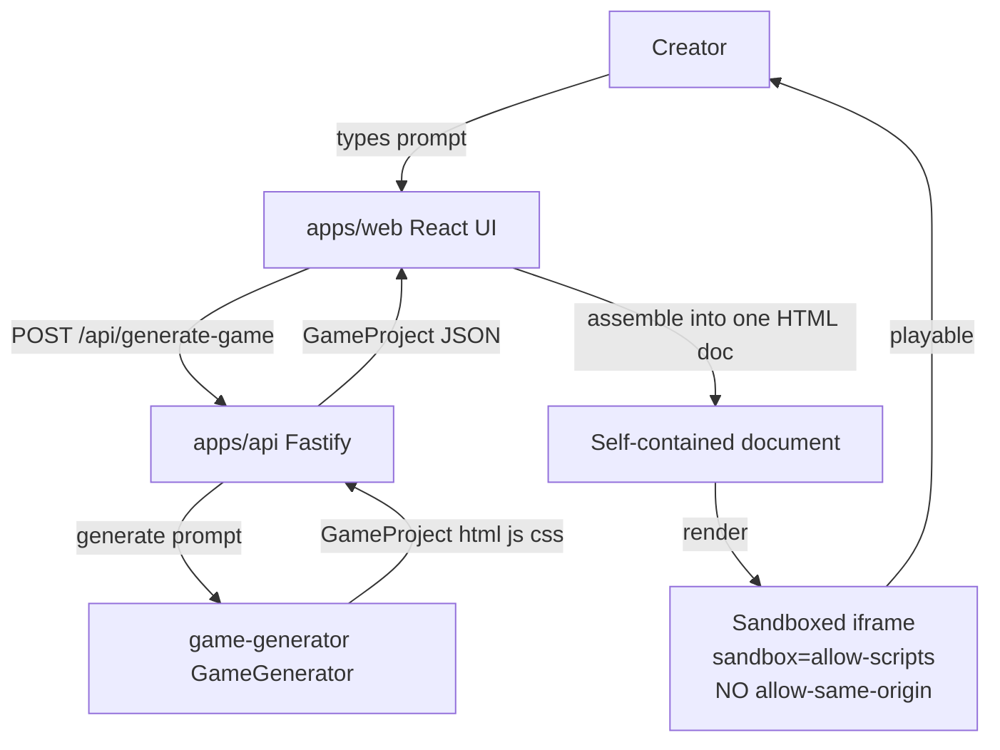
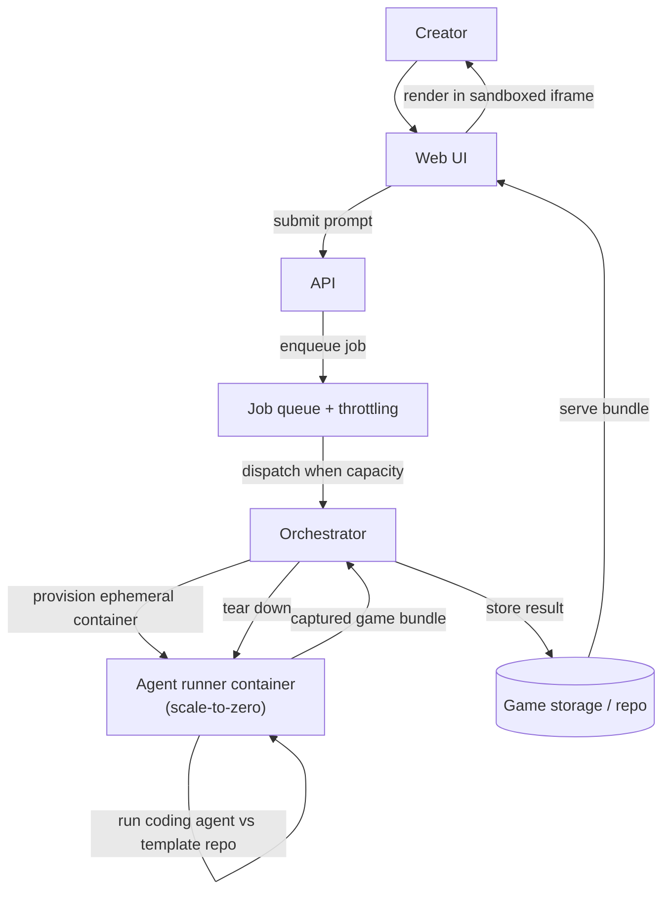

# Architecture

Two sections: the **current MVP architecture** (what exists on this branch) and a clearly
separated **target architecture** (the container-orchestration + queue + GCP direction the
project is heading toward, not yet built).

---

## Current MVP architecture ✅

### Monorepo layout

npm workspaces; `workspaces: ["packages/*", "apps/*"]`.

```
apps/
  web/                 Vite + React + TS frontend (prompt form + game player)
  api/                 Fastify + TS backend (POST /api/generate-game, GET /api/health)
packages/
  game-generator/      The generator "seam": GameGenerator interface + a mock
    src/
      types.ts         GameProject + GameGenerator interfaces
      mock.ts          MockGameGenerator (deterministic, keyword-based)
      container.ts     ContainerGameGenerator (runs the agent-runner image)
      index.ts         barrel export
    templates/
      dodge/           A real HTML/JS/CSS game with __TITLE__/__DESCRIPTION__ slots
  orchestrator/        Job queue: concurrency cap, per-creator throttle, backpressure
containers/
  agent-runner/        Container that runs one generation job and emits a GameProject
infra/                 Placeholder for future Terraform/GCP (nothing used yet)
```

### The generator seam

The single most important abstraction. Everything downstream depends only on this interface,
so the mock can later be swapped for a real agentic generator without touching the API or web.

```ts
// packages/game-generator/src/types.ts
export interface GameProject {
  title: string;
  description: string;
  html: string; // real, unconstrained markup — NOT a schema document
  js: string;
  css: string;
}

export interface GameGenerator {
  readonly name: string;
  generate(prompt: string): Promise<GameProject>;
}
```

The current implementation, `MockGameGenerator`, is **deterministic and offline**: it matches
keywords in the prompt to a hand-authored template (e.g. the `dodge` template), substitutes
placeholders like `__TITLE__` / `__DESCRIPTION__`, and returns the assembled `GameProject`.
It needs no API key or network, so the whole loop runs locally out of the box. This exists to
prove the loop _before_ spending on real model calls.

### Sandboxed-iframe execution model

Generated code is **not** trusted and **cannot** be schema-validated the way structured data
can. The safety boundary is therefore the browser sandbox, not validation:

- The `html`, `js`, and `css` are assembled into **one self-contained document**.
- That document is loaded into an `<iframe>` with **`sandbox="allow-scripts"`** and
  **no `allow-same-origin`**.
- Consequences: generated code can run JS and render, but **cannot** access the parent page,
  its DOM, cookies, `localStorage`, or make same-origin requests. A malicious or broken game
  is contained to its own throwaway origin.

> This is the core safety decision. Do not add `allow-same-origin` to the sandbox — it would
> collapse the isolation that justifies running arbitrary generated code at all. See
> [`risks-and-open-questions.md`](./risks-and-open-questions.md).

### Request flow: prompt → api → generator → assembled HTML → iframe



- **`POST /api/generate-game`** — body `{ prompt: string }` (trimmed, 1–500 chars). Returns
  the generated project synchronously. Input is validated with `zod`.
- **`GET /api/health`** — returns status and the active generator name.
- CORS is enabled (`@fastify/cors`) so the Vite dev server can call the API.

### Async job path (`packages/orchestrator`)

Real generation is slow and expensive, so alongside the synchronous endpoint there is a
queued path. Submissions don't hold a request open:

- **`POST /api/jobs`** — body `{ prompt, creatorId? }`. Enqueues and returns **202** with
  `{ id, state, createdAt }`. Returns **429** when the queue is full (backpressure).
- **`GET /api/jobs/:id`** — poll for state; on `succeeded` it returns the assembled
  `html` ready for the sandboxed iframe, on `failed` an error. **404** if unknown.

The `Orchestrator` enforces a **global concurrency cap** and a **per-creator cap**, so a
single creator can't monopolize capacity — and because dispatch _skips_ rather than blocks on
a creator at their cap, their backlog doesn't head-of-line block everyone else. Dispatch is
event-driven (on submit, and whenever a job settles), not timer-polled. Failures are terminal;
jobs are not retried blindly, because agent runs are expensive and non-idempotent.

A job is executed by a `JobRunner`. `generatorRunner()` adapts any `GameGenerator` into one,
so the queue drives the offline mock today and a containerized agent later without changing.

`apps/web` uses this queued path (`generateGameViaJob` in `apps/web/src/api.ts`), surfacing
each transition — "Waiting for a free slot…" / "Starting up…" / "Building your game…" — so
the wait is explained rather than a spinner. The synchronous endpoint remains for simple callers.

Finished jobs are retained for polling but pruned oldest-first past `maxRetainedJobs`
(default 200), so a long-running process doesn't grow without bound — each finished job holds
a whole generated game.

> ⚠️ The queue is **in-memory and in-process**: it does not survive a restart or span
> instances. Making it durable/distributed is outstanding — see [`roadmap.md`](./roadmap.md).

### Local run

`npm run dev` builds the packages, then runs the API and web app together
(`concurrently`). Everything runs on localhost — no cloud, no secrets. See
[`contributing-for-agents.md`](./contributing-for-agents.md).

---

## Target architecture 📋 (not built)

The direction the repo is heading. **None of this exists yet** — it is captured here so the
current design (especially the generator seam) stays compatible with it.

### What changes

The `MockGameGenerator` is replaced by a **real agentic generator** that runs a coding CLI
(Claude Code / Codex / "agy") **inside an ephemeral container** against a game-template repo,
rather than paying per-token for a hosted API. Because traffic is expected to be **mostly idle
with occasional bursts**, the design leans toward **scale-to-zero on-demand** compute (e.g.
Cloud Run Jobs), with a possible tiny warm pool as a middle ground.

An **orchestration layer** sits between the API and the containers: it accepts creator prompts
securely, queues and throttles jobs, provisions one ephemeral container per job, runs the
agent, captures the output, and tears the container down. See
[`container-orchestration.md`](./container-orchestration.md) for the full design and the job
state model.

### Target orchestration flow



### Still open

- **Cloud target**: leaning GCP + Terraform (Cloud Run for API, static hosting/CDN for web),
  but hosting is deliberately still open. `infra/` is an intentional placeholder.
- **Warm pool vs scale-to-zero**: tradeoff for bursty/idle traffic — see
  [`container-orchestration.md`](./container-orchestration.md#scale-to-zero-vs-warm-pool).
- **Agent account model & ToS**: using subscription-based coding CLIs as always-on
  multi-tenant backend compute is a diligence blocker — see
  [`risks-and-open-questions.md`](./risks-and-open-questions.md#blockers).
