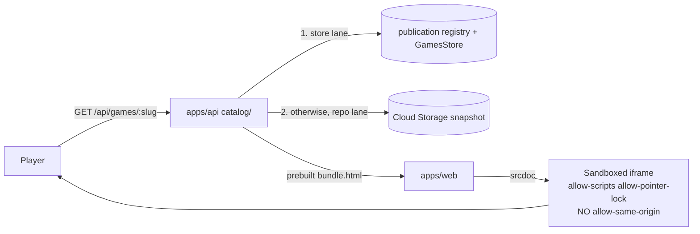
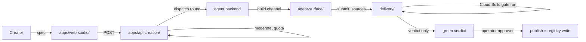

# Architecture

How the shipped system is put together: the workspaces, what lives in each, the boundaries
between them, and the four flows that cross those boundaries. For _what_ is live versus in
flight, read [`README.md`](./README.md)'s status table — this document describes structure,
not status.

> [!NOTE]
> This replaced a description of a local-preview app built around a
> `MockGameGenerator` package and a `POST /api/generate-game` route. Neither exists: the
> generator seam was removed when games moved to their own agent-maintained repository, and
> `packages/game-generator` survives on some working copies only as untracked build output.
> If you are following a doc that mentions either, that doc predates the pivot.

---

## Workspaces

npm workspaces: `workspaces: ["packages/*", "apps/*"]`.

```
apps/
  api/       Fastify + TS. The whole backend: catalog, creation, agent surface,
             delivery, community, realtime, telemetry, notifications, platform.
  web/       Vite + React + TS. The player, catalog, Creator Studio, review desk,
             party mode, admin console.
  world/     Fastify + TS. The persistent-world zone host — its own Cloud Run
             service, not part of the API image.
  e2e/       Vitest suites that drive the deployed site.
packages/
  contract/  Types and vocabularies: route tables, status enums, protocol
             versions, limits. Depended on by apps/{api,web,world} and by
             zone-core — not by apps/e2e, which drives the deployed site over
             HTTP and needs no shared types. It is the only workspace package
             apps/web imports.
  zone-core/ The zone simulation kernel — schema, ticket, cage, zone. Imported by
             apps/world and by apps/api's realtime bucket.
infra/       Deploy scripts, Cloud Build configs, env manifest. Scripts, not IaC.
eslint-rules/ The repo's own enforcement gates (see below).
docs/        This folder.
```

Production game sources are **not** in this repo — with one deliberate exception:
`apps/api/fixtures/games-repo/games/` holds three complete fixture games that
`catalog/local-games-repo.ts` serves when no external checkout is configured, which is what
makes local development work with no keys. Beyond those, repo-lane games live in
`gamedevpl/www.gamedev.pl-games`, a private repository maintained by coding agents (see
[`games-repo.md`](./games-repo.md)); store-lane games are held in the publication registry
with their sources in GCS and are never committed to that repo. Which lane a slug is in
decides where to look — see [Two catalog lanes](#two-catalog-lanes) below.

---

## The execution model

This is the load-bearing safety decision and it has not changed since the project started.

Generated game code is **not** trusted and **cannot** be statically sanitized or
schema-validated. The boundary is enforced by the browser at execution time:

- A game's HTML, JS and CSS are assembled into **one self-contained document**.
- That document is loaded into an `<iframe>` with **`sandbox="allow-scripts allow-pointer-lock"`**
  and **no `allow-same-origin`**.
- The game can run JavaScript and draw. It **cannot** reach the parent page, read or write
  cookies, touch `localStorage`, or make same-origin requests. A malicious or broken game is
  contained to its own throwaway, unique origin.

> [!IMPORTANT]
> Never add `allow-same-origin` to this sandbox. It would collapse the isolation that
> justifies running arbitrary generated code at all. The attribute is asserted in
> `apps/web/src/GameFrame.sandbox.test.ts` and `StudioStage.test.tsx`; the reasoning is in
> [`security-model.md`](./security-model.md).

Device sensing (tilt, camera) is read by the **shell** on its own origin and passed in — the
sandbox is unchanged by it, and raw readings never leave the browser.

---

## `apps/api` — nine buckets and a composition root

The API is organised into nine top-level buckets. Every **mapped** file belongs to exactly
one, and the assignment is machine-checked rather than conventional; two files are unmapped
and belong to no bucket (below).

| Bucket           | What it owns                                                                                                                                                                                                                   |
| ---------------- | ------------------------------------------------------------------------------------------------------------------------------------------------------------------------------------------------------------------------------ |
| `platform/`      | Composition root (`app.ts`), auth, rate limits, moderation, OAuth, account deletion, and the Store. The bucket every other bucket may import.                                                                                  |
| `creation/`      | Specs, drafts, remix, the Creator Studio's server half, job dispatch and reconciliation, scorecards                                                                                                                            |
| `agent-surface/` | The MCP server, the agent channel, agent keys, OAuth metadata — everything a coding agent talks to                                                                                                                             |
| `delivery/`      | Receiving a delivery over the build channel and getting it to playable: staged sources, candidate versions, previews, bundling, assembly, the gate runner. Nothing is merged here — repo-lane merge-back lives in `community/` |
| `catalog/`       | The games-repo client, catalog reads, game pages, recommendations, health sweeps                                                                                                                                               |
| `community/`     | Reviews, votes, proposals, player feedback, suggestions                                                                                                                                                                        |
| `realtime/`      | Multiplayer relay, presence, worlds, zones, game saves                                                                                                                                                                         |
| `telemetry/`     | Event intake and trend aggregates                                                                                                                                                                                              |
| `notifications/` | In-app, email, Web Push, contact, digests                                                                                                                                                                                      |

`store/**` is the shared persistence layer — Firestore, an in-memory implementation, a fake
for tests, plus `records/` and `slices/`. It is classified as `platform`, not as a domain of
its own, and `platform/store.ts` is the façade over it.

**The boundary is enforced by lint, not by convention.** `eslint-rules/module-boundary.mjs`
reads `module-boundary-map.mjs` and flags a **domain** module's value-level import that
leaves its bucket for anywhere but `platform/` or itself. `platform` itself is exempt as an
importer — the rule returns immediately for a mapped `platform` file — because the
composition root has to reach every domain's registrars. Type-only imports are exempt too:
erased at compile time, so no runtime coupling. Buckets graduate from warn to error one at a time, by
being appended to `ENFORCED_BUCKETS`; `telemetry`, `catalog`, `realtime` and `notifications`
are at error today, the rest stay warn-only under `npm run module-boundary`.

Two files are unmapped: `apps/api/src/submissions.ts` and `creation/remix-view.ts`.
`submissions.ts` is left that way deliberately — it is the remaining mega-file, and leaving
it unclassified means every domain it reaches into surfaces as an honest warning rather than
being quietly waved through. `remix-view.ts` is simply unclassified, and `npm run
module-boundary` reports it as such.

`platform/app.ts` is a single `buildApp` that registers everything — including the agent
channel and the MCP server, which are mounted in the same app rather than in a sidecar.

---

## `apps/web` — core, surfaces, and lazy chunks

```
apps/web/src/
  core/              router.ts, dataLayer.ts, persistence.ts, styles/tokens.css
  surfaces/
    studio/          Creator Studio — by far the largest surface
    admin/           Operator console
    catalog/         Browse and rails
    review/          The review desk
    party/           Party mode (shared screen, phones as controllers)
  *.tsx              The shell: App, GameFrame, GamePage, auth, legal, settings
```

`core/` holds the three cross-cutting mechanisms, each of which replaced a scattered pattern:
`router.ts` (routing and nav targets), `dataLayer.ts` (fetch cache with dedup and
invalidation), `persistence.ts` (one wrapper over what were twelve ad-hoc `localStorage`
users).

**Four surfaces are lazy route chunks** — `AdminConsole`, `CreatorStudioView`, `ReviewDesk`
and `PartyPage` are `lazy(() => import(...))` in `App.tsx`, so none of them is in the entry
bundle.

That split has a consequence worth knowing before you touch CSS. Vite's `cssCodeSplit` emits
each lazy chunk's stylesheet **after** the main sheet, so a rule in `surfaces/studio/*.css`
loads later than the same-specificity rule in `styles.css`. Moving a base rule into a lazy
file while its override stays global silently inverts the two. CSS lives beside the component
that owns it and is pulled in by side-effect import; where a base must stay global for this
reason, the rule carries a comment saying so.

---

## Two catalog lanes

The single most important structural fact about the catalog, and the one that explains most
of the branching in `community/` and `catalog/`: **a published game lives in one of two
places**, and which one decides how it is read, changed and republished.

|                    | **Store lane**                                                    | **Repo lane**                            |
| ------------------ | ----------------------------------------------------------------- | ---------------------------------------- |
| System of record   | The publication registry + the version's `source/` objects in GCS | `games/<slug>/` in the games repo        |
| Population         | Games built through the platform                                  | The ~98 older git games                  |
| Publishing         | A registry pointer write                                          | A commit on the games repo's `main`      |
| An accepted change | Adopted in place onto an owner-owned job                          | Landed as a branch + PR by the apply-bot |

A slug with **no publication record is a repo-lane game** — that is the actual test, in
`community/proposal-base.ts`. The repo lane wins catalog ties.

Neither lane lets a creator publish. Accepting a change adopts a green version; going live is
still the operator step below — `store.setPublication` has exactly one production caller,
the admin-only route in `creation/job-admin-routes.ts`.

`community/proposal-base.ts` is the one place the difference is resolved **for a proposal's
source base** — the serving paths below make their own lane decisions independently. So
everything downstream of a proposal — the remix on-ramp, an agent's proposal round, the
diff — asks one question and gets back a file set plus a base to pin against.

## The flows

### Play



**The two endpoints order the lanes differently, so do not generalise from one to the other.**

- **`/api/games/:slug` is store-first.** `catalog/game-play-route.ts` asks
  `storePublishedGame(slug)` before anything else; a hit returns the stored `bundle.html`
  artefact directly and the request is done. Only a miss falls through to the repo-lane path.
- **`/api/catalog` is repo-first.** It loads the repo catalog, then appends store
  publications whose slugs are **not already taken** by a repo entry. That is the mechanism
  behind "the repo lane wins catalog ties".

In the snapshot-backed configuration neither lane assembles a game on the request path —
both are sealed earlier. (With `GAMES_SNAPSHOT_BUCKET` unset, the repo-lane path has no
snapshot reader to consult and does assemble per request from the fixture sources; that is
the local/dev configuration, not production.)

- **Store lane** — the gate produces `bundle.html` as a derived artefact; the play route
  serves those bytes as-is.
- **Repo lane** — `catalog/game-snapshot-publish.ts` bakes to the Cloud Storage snapshot.
  With `GAMES_SNAPSHOT_BUCKET` set, published repo-lane catalog, play and media are served
  only from that snapshot; unsetting it is an opt-out for local dev and fixtures, not a
  fallback. See [`games-snapshot.md`](./games-snapshot.md) for why the per-request rebuild
  had to go.

Both sealing paths, plus the repo-lane fallback in the play route, go through one assembler:
`platform/assemble.ts`'s `assembleGameHtml`. The bake uses it deliberately rather than the
games repo's own `tools/build.ts`, because that is where the restrictive CSP, the AI Act
art. 50(2) provenance metadata and the credential scan are applied — so there is one
authoritative definition of "what a served game is", and the gate seals the same artefact the
player later receives.

### Create



> [!IMPORTANT]
> **A green gate does not publish.** `delivery/gate-runner.ts` records a verdict and nothing
> more — its own header says so: "This never publishes. It records a verdict; a human still
> approves." The registry write happens in `creation/job-admin-routes.ts`, behind the
> admin-only `POST /api/admin/jobs/:jobId/publish`, and the transition is recorded
> `by: 'operator'`. That human step is the moderation boundary; do not automate past it.

A round is **dispatched to an agent backend** and the agent delivers back over the **build
channel**, calling `submit_sources`. It does not travel as a merged pull request: nothing in
`apps/api` calls `createIssue`, and the managed Copilot provider passes
`createPullRequest: false`, so the agent path opens no pull request at all. The one
production caller of `ensureOpenPullRequest` is `community/proposal-apply-bot.ts` — the
repo-lane merge-back, not agent mechanics. The agent's working branch is removed by
`deleteWorkspace`, which `managed-backend.ts`'s `cleanup` calls when a previous dispatch is
released (a resume, cancellation or abandonment), not at job completion.

> [!NOTE]
> `GitHubClient.ensureOpenPullRequest`'s doc comment describes the adapter closing that PR
> when the job finishes. It does not: `closePullRequest` has no production caller. The
> comment records an intent the shipped code never implemented — do not plan against it.

`BuilderKind` is `'platform' | 'self'`: the platform's own hosted builder, or the creator's
own agent connected over MCP.

The one place a delivery becomes a git commit is the **repo lane's** merge-back:
`community/proposal-apply-bot.ts` writes an accepted proposal's exact file contents into
`games/<slug>/` and opens a PR. That is a mechanical overlay on purpose — the proposal already
holds the file contents a green gate ran against, so asking an agent to "apply" them would
make the merge unreviewable. From there the games repo's own `validate.yml` gates the PR,
its CODEOWNERS puts a human on the merge, and the snapshot bake republishes.

### Self-build (MCP)

A creator can point their own agent — Claude Code, Codex, any MCP-capable client — at the
platform instead of waiting for the hosted builder. `agent-surface/` exposes the MCP server
and the agent channel: the agent opens a round, reads the kit and brief, stages sources,
submits, and gets a gate verdict. The loop and its rules are in the
[`byoca-mcp`](../.claude/skills/byoca-mcp/SKILL.md) skill; the hosted alternative is
[`managed-agent-backend.md`](./managed-agent-backend.md).

### Realtime

Two separate things share the name:

- **Party mode / multiplayer relay** — `realtime/mp.ts` over `@fastify/websocket`. Room state
  lives in one process's memory, so the app service deploys with `--max-instances 1` **while
  the relay is in-process**. Setting `MP_RELAY_URL` moves room creation to the standalone
  `gamedev-mp-relay` service, and the same deploy step then raises the app to 4 instances —
  the pin exists for the in-process registry, not as a permanent property of the service.
- **Persistent world** — `apps/world` is its own Cloud Run service (`gamedev-world`) running
  the zone host over `packages/zone-core`. See [`persistent-world-plan.md`](./persistent-world-plan.md)
  and the `p3-zone-*` docs.

---

## Deployment

GitHub Actions → Cloud Run via Workload Identity Federation. No IaC; `infra/` is scripts and
Cloud Build configs.

| Service            | What runs there                                       |
| ------------------ | ----------------------------------------------------- |
| `gamedev-app`      | `apps/api` serving the built `apps/web` — the site    |
| `gamedev-mp-relay` | The multiplayer relay, when `MP_RELAY_URL` selects it |
| `gamedev-world`    | `apps/world`, the zone host                           |

All in `europe-west1`. The gate runner is a Cloud Build job with its own service account.

Both deploy paths — `.github/workflows/deploy.yml` and `infra/deploy-api.sh` — must thread
the **same** environment map, because `--set-env-vars` replaces it wholesale: a value typed
onto the service by hand vanishes on the next deploy. `npm run env-manifest` asserts the two
agree, and CI runs it. Details in [`deployment.md`](./deployment.md).

---

## Repo-wide gates

Four checks run in `npm run lint` beyond ESLint itself, and they are three different kinds of
thing:

- **Two baseline ratchets** — `module-size` and `comment-prose`. They do not demand the
  codebase be clean, only that it not get worse, and raising a baseline is a deliberate
  `--write --force` that shows up in the diff.
- **One exact invariant** — `env-manifest` asserts both deploy paths thread exactly the
  variables `infra/env-manifest.json` declares. No baseline, no debt, nothing to ratchet: it
  matches or it fails.
- **One visibility-only check** — `npm run module-boundary` runs the rule at warning severity
  and exits 0, today with 131 warnings, so a new cross-bucket import in an ungraduated bucket
  is reported and blocks nothing. It blocks only for the buckets in `ENFORCED_BUCKETS`, where
  the main `eslint .` pass runs it at `error`.

| Gate              | Rule                                                                                                        |
| ----------------- | ----------------------------------------------------------------------------------------------------------- |
| `module-size`     | No file grows past its baseline; new files cap at 500 lines. [`module-size-debt.md`](./module-size-debt.md) |
| `comment-prose`   | `//` one-liners ≤12 words; per-file prose baseline. [`comment-prose-debt.md`](./comment-prose-debt.md)      |
| `module-boundary` | Cross-bucket imports in `apps/api/src` (error for graduated buckets, warn elsewhere)                        |
| `env-manifest`    | The two deploy paths thread an identical env map                                                            |

Raising a baseline is a deliberate act (`--write --force`), which is the point: it shows up in
the diff.

---

## Where to read next

- [`games-repo.md`](./games-repo.md) — the games repository, and why games are not here
- [`security-model.md`](./security-model.md) — the threat model behind the sandbox
- [`local-development.md`](./local-development.md) — running the whole product with no keys
- [`contributing-for-agents.md`](./contributing-for-agents.md) — the contract for agents working in this repo
- [`deployment.md`](./deployment.md) — the delivery shape in full
