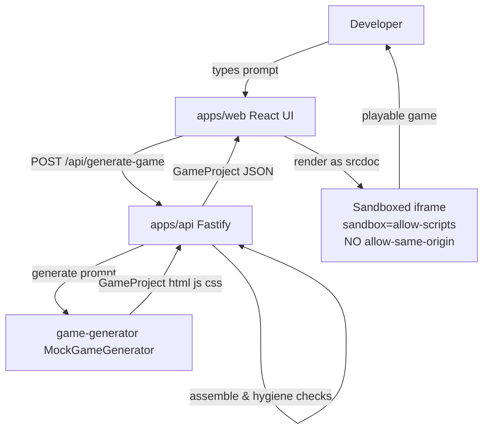
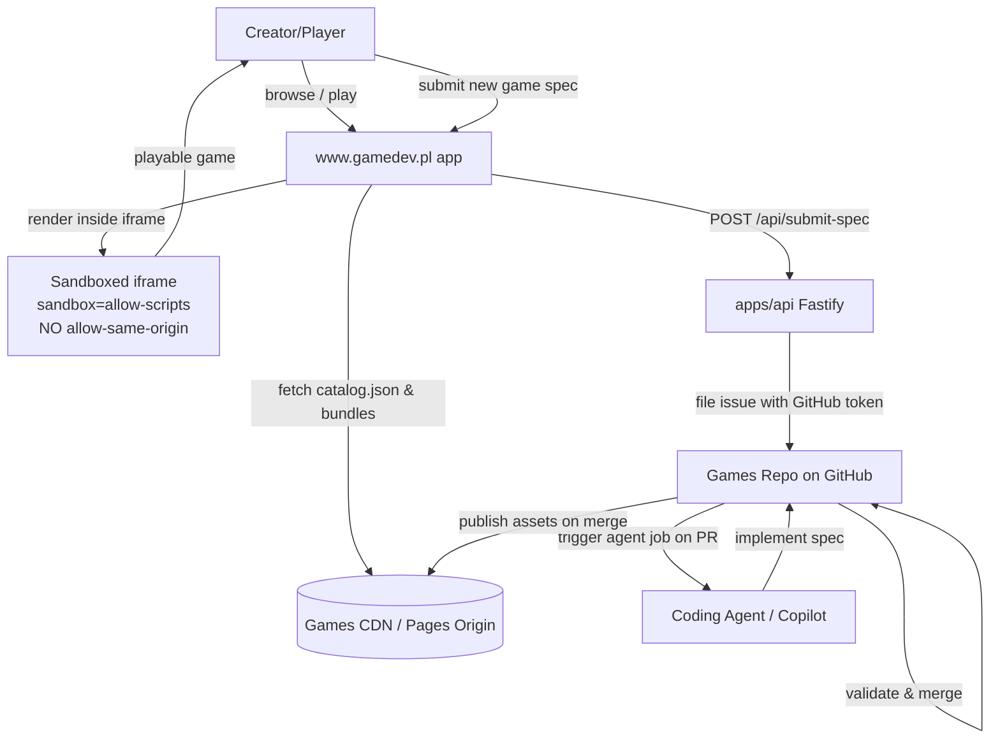

# Architecture

This document describes the **current local-preview architecture** (what exists on this branch) and the **target decentralized games-repo architecture** (the direction the project has pivoted to).

---

## Current Local-Preview Architecture ✅

The local architecture is designed to let developers test the core player and game-assembly loop entirely offline, with zero dependencies, external services, or cloud costs.

### Monorepo Layout

npm workspaces: `workspaces: ["packages/*", "apps/*"]`.

```
apps/
  web/                 Vite + React + TS frontend (prompt form + game player)
  api/                 Fastify + TS backend (POST /api/generate-game, GET /api/health)
packages/
  game-generator/      The generator "seam": GameGenerator interface + a mock
    src/
      types.ts         GameProject + GameGenerator interfaces
      mock.ts          MockGameGenerator (deterministic, keyword-based)
      index.ts         barrel export
    templates/
      dodge/           A real HTML/JS/CSS game with __TITLE__/__DESCRIPTION__ slots
      collect/         A real HTML/JS/CSS game where player collects coins
      space/           A real HTML/JS/CSS space hazards survival game
infra/                 Non-deployable placeholder until hosting is selected
docs/                  The project plan of record and design documentation
```

### The Generator Seam

The generator seam is the core abstraction for game projects. Everything downstream (the API and player) depends only on this interface, separating the generation mechanics from the browser presentation.

```ts
// packages/game-generator/src/types.ts
export interface GameProject {
  title: string;
  description: string;
  html: string; // real, unconstrained markup — NOT a schema document
  js: string;
  css: string;
}

export interface GameGenerator {
  readonly name: string;
  generate(prompt: string): Promise<GameProject>;
}
```

The active local implementation, `MockGameGenerator`, is **deterministic and offline**: it scans keywords in the prompt to match a hand-authored template (e.g., matching "dodge" to the `dodge` template), substitutes metadata placeholders like `__TITLE__` / `__DESCRIPTION__`, and returns the assembled `GameProject`.

It serves as a **local preview/development only** affordance to keep the player surface exercisable without requiring live agent compute.

### Sandboxed-IFrame Execution Model

Generated code is **not** trusted and **cannot** be statically sanitized or schema-validated. The security boundary is therefore enforced entirely by the browser sandbox at execution time:

- The `html`, `js`, and `css` of a game are assembled into **one self-contained document**.
- That document is loaded into an `<iframe>` with **`sandbox="allow-scripts"`** and **no `allow-same-origin`**.
- **Consequences**: Generated code can run JavaScript and render visually, but it **cannot** access the parent page, read/write cookies, access `localStorage`, or make same-origin requests. A malicious or broken game is contained to its own throwaway, unique origin.

> [!IMPORTANT]
> This is the core safety decision. Do not add `allow-same-origin` to the sandbox under any circumstances — it would collapse the isolation that justifies running arbitrary generated code at all. See [`security-model.md`](./security-model.md).

### Local Preview Request Flow



- **`POST /api/generate-game`**: Body `{ prompt: string }` (validated with `zod`). Invokes the mock generator, runs basic hygiene and credential-leak scanning on the output, and returns the assembled HTML.
- **`GET /api/health`**: Returns status and the active generator name (`mock`).
- **CORS**: Enabled (`@fastify/cors`) to allow the Vite dev server to call the API.

---

## Target Decentralized Games-Repo Architecture 🚧

The project has pivoted away from hosting a multi-tenant agent execution pipeline (avoiding legal, license, and subscription Terms of Service complications). Instead, games are moved to a **dedicated, agent-maintained repository**.

### Decentralized Flow



### Key Components

1. **The Games Repository**:
   - A dedicated public/private monorepo owned by the organization.
   - Houses a folder per game containing its spec (`SPEC.md` with metadata frontmatter and free-form design text) and implementation (`index.html`, `game.ts`, `style.css`).
   - Coding agents (such as GitHub Copilot or Claude Code) work on this repo autonomously, treating `SPEC.md` as the source of truth to implement games and fix bugs.

2. **Publish Pipeline**:
   - A GitHub Actions workflow runs static validation on PRs (enforcing game size caps, checking for console errors headlessly, verifying the offline-only rule, and screening for credential leaks).
   - Merging to the default branch is what publishes a game. **As built, no bundle is pushed to a public origin** — the original plan of compiling `/catalog.json` onto GitHub Pages or a CDN bucket was dropped so the games repo could stay private.

3. **The gamedev.pl Application**:
   - **Catalog**: Built by the API straight from `SPEC.md` frontmatter in the games repo, so there is no `catalog.json` artifact to keep in sync.
   - **Player**: The API reads a game's sources, bundles them into one self-contained document, and the app renders that in the sandboxed iframe. Isolation comes from the sandbox, not from a separate origin — which also makes unmerged PR builds playable as previews.
   - **Spec Submission**: Captures prompt descriptions from creators and routes them through the Fastify API (holding a scoped GitHub Token) to open structured issue templates on the games repo, triggering the agent workflow.

This architecture keeps the `www.gamedev.pl` platform nearly static, decoupling agent runtime infrastructure completely while maintaining a robust, cookieless security boundary. For more details on the concrete directory structures and CI checks, see [`games-repo-blueprint.md`](./games-repo-blueprint.md).
