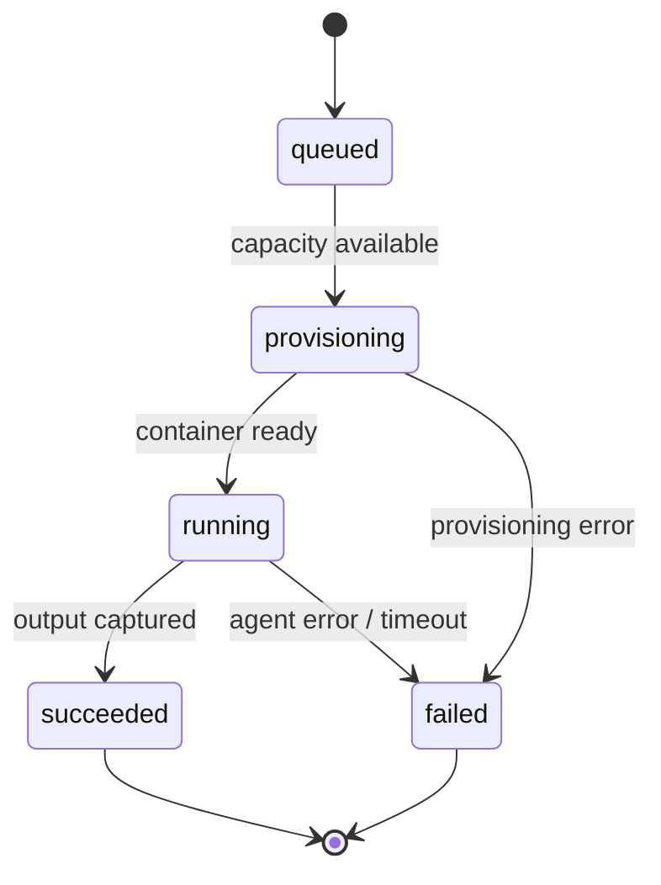

# Container Orchestration — Archived Design

> **Status: 🗃️ Retired. Do not implement.** This records the removed self-hosted generation
> direction for historical context. The product now uses a dedicated games repository where
> agents propose pull requests; see [`games-repo.md`](./games-repo.md). The container runner,
> auth proxy, job tokens, orchestrator, and job endpoints were removed.

## Why this layer exists

Real game generation will run a coding-agent CLI (Claude Code / Codex / "agy") **inside an
ephemeral container** against a game-template repo, instead of paying per-token for a hosted
API. That work is untrusted, resource-heavy, and bursty. The orchestration layer is the
controlled boundary between "a creator submitted a prompt" and "an isolated container ran an
agent and produced a game", so that generation is safe, throttled, and cost-efficient.

## Responsibilities

| #   | Responsibility                               | Notes                                                                                                                      |
| --- | -------------------------------------------- | -------------------------------------------------------------------------------------------------------------------------- |
| 1   | **Provision** an ephemeral container per job | One job = one throwaway container. No shared long-lived worker state.                                                      |
| 2   | **Receive the prompt securely**              | The creator prompt is untrusted input; it must not be able to escape the container or exfiltrate secrets/other jobs' data. |
| 3   | **Run the agent**                            | Invoke the coding CLI against the template repo inside the container.                                                      |
| 4   | **Capture output**                           | Collect the produced game files and normalize them into a `GameProject` (or a repo push).                                  |
| 5   | **Tear down**                                | Destroy the container and its scratch space when the job ends (success or failure).                                        |
| 6   | **Queue + throttle**                         | Accept more requests than can run at once; admit them at a controlled rate.                                                |

## Queue + throttling model

- Creator submissions become **jobs** placed on a **queue**; they do not run synchronously.
- The orchestrator **dispatches** jobs to containers only when capacity allows — a
  concurrency cap plus per-creator throttling to prevent one creator monopolizing capacity or
  running up cost.
- Backpressure: when the queue is deep, new jobs still enqueue (state `queued`) and the client
  polls for status rather than holding a long request open.
- Failures are surfaced as a terminal job state, not retried blindly (agent runs are expensive
  and non-idempotent).

## Scale-to-zero vs warm-pool

Traffic is expected to be **mostly idle with occasional bursts**. That shapes the tradeoff:

| Option                                                                 | Pros                                                        | Cons                                                                 |
| ---------------------------------------------------------------------- | ----------------------------------------------------------- | -------------------------------------------------------------------- |
| **Scale-to-zero on-demand** (e.g. Cloud Run Jobs) — _leaning this way_ | No idle cost; pay only per job; matches bursty/idle profile | Cold-start latency on the first job after idle                       |
| **Warm pool** (always-N containers ready)                              | Low latency, no cold start                                  | Pays for idle capacity most of the time — wasteful for this profile  |
| **Tiny warm pool** (middle ground)                                     | Absorbs small bursts with low latency; caps idle cost       | Still some idle spend; sizing is guesswork until real traffic exists |

**Current lean:** scale-to-zero on-demand, with a _possible_ tiny warm pool as a middle
ground once real traffic patterns are known. **Open / TBD** until measured.

## Multi-account rotation idea — ⚠️ ToS caveat (read first)

One idea to route around per-account rate limits is to **rotate across multiple agent
accounts**. Document it, but do not design around it yet:

> ⚠️ **Rotating multiple personal/subscription accounts to circumvent rate limits reads as
> clearly against typical subscription Terms of Service.** This must get an **explicit
> answer from the vendor's commercial terms** before any design commits to it. It is a
> **blocker**, not a decided approach. The compliant path may be Team/Enterprise plans or
> per-token API quotas. See [`risks-and-open-questions.md`](https://github.com/gamedevpl/www.gamedev.pl-ops/blob/main/docs/risks-and-open-questions.md#blockers).

Relatedly: even _single-account_ always-on multi-tenant backend use of a subscription CLI is a
different usage pattern than an interactive developer seat and needs its own ToS check (also a
blocker).

## Proposed minimal job interface

A deliberately small model — enough to queue, run, and report a job. **Illustrative, not
implemented.**

```ts
interface GenerationJob {
  id: string; // unique job id
  creatorId: string; // who submitted it (for throttling & attribution)
  prompt: string; // the untrusted natural-language prompt
  repoRef?: string; // optional: target repo/template to run against
  state: JobState;
  createdAt: string;
  // result set when state === 'succeeded'
  result?: {
    // GameProject bundle or a reference to where output was stored/pushed
  };
  // error set when state === 'failed'
  error?: string;
}

type JobState =
  | 'queued' // accepted, waiting for capacity
  | 'provisioning' // container being created
  | 'running' // agent executing inside the container
  | 'succeeded' // output captured, container torn down
  | 'failed'; // errored; container torn down
```

### State transitions



Every terminal transition (`succeeded`/`failed`) **must** tear the container down.

## Explicitly out of scope for this design

- The container image contents and the exact agent invocation (Phase 1).
- The cloud provider and Terraform wiring — **GCP is a lean, not a decision** (Phase 5).
- Persistence/storage of finished games and their repos (Phase 3).

## Implemented so far (Phase 1 kickoff) ✅

The first vertical slice of the container path is now buildable and runnable locally.
It proves the pipeline end-to-end **without any tokens or ToS exposure**, and stays
strictly agent-agnostic per the [blockers](https://github.com/gamedevpl/www.gamedev.pl-ops/blob/main/docs/risks-and-open-questions.md#blockers) (B1/B2).

**What was built**

- **`containers/agent-runner/`** — a self-contained container image:
  - `Dockerfile` (Node 20 slim, non-root, no build step) packaging `runner.mjs` + a
    game-template working dir. Builds offline.
  - `runner.mjs` — a dependency-free ESM entrypoint. Reads `AGENT_MODE` + `PROMPT`
    from env, runs the agent against `template/`, and writes a `GameProject` JSON
    (matching `packages/game-generator/src/types.ts`) to **stdout** (clean; logs go
    to stderr) and to `OUTPUT_PATH` (default `/out/game-project.json`).
    - `AGENT_MODE=mock` (default): deterministic, offline — fills the template.
    - `AGENT_MODE=external`: a **pluggable, agent-agnostic** seam. It copies
      `template/` to a scratch dir, runs a configurable CLI (`AGENT_CMD`, plus
      optional `AGENT_ARGS` / `AGENT_TIMEOUT_MS` / `AGENT_PROMPT_ENV`) against that
      copy with the prompt supplied via env **and** stdin, then collects
      `index.html` / `game.js` / `style.css` back into a `GameProject`. `AGENT_CMD`
      is **unset by default**, so external mode is off unless deliberately
      configured — no accidental spend. No provider is hardcoded (see B1/B2).
  - `README.md` — build/run instructions, the env/output contract, and a prominent
    pointer to the ToS blockers.
- **`ContainerGameGenerator`** (`packages/game-generator/src/container.ts`, exported
  from `index.ts`) — implements `GameGenerator` with `name = 'container'`. Its
  `generate(prompt)` shells out to `docker run` the image (mock mode by default,
  image/mode configurable via `AGENT_RUNNER_IMAGE` / `AGENT_MODE`), then parses the
  emitted JSON. The parse+validate step is a pure `parseGameProject()` function,
  unit-tested (valid → GameProject; malformed → throws) with **no docker in tests**.
- **API wiring** — `LLM_PROVIDER=container` selects it in `apps/api`; the default
  stays `mock`, unchanged.

**How to run it (mock mode)**

```sh
docker build -t gamedevpl/agent-runner containers/agent-runner
docker run --rm --network none \
  -e AGENT_MODE=mock -e PROMPT="a tiny dodge-the-blocks game" \
  gamedevpl/agent-runner > game-project.json
```

The emitted `game-project.json` is a valid `GameProject`. `ContainerGameGenerator`
does exactly this and returns the parsed object.

**Not yet built (still per the design above):** the queue/throttle layer, job state
model persistence, scale-to-zero provisioning, teardown orchestration, and any real
(non-mock) agent invocation — the last gated on the ToS blockers.
