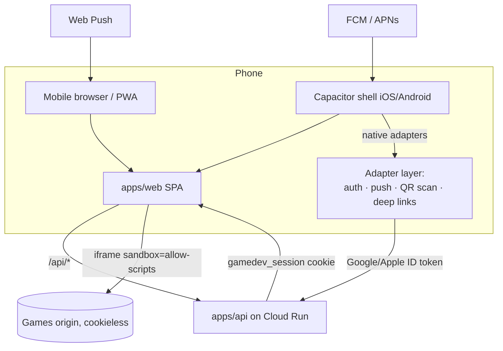

# Mobile app: design & phased plan (iOS + Android)

> Status: **proposed** (2026-07-23), **reality-synced 2026-07-25**. Goal: creators and
> players can create and play from iOS and Android phones — without breaking the
> platform's two founding invariants: games are sandboxed web content, and QR-party
> guests join with **zero installs**.
> Builds on [`vision.md`](./vision.md), [`multiplayer-plan.md`](./multiplayer-plan.md),
> [`notifications-plan.md`](./notifications-plan.md), and the M1 auth stack from
> [`auth-and-usage-plan.md`](./auth-and-usage-plan.md).

> **Progress since the first draft (2026-07-25).** The strategy below is unchanged; the
> milestone boundaries have shifted because work landed out of the planned order:
>
> - ✅ **Web push is live** (desktop + Android), shipped via the notifications track, not
>   M1. `apps/web/public/sw.js` (push-only worker), `apps/web/src/pushApi.ts`,
>   `apps/api/src/push-routes.ts` / `pusher.ts`, VAPID wiring, and a **per-user push
>   subscription registry** in `apps/api/src/store.ts` all exist and are verified in prod.
>   This plan had scheduled push into M1 and the token registry into M2 — **both are now
>   done**, so M1 shrinks to manifest + offline shell + install path, and M2's push work
>   is registration/APNs only.
> - ✅ **QR-party multiplayer shipped** (`apps/web/src/mp/`, `ControllerView` with
>   wake-lock) — the M2 sequencing precondition is met, and the zero-install mobile-web
>   controller path is proven, not hypothetical.
> - ✅ **The games touch contract is built and CI-enforced.** An earlier revision of this
>   note called it "entirely unbuilt, the critical unstarted M0 item" — that was wrong, and
>   it stayed wrong long enough to misdirect planning, so the evidence is named here:
>   `shared/modules/input.ts` gives every GameKit game an on-screen pad and action buttons,
>   gated on `(pointer: coarse)` so desktop play and the deterministic capture harness are
>   untouched; `tools/lib/touch.ts` classifies each game **from its code**, not its claims
>   (`gamekit` | `native` | `controllers` | `none`); `tools/catalog.ts` emits `touch`
>   (derived) and `orientation` (authored) per entry; `tools/validate.ts` Check 13 fails any
>   keyboard-only game unless it explicitly declares `touch: none`, and also catches a
>   SPEC.md that has drifted from the code. It runs in CI through `npm run check` in
>   `.github/workflows/validate.yml`. **Current state: 73 games, none keyboard-only** —
>   67 `gamekit`, 3 `controllers`, 3 `native`.
> - ✅ **`GameTheater` is mobile-hardened** — `useScreenWakeLock` while playing, a rotate
>   nudge driven by the catalog's `orientation`, an on-screen close that does not rely on
>   browser chrome, and safe-area insets in `styles.css`. M0 listed all four as unstarted.
> - ✅ **The responsive audit is done.** The header is one 61px row on a phone (language,
>   GitHub and sign-out moved into the menu, because five controls beside a logo cannot
>   fit 360px at thumb size); every tap target is ≥44px at 320/360/375px in both locales,
>   with no element overlapping another on any of the 83 catalog cards; no field is under
>   the 16px that makes iOS force-zoom on focus; the nine blurred panels carry
>   `-webkit-backdrop-filter`, without which every iPhone below Safari 18 silently dropped
>   the blur; and the hero prompt card no longer floats its media buttons over the
>   textarea. What M0 still waits on is a real device, not more code.

## Problem

This section described the state at the first draft, when the product was a desktop-shaped
SPA and phones appeared in the design twice — as QR-party controllers
([`multiplayer-plan.md`](./multiplayer-plan.md)) and as the device in a creator's pocket
when their game finishes building ([`notifications-plan.md`](./notifications-plan.md)) —
with nothing built for them. Most of that has since been answered; what is left:

- The web app's responsive pass is finished (see the progress note); every surface has
  been audited at 320/360/375px in both locales. `GameTheater` now has its wake-lock,
  orientation nudge, safe-area insets and on-screen back. Still missing entirely: a PWA
  manifest, offline caching, and any install path. There is a service worker (`sw.js`) but
  it is deliberately **push-only** — it caches nothing and intercepts no fetches, and
  `apps/web/public/` contains nothing else.
- Published games have a touch contract, enforced in CI rather than by convention, and
  the website now reads it: the derived `touch` value travels from the games repo's
  committed `catalog.json` through `/api/catalog` to a **Keyboard only** badge on the
  card. No game triggers it today, which is the point — CI will not let a keyboard-only
  game through unlabelled, so the badge is the thing that catches the first one.
- The "your game is live!" push moment now **has** a delivery channel on desktop and
  Android (web push shipped). The remaining gap is **iOS**, where push requires either an
  installed PWA (iOS 16.4+) or a native app.
- There is no store presence, which is how most players think apps are discovered.

## Constraints that shape the answer

These are facts, not preferences; any mobile strategy must satisfy all five.

1. **Games are web content, permanently.** Every game is HTML/JS/CSS executed in an
   `<iframe sandbox="allow-scripts">` from a cookieless origin
   ([`security-model.md`](./security-model.md)). A native app would still render games in
   a WebView. There is no native rendering to gain — which removes the main argument for
   React Native/Flutter/native rewrites.
2. **QR guests must stay zero-install.** The Jackbox moment dies if scanning a QR code
   leads to an app-store interstitial. The mobile _browser_ join/controller flow is the
   product for guests; an app may _also_ scan/join, but must never be required.
3. **Google sign-in does not work inside embedded WebViews.** Google blocks OAuth in
   embedded user agents (`disallowed_useragent`). A wrapped app must use native sign-in
   (Credential Manager on Android, ASWebAuthenticationSession or native SDK on iOS) and
   then mint the same `gamedev_session` cookie via a small token-exchange endpoint —
   the session model in `apps/api/src/auth.ts` already verifies a Google ID token, so
   the exchange is the existing `/api/auth/google` fed from a native token source.
4. **App Store policy applies.** Apple guideline 4.7 permits HTML5 mini-game catalogs
   under conditions (games free, contained in the app, no links out to purchases);
   guideline 1.2 (UGC) requires in-app reporting, blocking, and moderation — the
   moderation side exists in [`content-safety-plan.md`](./content-safety-plan.md), but a
   user-facing **report game** action does not yet; guideline 4.8 requires Sign in with
   Apple alongside Google sign-in. Google Play's UGC policy mirrors 1.2.
5. **The API scales to zero.** Cloud Run cold starts are felt hardest on mobile (brief
   sessions, flaky networks). The mobile surfaces must render something useful from
   cache instantly and treat the network as eventually-available.

## Decision: one web codebase, three delivery vehicles

**Recommended: progressive enhancement of the existing `apps/web` SPA — mobile-web
hardening first, then PWA, then thin Capacitor shells for the stores.** One codebase,
one design system, one auth stack; the native layer is an adapter, not a second product.

| Vehicle           | What it is                                          | What it adds                                                                        | Who it serves                                                  |
| ----------------- | --------------------------------------------------- | ----------------------------------------------------------------------------------- | -------------------------------------------------------------- |
| **M0 Mobile web** | The SPA, actually responsive + touch-playable games | Play + create from any phone browser today; QR guests                               | Everyone (baseline)                                            |
| **M1 PWA**        | Manifest + service worker + install prompt          | Home-screen icon, instant shell loads, web push (Android fully; iOS when installed) | Returning players/creators                                     |
| **M2 Store apps** | Capacitor iOS/Android shells around the same SPA    | Store discovery, native push (APNs/FCM), native sign-in, QR scanner, deep links     | Players who live in app stores; reliable creator notifications |

### Rejected alternatives

- **React Native / Flutter / fully native**: games render in a WebView regardless
  (constraint 1), so a native rewrite duplicates the catalog, studio, auth, i18n, and
  status surfaces in a second codebase for zero rendering benefit. Rejected on
  maintenance cost — this is a solo-owner project with agent contributors.
- **PWA-only, no store apps**: viable and is the fallback position if Apple review
  proves hostile (see risks), but forfeits store discovery and reliable iOS push
  (installed-PWA push exists since iOS 16.4 but install friction on iOS is high — no
  install prompt, buried "Add to Home Screen" flow).
- **Store apps first, skip PWA**: inverts the value order. M0/M1 serve every user
  including QR guests and cost a fraction of store submission + review + compliance.

## Architecture

The SPA gains a tiny **platform adapter** module (`apps/web/src/platform/`): every
capability that differs by vehicle (sign-in method, push registration, QR scanning,
share, wake lock) goes behind one interface with a web implementation and a Capacitor
implementation. Nothing else in the SPA may branch on platform.

### The games touch contract (games-repo change) — ✅ built

Playability on phones is a **published-game contract**, enforced where the other game
contracts live ([`games-repo-blueprint.md`](./games-repo-blueprint.md)). As built, it is
stricter than this plan originally specified in one important way: `touch` is **derived
from each game's source**, not declared in its frontmatter, so a SPEC.md cannot claim a
playability the code does not deliver.

- ✅ `catalog.json` carries `touch: gamekit | native | controllers | none` (derived by
  `tools/lib/touch.ts`) and `orientation: portrait | landscape | any` (authored — it is
  design intent that no source reveals). `SPEC.md` may state `touch`, but only as an
  assertion CI checks against the code.
- ✅ Touch controls come from the platform, not per-game effort: `GameKit.createInput`
  draws an on-screen pad and action buttons on any coarse-pointer device and synthesizes
  them into the same key state the keyboard writes. A game asks `input.down('arrowleft')`
  and never learns where the press came from — the same indirection the QR-party phone
  controllers ride on.
- ✅ CI enforcement is **fail-closed**: Check 13 in `tools/validate.ts` rejects a
  keyboard-only game outright unless it declares `touch: none`, making desktop-only an
  explicit, reviewable choice rather than an accident.
- ✅ Retrofit is complete — 73 games, none keyboard-only.
- 📋 Not done: the SPA ignores the `touch` value (no badge, no filter), and the games-repo
  agent instructions carry no touch rule. The second matters less than it looks: CI
  enforcement catches what instructions only request.

This landed in M0 because _nothing else matters if the games themselves reject fingers_.

### Auth on each vehicle

- **Mobile web / PWA**: existing Google Identity Services flow, unchanged.
- **Capacitor**: native Google sign-in (Credential Manager / iOS SDK) yields an ID
  token → existing `POST /api/auth/google` → same session cookie inside the shell's
  WebView (cookies work fine in the shell; it's _Google's page_ that refuses WebViews,
  and native sign-in avoids loading it).
- **Sign in with Apple** (required by 4.8): new verifier alongside
  `GoogleAuthVerifier` in `apps/api/src/auth.ts` — Apple ID tokens are JWTs verified
  against Apple's JWKS; account keyed by Apple `sub` in the same Firestore user model.
  Web gets it too (Apple JS) so accounts stay portable across vehicles.

### Push delivery

Extends [`notifications-plan.md`](./notifications-plan.md)'s delivery phase rather than
inventing a channel. **Already built** (via the notifications track): the detection +
storage layers, a per-user **web-push subscription registry** (`apps/api/src/store.ts`),
and `submission.published` delivered over web push on desktop + Android. **Remaining**:
native token registration on iOS/Android (APNs/FCM) inside the Capacitor shell — the same
registry gains FCM/APNs token rows alongside the web-push subscriptions it already holds.

## Milestones

### M0 — Mobile-web hardening 🚧 (every build item done; awaiting a real-device pass)

- ✅ Responsive pass over `App.tsx` surfaces, at 320px as well as 360px — one column,
  thumb-sized targets, safe-area insets, no horizontal scroll, no field under 16px.
  Every surface has now been driven at 360px, most through a real signed-in session
  (`/api/auth/dev`, local-only) rather than props stubs. (`CreatorStudio` was on this
  list until it was deleted as dead code — it had not been mounted since the QA gate
  moved into `App`.)
  - ✅ `NavHeader` — one row, ≥44px targets, overflow controls moved into the menu.
  - ✅ `HeroPromptSection` — media buttons no longer float over the textarea, example
    chips are one swipeable row instead of a 148px stack, and the wordmark stops
    colliding with the sign-in button on a 320px screen.
  - ✅ `AuthModal` — was rendering off the top of the screen (the header's
    `backdrop-filter` made it the containing block for the modal's `position: fixed`
    backdrop); portalled to `document.body`.
  - ✅ `SketchModal` — every control (palette, size, action buttons) was under 44px;
    all now meet the floor.
  - ✅ `ClosedBetaSplash` — clean at 320/360. Google's own sign-in widget renders at
    40px (their "large" preset, the largest available); not actionable without
    deviating from their branding rules, and 4px under the floor is not worth it.
  - ✅ `SubmissionStatusView` — the QA panel's two "Create Now" buttons (identical
    markup, one measured 52px and the other 36px — no CSS difference found to explain
    it) and the "Stop this build" / "Yes, stop it" / "Keep building" controls (14px)
    are now ≥44px.
  - ✅ `ArcadeCatalog` — four real bugs, three of them live on prod before this pass.
    (1) The AI Act disclosure badge (`.ai-pill`) and the preview-toggle button both
    claimed `top:10px; left:10px`, so the mandatory disclosure was drawn on top of
    "Watch preview" on every card with a video. (2) The preview toggle (116×28) and
    the `catalog-moment` screenshot thumbnails (42×26) were under the tap floor; the
    toggle is now a 44px icon-only button on a finger (its label moves to
    `aria-label`, because at 44px tall the labelled pill is 127px wide — 145px in
    Polish — and reached the thumbnails across the card), and the thumbnails are
    48×44. (3) The genre chip is agent-authored and right-anchored, so a long one
    ("arcade racing (pseudo-3d)") grew leftwards over the preview toggle on 9 of 83
    cards at desktop width; it now truncates at 40% of the card. (4) At ≤360px the
    card is only 296×167 and could not hold all of it: a two-line title climbed under
    the badge column and the AI disclosure landed on the first word of the title. The
    badges sit in a row there, and the frame picker — the one item that is a
    convenience rather than information — is dropped below 360px.
  - ✅ `SiteFooter` — the four footer nav links, one of which is the DSA
    illegal-content report route, were 15px tall. Now ≥44px on a finger. The links
    inside the operator and AI-notice _sentences_ stay inline: there is no way to
    give a word in a paragraph a 44px box without wrecking the paragraph.
- ✅ Mobile play surface: `GameTheater` has wake-lock, the orientation nudge from catalog
  metadata, safe-area insets, and an on-screen close.
- ✅ **Games touch contract** — built and CI-enforced; see the section above. 73 games,
  none keyboard-only. A phone can now also restart a finished game (GameKit's on-screen
  "Play again"), closing the one real gap a player reported from a device.
- ✅ Surface `touch` in the SPA. Two earlier notes here were wrong in opposite
  directions and are both retracted: this was never a one-line badge, and it was not
  the plumbing job the 2026-07-26 correction described either. The games repo already
  commits `catalog.json` with a derived `touch` per game, and `getCatalog` in
  `github-client.ts` already reads it as the fast path (falling back to the SPEC.md
  fan-out for a ref that predates the artifact) — so the value reaches `/api/catalog`
  today. The missing half was purely web-side: `catalog.ts` now parses it, and a card
  shows a red **Keyboard only** pill when a game's own source says a finger cannot
  drive it.
  - Only `none` gets a badge. `gamekit`/`native` are nearly every game, so labelling
    them would put a pill on almost every card to announce that it works normally,
    and `controllers` already announces itself through the party badge.
  - No filter. `validate.ts` Check 13 fails any keyboard-only game that doesn't
    declare `touch: none`, and none do — a "playable on this device" control would
    today be a switch that never removes a card. The badge is what pays off the day
    the first one lands; a filter can follow it, not precede it.
  - An absent or unrecognised value parses to `null`, never `'none'`: the badge is a
    warning, so the SPEC-derived fallback path must not make every card show one.
- 🚧 Exit criterion: **on a real iPhone and a real Android phone, sign in, browse, play a
  touch game, submit a spec, and watch its status — comfortably.** This is the only
  open item in M0, and it is the one item no agent can close. Partly met on
  2026-07-25: the owner signed in, submitted a spec, answered the QA questions, and
  played games from an iPhone SE, and reported two real bugs from that pass — a
  cluttered prompt card and games with no way to restart on a phone — both since fixed
  and confirmed live. **Still open: catalog browsing and general play on a real
  device** have not been re-verified since, and the catalog card is precisely what
  changed most on 2026-07-26. Everything in the list above has been driven in a
  browser pane at 320/360/375px in both locales, which is a stand-in for a phone, not
  a phone: it has a mouse, so `(pointer: coarse)` never matched, and every touch rule
  here was verified through its `max-width` half.

### M1 — PWA 📋 (push already done; only the shell remains)

- 📋 Web app manifest (name, icons, `display: standalone`, theme `#1d2123`/`#00e4ac`),
  a service worker that precaches the shell (extend the existing push-only `sw.js` — never
  cache game bundles; they stay sandboxed and cross-origin), offline fallback page, custom
  install prompt on Android, "Add to Home Screen" hint on iOS.
- ✅ Web-push registration + per-user subscription registry + `submission.published`
  delivered over web push on desktop/Android — **already shipped via the notifications
  track**. M1 no longer owns any push work; it only makes the app installable so iOS gets
  push too.
- Exit criterion: **installed PWA opens to a rendered shell in under a second on a cold
  API** (the Android-push half of the original criterion is already met in the browser).

### M2 — Store apps (Capacitor) 📋

- Capacitor workspace (`apps/mobile/`) wrapping the built SPA; iOS + Android projects,
  CI builds via the existing pinned-actions posture ([`deployment.md`](./deployment.md)).
- Native adapters: Google sign-in, Sign in with Apple (+ API verifier), push
  registration (FCM/APNs), QR scanner for join links, deep links / universal links for
  `/join/<room>` and `#/status/<token>` routes.
- Store compliance work: in-app **report game** action (feeds the moderation queue from
  [`content-safety-plan.md`](./content-safety-plan.md)), privacy manifests/data-safety
  forms, UGC policy screens, review notes explaining the sandbox + human merge gate.
- Exit criterion: **both apps approved and listed; sign-in, play, create, push, and QR
  join all work from the store build.**

### M3 — Mobile-native polish 📋 (after M2 proves demand)

- Share sheet ("I made this game") with OS share targets; home-screen quick actions.
- Controller haptics for QR-party guests in the app; app shortcuts into "scan to join".
- Push for `game.updated` / `catalog.new_game` follows the notifications plan's M3.

## Risks & mitigations

- **Apple rejects the catalog as an "HTML5 game store" (4.7)** — _the_ existential risk
  for M2. Mitigations: games are free, run in-app, no external purchase links, human
  curation gate is a strong review-notes story; if rejected anyway, the fallback is the
  PWA (M1), which no store can veto. Do not build M2 features that only make sense with
  store approval before approval exists.
- **UGC review friction (1.2 / Play UGC)**: report/block must be visibly present at
  first submission — build it in M2 scope, not after rejection.
- **Agent-built games regress on touch**: ✅ largely closed — Check 13 rejects a
  keyboard-only game at CI, and because `touch` is derived from source rather than
  declared, a regression cannot be papered over in frontmatter. The open half is the
  catalog filter, which would let a phone visitor avoid a `touch: none` game rather than
  be served a broken one; no such game exists today, so this is prevention, not triage.
- **Cold-start latency reads as "app is broken" on mobile**: PWA shell cache (M1)
  plus honest skeleton/retry states; revisit min-instances only if telemetry says so.
- **Capacitor WebView drift** (old Android System WebView versions): set a floor
  (Chromium ≥ 100), show an update screen below it — same honesty pattern as the
  unavailable-game states.

## Open questions (with working answers)

1. **Should guests' controller page get PWA install nudges?** Working answer: no —
   zero-friction is the point; nudge only after a repeat visit.
2. **Sign in with Apple on web too, or app-only?** Working answer: web too, otherwise
   an Apple-account creator can't reach their games from a desktop browser.
3. **One store app or player-app + creator-app?** Working answer: one app; creation is
   a form + status view, not a heavy tool, and two listings double compliance cost.
4. **Monetization in-app?** Working answer: none anywhere in the app (also the safest
   4.7 posture); revisit only post-beta and web-first.
5. **Tablets?** Working answer: they inherit the responsive layout for free; no
   tablet-specific milestone. iPad gets the phone layout scaled until demand appears.

## Sequencing note

M0 is pure web + games-repo work and directly serves the live closed-beta cohort
([`closed-beta-launch-plan.md`](./closed-beta-launch-plan.md)). Its gating item — the
games touch contract — is **done**, so what remains is the tail of the responsive audit
plus one small feature (surfacing `touch` in the catalog). The honest blocker on
declaring M0 finished is not code: it is that the exit criterion requires real phones,
and only part of it has been walked so far.

M1 is now small (manifest + offline shell; push is done) and independent — and it is the
only route to push on iOS, which needs an installed PWA. QR-party v1 **already exists**,
so that M2 precondition is met; M2 still waits on the public-beta content-safety gates
(the in-app report action depends on the moderation queue).

---

## Appendix: the full-native variant (considered, not chosen)

> Owner asked (2026-07-23): _what if we wanted to go full native?_ Decision: no —
> recorded here so future agents don't relitigate it from scratch. "Full native"
> splits into two separate questions with very different answers.

### A. Native shells (SwiftUI + Kotlin/Compose instead of Capacitor) — possible, deferred

A legitimate M2 alternative: native catalog/studio/lobby chrome, with the game surface
itself a WKWebView / Android WebView loading the cookieless games origin.

- **Gains**: genuinely native navigation/gesture/scroll feel; first-class platform
  integration (sign-in, push, QR, share). It does **not** reduce the guideline-4.7
  store risk — Apple scrutinizes the HTML5 games catalog, not the chrome around it.
- **Costs**: three codebases forever (the web app can never be retired — QR guests are
  zero-install by design), every feature ×3, store-review release latency instead of
  instant web deploys, macOS CI + signing infra. Agents can write the Swift/Kotlin,
  but the owner's review bandwidth is the real bottleneck and it triples.
- **Why Capacitor first**: ~80% of the native feel at ~30% of the cost with one
  codebase. Crucially, the expensive M2 investments are **shell-agnostic** — the
  native sign-in → `/api/auth/google` exchange, the Apple verifier, the push token
  registry, deep links, the report-game action, and all store compliance work carry
  over unchanged. A later SwiftUI/Compose rewrite ("M2.5") throws away only the
  thinnest wrapper layer. Revisit only if the store apps prove demand _and_ the
  wrapped shell measurably underperforms.

### B. Native games — rejected; this is a different product, not a bigger budget

Every shape "native game code" can take breaks founding invariants of the games repo:

1. **Agents write native code per game** (Swift/Kotlin or an engine project per game).
   There is no sandbox for native code in-process, so merge-as-curation inverts into
   merge-as-security-audit of arbitrary agent output — the exact burden this
   architecture exists to avoid. Games ship in the binary, so publish-on-merge
   (minutes) becomes publish-on-store-review (days), and web play requires writing
   every game twice.
2. **Constrained data format + trusted native engine.** Safe and dynamically
   deliverable (data is a level pack, not code under Apple 2.5.2) — but this is the
   retired `@gamedevpl/engine` DSL resurrected: agents produce far better games as
   real code than as schema documents, every new mechanic bottlenecks on engine work,
   and reviewable code diffs degrade into data blobs. Already tried; already retired.
3. **JS games on a custom native rendering bridge** (JavaScriptCore + proprietary
   canvas shim). Legal under 2.5.2 and sandboxable, but agents write against the web
   platform from training data — a partial shim breaks a fraction of every generated
   game, CI can't reliably prove arbitrary JS stays inside a bridge's API subset, and
   we'd own a proprietary runtime forever. Chronic-failure mode.

Hard platform fact underneath all three: **Apple guideline 2.5.2 forbids downloading
executable code except JavaScript run by WebKit/JavaScriptCore** — dynamically
delivered games on iOS are web-tech by law, not by preference.

### Decision rule

The native boundary may move **outward** (more native around the game) but never
**inward** (into the game). The WebView is the line. The games repo contract — real
unconstrained web code, sandbox-enforced safety, publish-on-merge, one artifact for
every surface — is the product moat and stays fixed across all delivery vehicles.
The only games-repo cost native shells ever impose is the wider runtime matrix
already in M0: WebKit as a first-class CI target, touch/orientation metadata, and
mobile WebKit rules (gesture-gated audio, no hover-dependent mechanics) in the agent
instructions.
