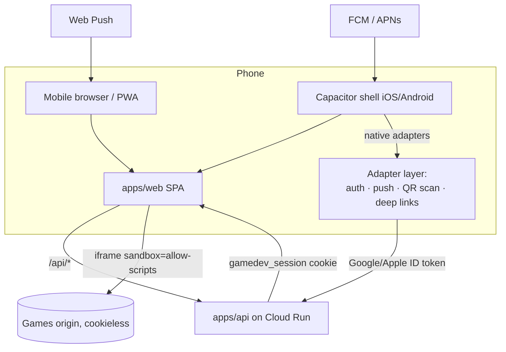

# Mobile app: design & phased plan (iOS + Android)

> Status: **proposed** (2026-07-23). Goal: creators and players can create and play from
> iOS and Android phones — without breaking the platform's two founding invariants:
> games are sandboxed web content, and QR-party guests join with **zero installs**.
> Builds on [`vision.md`](./vision.md), [`multiplayer-plan.md`](./multiplayer-plan.md),
> [`notifications-plan.md`](./notifications-plan.md), and the M1 auth stack from
> [`auth-and-usage-plan.md`](./auth-and-usage-plan.md).

## Problem

Today the product is a desktop-shaped SPA. Phones already appear in the design twice —
as QR-party controllers ([`multiplayer-plan.md`](./multiplayer-plan.md)) and as the device
in a creator's pocket when their game finishes building
([`notifications-plan.md`](./notifications-plan.md)) — but nothing is actually built for
them:

- The web app has a viewport meta tag and nothing else: no responsive audit, no touch
  affordances, no PWA manifest, no service worker, no install path.
- Published games have **no touch-input contract**. An agent-built game that only reads
  `keydown` is simply unplayable on a phone, and no CI check would notice.
- The "your game is live!" push moment (the single highest-value notification) has no
  delivery channel on iOS without either an installed PWA (iOS 16.4+) or a native app.
- There is no store presence, which is how most players think apps are discovered.

## Constraints that shape the answer

These are facts, not preferences; any mobile strategy must satisfy all five.

1. **Games are web content, permanently.** Every game is HTML/JS/CSS executed in an
   `<iframe sandbox="allow-scripts">` from a cookieless origin
   ([`security-model.md`](./security-model.md)). A native app would still render games in
   a WebView. There is no native rendering to gain — which removes the main argument for
   React Native/Flutter/native rewrites.
2. **QR guests must stay zero-install.** The Jackbox moment dies if scanning a QR code
   leads to an app-store interstitial. The mobile _browser_ join/controller flow is the
   product for guests; an app may _also_ scan/join, but must never be required.
3. **Google sign-in does not work inside embedded WebViews.** Google blocks OAuth in
   embedded user agents (`disallowed_useragent`). A wrapped app must use native sign-in
   (Credential Manager on Android, ASWebAuthenticationSession or native SDK on iOS) and
   then mint the same `gamedev_session` cookie via a small token-exchange endpoint —
   the session model in `apps/api/src/auth.ts` already verifies a Google ID token, so
   the exchange is the existing `/api/auth/google` fed from a native token source.
4. **App Store policy applies.** Apple guideline 4.7 permits HTML5 mini-game catalogs
   under conditions (games free, contained in the app, no links out to purchases);
   guideline 1.2 (UGC) requires in-app reporting, blocking, and moderation — the
   moderation side exists in [`content-safety-plan.md`](./content-safety-plan.md), but a
   user-facing **report game** action does not yet; guideline 4.8 requires Sign in with
   Apple alongside Google sign-in. Google Play's UGC policy mirrors 1.2.
5. **The API scales to zero.** Cloud Run cold starts are felt hardest on mobile (brief
   sessions, flaky networks). The mobile surfaces must render something useful from
   cache instantly and treat the network as eventually-available.

## Decision: one web codebase, three delivery vehicles

**Recommended: progressive enhancement of the existing `apps/web` SPA — mobile-web
hardening first, then PWA, then thin Capacitor shells for the stores.** One codebase,
one design system, one auth stack; the native layer is an adapter, not a second product.

| Vehicle           | What it is                                          | What it adds                                                                        | Who it serves                                                  |
| ----------------- | --------------------------------------------------- | ----------------------------------------------------------------------------------- | -------------------------------------------------------------- |
| **M0 Mobile web** | The SPA, actually responsive + touch-playable games | Play + create from any phone browser today; QR guests                               | Everyone (baseline)                                            |
| **M1 PWA**        | Manifest + service worker + install prompt          | Home-screen icon, instant shell loads, web push (Android fully; iOS when installed) | Returning players/creators                                     |
| **M2 Store apps** | Capacitor iOS/Android shells around the same SPA    | Store discovery, native push (APNs/FCM), native sign-in, QR scanner, deep links     | Players who live in app stores; reliable creator notifications |

### Rejected alternatives

- **React Native / Flutter / fully native**: games render in a WebView regardless
  (constraint 1), so a native rewrite duplicates the catalog, studio, auth, i18n, and
  status surfaces in a second codebase for zero rendering benefit. Rejected on
  maintenance cost — this is a solo-owner project with agent contributors.
- **PWA-only, no store apps**: viable and is the fallback position if Apple review
  proves hostile (see risks), but forfeits store discovery and reliable iOS push
  (installed-PWA push exists since iOS 16.4 but install friction on iOS is high — no
  install prompt, buried "Add to Home Screen" flow).
- **Store apps first, skip PWA**: inverts the value order. M0/M1 serve every user
  including QR guests and cost a fraction of store submission + review + compliance.

## Architecture

The SPA gains a tiny **platform adapter** module (`apps/web/src/platform/`): every
capability that differs by vehicle (sign-in method, push registration, QR scanning,
share, wake lock) goes behind one interface with a web implementation and a Capacitor
implementation. Nothing else in the SPA may branch on platform.

### The games touch contract (games-repo change)

Playability on phones is a **published-game contract**, enforced where the other game
contracts live ([`games-repo-blueprint.md`](./games-repo-blueprint.md)):

- `SPEC.md` frontmatter and `catalog.json` gain `mobile` metadata:
  `touch: true|false`, `orientation: portrait|landscape|any`. The catalog UI badges and
  filters on it; the player pre-rotates/fullscreens accordingly.
- Games-repo agent instructions require touch controls for new games (on-screen
  buttons or pointer events — `pointerdown`/`pointerup`, never keyboard-only).
- CI validation gains a headless touch smoke check (dispatch pointer events, assert the
  game reacts) — same style as the existing console-error check.
- Existing seeded games get touch controls retrofitted as ordinary spec-change PRs.

This lands in M0 because _nothing else matters if the games themselves reject fingers_.

### Auth on each vehicle

- **Mobile web / PWA**: existing Google Identity Services flow, unchanged.
- **Capacitor**: native Google sign-in (Credential Manager / iOS SDK) yields an ID
  token → existing `POST /api/auth/google` → same session cookie inside the shell's
  WebView (cookies work fine in the shell; it's _Google's page_ that refuses WebViews,
  and native sign-in avoids loading it).
- **Sign in with Apple** (required by 4.8): new verifier alongside
  `GoogleAuthVerifier` in `apps/api/src/auth.ts` — Apple ID tokens are JWTs verified
  against Apple's JWKS; account keyed by Apple `sub` in the same Firestore user model.
  Web gets it too (Apple JS) so accounts stay portable across vehicles.

### Push delivery

Extends [`notifications-plan.md`](./notifications-plan.md)'s delivery phase rather than
inventing a channel: the notifications doc's detection + storage layers stay identical;
this plan adds **device token registry** (per-uid FCM/APNs/web-push tokens in Firestore)
and makes `submission.published` the first push-delivered event. FCM can fan out to
Android, iOS (via APNs), _and_ web push, so one delivery integration covers all three.

## Milestones

### M0 — Mobile-web hardening 📋 (prerequisite for everything)

- Responsive pass over `App.tsx` surfaces: `NavHeader`, `ArcadeCatalog`, `CreatorStudio`,
  `SubmissionStatusView`, `ClosedBetaSplash` — one column, thumb-sized targets,
  safe-area insets, no horizontal scroll at 360 px.
- Mobile play surface: fullscreen game route, orientation hint from catalog metadata,
  wake-lock while playing, on-screen close/back that doesn't rely on browser chrome.
- Games touch contract shipped (frontmatter, catalog badge/filter, agent instructions,
  CI smoke check, retrofit PRs for seeded games).
- Exit criterion: **on a real iPhone and a real Android phone, sign in, browse, play a
  touch game, submit a spec, and watch its status — comfortably.**

### M1 — PWA 📋

- Web app manifest (name, icons, `display: standalone`, theme `#1d2123`/`#00e4ac`),
  service worker precaching the shell (never game bundles — they stay sandboxed and
  cross-origin), offline fallback page, custom install prompt on Android, "Add to Home
  Screen" hint on iOS.
- Web-push registration behind the platform adapter + token registry endpoint
  (`POST /api/push/tokens`); deliver `submission.published` via web push on Android.
- Exit criterion: **installed PWA opens to a rendered shell in under a second on a cold
  API, and an Android creator gets a push when their game publishes.**

### M2 — Store apps (Capacitor) 📋

- Capacitor workspace (`apps/mobile/`) wrapping the built SPA; iOS + Android projects,
  CI builds via the existing pinned-actions posture ([`deployment.md`](./deployment.md)).
- Native adapters: Google sign-in, Sign in with Apple (+ API verifier), push
  registration (FCM/APNs), QR scanner for join links, deep links / universal links for
  `/join/<room>` and `#/status/<token>` routes.
- Store compliance work: in-app **report game** action (feeds the moderation queue from
  [`content-safety-plan.md`](./content-safety-plan.md)), privacy manifests/data-safety
  forms, UGC policy screens, review notes explaining the sandbox + human merge gate.
- Exit criterion: **both apps approved and listed; sign-in, play, create, push, and QR
  join all work from the store build.**

### M3 — Mobile-native polish 📋 (after M2 proves demand)

- Share sheet ("I made this game") with OS share targets; home-screen quick actions.
- Controller haptics for QR-party guests in the app; app shortcuts into "scan to join".
- Push for `game.updated` / `catalog.new_game` follows the notifications plan's M3.

## Risks & mitigations

- **Apple rejects the catalog as an "HTML5 game store" (4.7)** — _the_ existential risk
  for M2. Mitigations: games are free, run in-app, no external purchase links, human
  curation gate is a strong review-notes story; if rejected anyway, the fallback is the
  PWA (M1), which no store can veto. Do not build M2 features that only make sense with
  store approval before approval exists.
- **UGC review friction (1.2 / Play UGC)**: report/block must be visibly present at
  first submission — build it in M2 scope, not after rejection.
- **Agent-built games regress on touch**: contract + CI smoke check in M0; catalog
  filter hides `touch: false` games on phones rather than serving broken ones.
- **Cold-start latency reads as "app is broken" on mobile**: PWA shell cache (M1)
  plus honest skeleton/retry states; revisit min-instances only if telemetry says so.
- **Capacitor WebView drift** (old Android System WebView versions): set a floor
  (Chromium ≥ 100), show an update screen below it — same honesty pattern as the
  unavailable-game states.

## Open questions (with working answers)

1. **Should guests' controller page get PWA install nudges?** Working answer: no —
   zero-friction is the point; nudge only after a repeat visit.
2. **Sign in with Apple on web too, or app-only?** Working answer: web too, otherwise
   an Apple-account creator can't reach their games from a desktop browser.
3. **One store app or player-app + creator-app?** Working answer: one app; creation is
   a form + status view, not a heavy tool, and two listings double compliance cost.
4. **Monetization in-app?** Working answer: none anywhere in the app (also the safest
   4.7 posture); revisit only post-beta and web-first.
5. **Tablets?** Working answer: they inherit the responsive layout for free; no
   tablet-specific milestone. iPad gets the phone layout scaled until demand appears.

## Sequencing note

M0 is pure web + games-repo work and can start now; it also directly serves the
closed-beta cohort ([`closed-beta-launch-plan.md`](./closed-beta-launch-plan.md)).
M1 is small and independent. M2 should wait until after the public-beta content-safety
gates are live (report action depends on the moderation queue) and until the QR-party
v1 exists — the store apps are dramatically more compelling when "scan to join" is real.

---

## Appendix: the full-native variant (considered, not chosen)

> Owner asked (2026-07-23): _what if we wanted to go full native?_ Decision: no —
> recorded here so future agents don't relitigate it from scratch. "Full native"
> splits into two separate questions with very different answers.

### A. Native shells (SwiftUI + Kotlin/Compose instead of Capacitor) — possible, deferred

A legitimate M2 alternative: native catalog/studio/lobby chrome, with the game surface
itself a WKWebView / Android WebView loading the cookieless games origin.

- **Gains**: genuinely native navigation/gesture/scroll feel; first-class platform
  integration (sign-in, push, QR, share). It does **not** reduce the guideline-4.7
  store risk — Apple scrutinizes the HTML5 games catalog, not the chrome around it.
- **Costs**: three codebases forever (the web app can never be retired — QR guests are
  zero-install by design), every feature ×3, store-review release latency instead of
  instant web deploys, macOS CI + signing infra. Agents can write the Swift/Kotlin,
  but the owner's review bandwidth is the real bottleneck and it triples.
- **Why Capacitor first**: ~80% of the native feel at ~30% of the cost with one
  codebase. Crucially, the expensive M2 investments are **shell-agnostic** — the
  native sign-in → `/api/auth/google` exchange, the Apple verifier, the push token
  registry, deep links, the report-game action, and all store compliance work carry
  over unchanged. A later SwiftUI/Compose rewrite ("M2.5") throws away only the
  thinnest wrapper layer. Revisit only if the store apps prove demand _and_ the
  wrapped shell measurably underperforms.

### B. Native games — rejected; this is a different product, not a bigger budget

Every shape "native game code" can take breaks founding invariants of the games repo:

1. **Agents write native code per game** (Swift/Kotlin or an engine project per game).
   There is no sandbox for native code in-process, so merge-as-curation inverts into
   merge-as-security-audit of arbitrary agent output — the exact burden this
   architecture exists to avoid. Games ship in the binary, so publish-on-merge
   (minutes) becomes publish-on-store-review (days), and web play requires writing
   every game twice.
2. **Constrained data format + trusted native engine.** Safe and dynamically
   deliverable (data is a level pack, not code under Apple 2.5.2) — but this is the
   retired `@gamedevpl/engine` DSL resurrected: agents produce far better games as
   real code than as schema documents, every new mechanic bottlenecks on engine work,
   and reviewable code diffs degrade into data blobs. Already tried; already retired.
3. **JS games on a custom native rendering bridge** (JavaScriptCore + proprietary
   canvas shim). Legal under 2.5.2 and sandboxable, but agents write against the web
   platform from training data — a partial shim breaks a fraction of every generated
   game, CI can't reliably prove arbitrary JS stays inside a bridge's API subset, and
   we'd own a proprietary runtime forever. Chronic-failure mode.

Hard platform fact underneath all three: **Apple guideline 2.5.2 forbids downloading
executable code except JavaScript run by WebKit/JavaScriptCore** — dynamically
delivered games on iOS are web-tech by law, not by preference.

### Decision rule

The native boundary may move **outward** (more native around the game) but never
**inward** (into the game). The WebView is the line. The games repo contract — real
unconstrained web code, sandbox-enforced safety, publish-on-merge, one artifact for
every surface — is the product moat and stays fixed across all delivery vehicles.
The only games-repo cost native shells ever impose is the wider runtime matrix
already in M0: WebKit as a first-class CI target, touch/orientation metadata, and
mobile WebKit rules (gesture-gated audio, no hover-dependent mechanics) in the agent
instructions.
