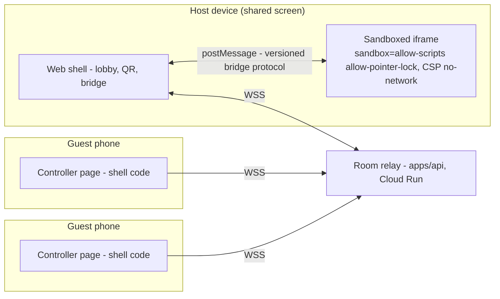

# Multiplayer games — design & implementation plan

Status: ✅ **Shipped and live** (verified 2026-07-26). Party mode runs in production: one
shared screen, phones as controllers, with `arena-tag` and `tactics-duel` in the catalog.
The relay lives in [`apps/api/src/realtime/mp.ts`](../apps/api/src/realtime/mp.ts) and keeps rooms **in the
memory of one process**, which is why the service deploys with `--max-instances 1` — see
[`deployment.md`](./deployment.md). Raising that cap requires moving room state out of
process first.

Revised 2026-07-23 after reading the actual games-repo runtime — the first draft assumed an
architecture this project no longer has. See
[§8 Plan revisions](#8-plan-revisions-what-changed-from-the-first-draft) for what changed and why.

---

## 1. The core user journey (CUJ)

> 1. Friends are together in a room and want to play a game.
> 2. One of them prompts it (or picks one from the catalog).
> 3. The others scan a QR code with their phones.
> 4. They start playing.

This is the "Jackbox moment": one shared screen (laptop / TV), phones as controllers, zero
installs, zero accounts for the guests. The design below is optimized for this journey first;
remote play (not in the same room) falls out of the architecture for free but is not the
v1 target.

**Reality check on step 2**: creation is asynchronous (spec → agent → PR → publish takes
minutes, see [vision.md](./vision.md)). The CUJ therefore has two flavors:

- **Instant**: pick an existing multiplayer game from the catalog → lobby → QR → play.
  This must work perfectly and is the v1 exit criterion.
- **Prompted**: prompt a new game → the lobby can form _while the agent builds_ ("scan now,
  we start when it's ready") → play. This is a great party moment precisely _because_ the
  wait is shared, but it depends on the whole creation pipeline's latency. It ships after
  the instant flavor works.

To make the instant flavor real on day one we seed **two first-party multiplayer games**
(owner decision, 2026-07-23 — down from five): one turn-based tactical, one real-time arcade.
Two is enough to prove the contract across both latency regimes and to give an agent two
house-style references to copy.

---

## 2. Product scope: multiplayer modes

| Mode                                     | What it means                                                                                                                                                                                | Ships        |
| ---------------------------------------- | -------------------------------------------------------------------------------------------------------------------------------------------------------------------------------------------- | ------------ |
| **A. Shared screen + phone controllers** | The game runs on ONE device (the host's screen). Phones render a platform-provided controller (d-pad + action button). Phones send inputs; the game never synchronizes state across devices. | **v1**       |
| B. Game-defined controllers              | Same as A, but the game supplies a custom controller layout (e.g., a drawing pad, a trivia answer sheet) rendered on phones.                                                                 | v2           |
| C. Each-device play                      | Every device runs the game with synchronized state (host-authoritative).                                                                                                                     | later, maybe |

**Why mode A first**: state synchronization is the hardest problem in multiplayer, and our
games are written by coding agents from prompts — they will get distributed state wrong
constantly, and the failures are invisible to validation. Mode A keeps the game a _single_
program with multiple input sources: the game runs in exactly one iframe, and the only new
concept a generated game must handle is "input arrives tagged with a slot number." That is a
contract an agent can reliably implement and our CI can reliably validate. Modes B and C
reuse the same session plumbing, so nothing is thrown away.

### 2.1 The slot model (the idea that makes everything else simple)

A multiplayer game declares **N player slots**. Every slot has a **keyboard binding on the
host machine** and can be **claimed by a phone**:

```
slot 1  →  WASD + Space        …until a phone claims it, then that phone drives slot 1
slot 2  →  Arrows + Enter      …until a phone claims it, then that phone drives slot 2
```

The game asks `party.down(1, 'left')` and never learns or cares which input source answered.
This single decision buys:

- **Hot-seat play for free** — two people on one keyboard, no lobby, no server, no phones.
- **Deterministic capture/CI** — the games repo's `CAPTURE.json` harness drives games by
  synthesizing key events. Because every slot has a keyboard binding, multiplayer games are
  capturable and assertable by the _existing_ pipeline with zero new tooling.
- **A graceful solo state** — a multiplayer game opened by one person with no phones is
  still a playable (hot-seat) game rather than a "waiting for players" dead end.
- **No special-casing in game code** — one input path, whatever the source.

---

## 3. UX design

### 3.1 Host flow (the shared screen)

1. **Entry point**: multiplayer-capable games show a **"Play together"** button next to Play,
   plus a badge in the catalog card (`ArcadeCatalog.tsx`). Plain **Play** still works and
   gives hot-seat.
2. **Lobby overlay** (over the game area, game not started yet):
   - A **large QR code** (the star of the screen — scannable from across a table) plus the
     short room code and the join URL for manual entry.
   - A live **slot list**: each slot shows either "press WASD" (keyboard) or the guest's
     nickname + color chip once a phone claims it. Their controller shows the same color so
     people can find themselves.
   - **Start** enables once the game's `min_players` is met (counting keyboard slots).
   - Host can kick a player (mis-scans, duplicates).
3. **In game**: the slot strip stays visible with connection dots. A guest disconnecting
   shows a toast; the slot falls back to its keyboard binding rather than breaking the game.
4. **End / replay**: "Play again" keeps the room and controllers alive — no re-scanning.
   Room dies when the host leaves or after the idle timeout.

For the **prompted** flavor: the creator flow (and the creator Q&A,
[creator-qa-plan.md](./creator-qa-plan.md)) gets a "playable with friends" option that writes
the multiplayer keys into the spec; the submission status view gains "start a lobby while you
wait" once that flavor ships.

### 3.2 Guest flow (the phone)

1. Scan QR → phone browser opens `https://<app>/join/<code>#<token>`.
2. **No account, no install.** One screen: pick a nickname (pre-filled with a fun default,
   e.g. "Green Fox") → **Join**.
3. Controller renders: a d-pad plus one action button, in the slot's color, sized for thumbs,
   `touch-action: none` so it never scrolls or zooms, wake-lock requested so the screen
   doesn't sleep mid-game.
4. States the controller must handle honestly: _waiting for host to start_,
   _connected/playing_, _reconnecting…_ (auto-retry into the same slot), _room ended_.

The join page is part of our own web shell (trusted code, normal origin) — **not** game code.

### 3.3 UX principles

- **The QR is the product.** Time from "Play together" click to a phone buzzing as a joined
  controller must be under ~10 seconds. No consent walls, no forms beyond the nickname.
- i18n en/pl for everything, same as the rest of the app.
- Latency expectations are honest: this is a couch platform (server round-trip ~30–80 ms in
  region). Agent-written games should be steered toward latency-tolerant designs (party,
  trivia, turn-based, one-button reaction games) — guidance in the games-repo agent
  instructions, not enforced by code.

---

## 4. Technical architecture

### 4.1 The sandbox constraint decides the topology

The load-bearing invariant of this codebase: games run in an iframe with
`sandbox="allow-scripts allow-pointer-lock"`, **no** `allow-same-origin` (`GameFrame.tsx`), and served bundles
carry a CSP with no `connect-src` — fetch/XHR/WebSocket are all blocked inside the game
([assemble.ts](../apps/api/src/assemble.ts)). Games are also validated to be offline-only and
self-contained ([validate.mjs](https://github.com/gamedevpl/www.gamedev.pl-games) Check 6:
no `fetch(`, no `XMLHttpRequest`, no remote assets).

**Multiplayer must not weaken any of that.** Therefore: games never touch the network.
The trusted shell (our React app) owns the one WebSocket, and the game iframe communicates
with the shell exclusively via `postMessage`, which CSP does not restrict. The restrictive
CSP and the sandbox attribute stay byte-identical for multiplayer games.



### 4.2 Room relay (in `apps/api`)

A room service inside the existing Fastify app (no new deployable) using
`@fastify/websocket`:

- `POST /api/mp/sessions` — host creates a room. **Requires a session** (the private-beta
  wall applies to hosts as normal). Body: `{ slug }`. Returns
  `{ code, joinPath, hostToken, joinToken, maxPlayers }`. Rate-limited per user.
- `GET /api/mp/ws` → WebSocket upgrade. One endpoint for hosts and guests. **No credential in
  the URL** — the first frame carries the token, so nothing secret lands in access logs.

**Room model**: in-memory `Map<code, Room>`, same pattern as the existing in-memory rate
limiter. A room holds: code, slug, host socket, `slots[]` (nickname, color, socket,
lastSeen), phase (`lobby | playing | ended`), timestamps. Rooms are **ephemeral by design** —
nothing is persisted to Firestore. Caps: `max_players` from the game's spec (≤8), one open
room per host, 2 h TTL, 10 min idle reap.

**Wire protocol** (`v: 1`, JSON, ≤2 KB/frame, zod-validated — malformed frames close the
connection):

| Direction      | Frames                                                                         |
| -------------- | ------------------------------------------------------------------------------ |
| guest → server | `hello { code, token, nick }`, `input { k, d }`, `bye`                         |
| server → guest | `welcome { slot, color, nick, phase }`, `phase { phase }`, `closed { reason }` |
| host → server  | `hello { code, token }`, `phase { phase }`, `kick { slot }`                    |
| server → host  | `roster { slots }`, `input { slot, k, d }`, `closed { reason }`                |

`k` is one of `up|down|left|right|a` (the v1 layout) and `d` is `0|1` (down/up). Every frame
already carries `v` as the protocol version, so key state cannot reuse that field — a release
of `0` would look like a version mismatch and be dropped. The server is a **relay with
admission control**, not a game engine: it validates, tags with the slot number, rate-limits
(token bucket, ~40 frames/s/connection), and forwards.

### 4.3 Join security (the QR that lets strangers in)

- `POST /api/mp/sessions` mints a **signed join token** (HMAC over `code|exp`, same discipline
  as `submission-token.ts`, keyed off `SESSION_SECRET` with a distinct scope string so a room
  token can never be confused with a session cookie).
- The QR encodes `https://<app>/join/<code>#<token>` — room code in the path, token in the
  **fragment**, which browsers never send to the server, so it stays out of access logs and
  Referer headers. It is then presented in the WS `hello` **frame body** (not the URL) — same
  reasoning.
- Guests get an ephemeral slot — **no account, no user doc, no cookie**. Nickname lives only
  in room memory and dies with the room.
- Beta reconciliation: the SPA shell is already public; `/api/mp/ws` is the **only** API a
  guest can reach, and it is useless without a valid room token. The beta `onRequest` wall
  exempts exactly that one path; everything else stays 401. Hosting still requires an
  allowlisted signed-in user, so a guest can only ever reach a room an allowlisted member
  opened for them.
- Room codes use an unambiguous alphabet (no `0/O/1/I`) so they can be read aloud; the
  **token**, not the code, is the credential.

### 4.4 The game-facing SDK: a GameKit `party` module

Games opt in via `GAME.json` (`"engine": { "modules": [..., "party"] }`) exactly like `input`
or `audio`. The module ships in the games repo at `shared/modules/party.js` and is bundled at
serve time by both assemblers.

```js
const party = GameKit.createParty({
  slots: [
    { name: 'P1', color: '#00e4ac', keys: { up: 'w', left: 'a', down: 's', right: 'd', a: ' ' } },
    { name: 'P2', color: '#ff7edb', keys: { up: 'arrowup', left: 'arrowleft', /* … */ a: 'enter' } },
  ],
});

party.down(1, 'left'); // held — keyboard or phone, the game can't tell
party.consume(2, 'a'); // edge-triggered, one-shot
party.slots(); // [{ slot, name, color, remote, connected }]
party.connected; // is a lobby attached at all?
```

Feature detection is the module's job, not the game's: with no parent window (capture
harness, direct file open) or no shell reply within 500 ms, the module simply stays in
keyboard-only mode. A game written against `createParty` therefore runs identically in the
lobby, in hot-seat, and in the deterministic capture harness.

**Bridge protocol** (`postMessage`, namespaced `gdp` + `v: 1`):

| Direction    | Messages                                                      |
| ------------ | ------------------------------------------------------------- |
| game → shell | `hello { slots }` (announce slot count), `phase { phase }`    |
| shell → game | `roster { slots }`, `input { slot, k, d }`, `phase { phase }` |

Bridge rules in the shell (`GameFrame` gains an optional `bridge` prop):

- Messages **from** the iframe are hostile input: validated, size-capped, unknown types
  dropped, never rendered as HTML, never eval'd, never forwarded anywhere but the room relay.
- Messages **to** the iframe carry only platform-constructed data (typed inputs, moderated
  nicknames) — never a raw client frame.
- `postMessage` must use `targetOrigin: '*'` (the sandboxed frame has an opaque origin); the
  shell only accepts messages whose `event.source` is that specific iframe's `contentWindow`.
- Single-player games are untouched: no bridge prop, no `party` module, zero behavior change.
  A regression test asserts the sandbox attribute and CSP output are unchanged.

### 4.5 Games-repo contract

`SPEC.md` frontmatter is a **flat `key: value` map** — both parsers (the repo's
`tools/lib/spec.mjs` and the API's `parseSpecFrontmatter`) reject nested YAML, so the
multiplayer metadata is flat, snake_case, matching `submitted_by`:

```yaml
multiplayer: controllers # v1: the only allowed value
min_players: 2
max_players: 4
```

- `validate.mjs`: new Check 12 — if `multiplayer` is present it must be `controllers`,
  `min_players`/`max_players` must be integers with `2 ≤ min ≤ max ≤ 8`, `GAME.json` must
  select the `party` module, and `game.js` must call `createParty(`. Conversely, selecting
  `party` without the frontmatter fails. The offline-only rule is **unchanged** — no new
  network allowances of any kind.
- `GAME_KIT_MODULES` gains `party` (canonical order today: `input, collision, world, ai,
gameplay, drawing, actors, gfx, effects, audio, party`) in both `tools/lib/assemble.ts`
  and the API's `github-client.ts`, which keep independent copies of that list.
- The catalog carries `multiplayer`, `minPlayers`, `maxPlayers` through `CatalogGameEntry` →
  `/api/catalog` → the web `CatalogEntry`.
- Agent instructions get a multiplayer section + the two seed games as house-style references.

### 4.6 Cloud Run realities

- WebSockets work on Cloud Run, but **rooms are in-memory and the service autoscales to 4
  instances** — a guest can land on an instance that doesn't hold the host's room. Session
  affinity does not fix this (it pins a _client_, not a _room_). For the closed beta the
  service therefore runs **`--max-instances 1`** while multiplayer is enabled: with an
  allowlisted handful of users and Cloud Run's default concurrency of 80, one instance is
  ample. This is the one genuine trade in this design.
- **The split is now built** ([`mp-relay.ts`](../apps/api/src/realtime/mp-relay.ts),
  [`infra/deploy-relay.sh`](../infra/deploy-relay.sh)) and takes the first of the two upgrade
  paths above: a `gamedev-mp-relay` service pinned to one instance, running the **same image**
  with `MP_RELAY_ONLY=1`, while the app service loses the pin. One correction to what this
  section predicted: the host is **not** authenticated by a short-lived HMAC ticket. The app
  service stays the front door for `POST /api/mp/sessions` — cookie-authenticated, exactly as
  today — and forwards the create to the relay over an **audience-pinned Google OIDC token**.
  That keeps `RoomRegistry.createRoom` running in one place, so room codes, room tokens, the
  one-room-per-host rule and every test in §7 keep their meaning; a ticket format would have
  needed a new claim set and its own code-collision handling for no benefit on a path that runs
  once per party. Externalized room state (Memorystore) remains the _second_ step, needed only
  when one instance of relay is no longer enough.
- **Lifting the app's pin is not a separate act.** `MP_RELAY_URL` both forwards room creation
  and raises the ceiling, in both deploy paths, enforced by
  [`mp-relay-deploy.test.ts`](../apps/api/src/mp-relay-deploy.test.ts) — because "raised the cap,
  forgot to forward the rooms" is the failure this whole section is about, and it presents as
  guests' wifi being bad. Rollout steps are in
  [`deployment.md`](./deployment.md#splitting-the-party-relay-out-lifting-the-ceiling).
  The wire protocol is unchanged, and the client already handles `room_not_found` by telling the
  host to restart the lobby — so raising the cap degrades visibly rather than mysteriously.
- WS connections cap at the request timeout (≤60 min); shell and controllers **auto-reconnect
  into the same slot**, which also covers phones sleeping/backgrounding — the #1 real-world
  event.
- Instance scale-down kills rooms: acceptable for ephemeral party sessions.
- No new secret: room tokens are HMAC'd from the already-mounted `SESSION_SECRET` under a
  distinct scope string. Smoke gate: anonymous `POST /api/mp/sessions` → 401.

### 4.7 Alternatives considered

- **WebRTC P2P** (server only signals): best latency and it would sidestep the
  instance-affinity problem entirely, but NAT/carrier quirks on guest phones make
  "scan → it just works" flaky, and it needs STUN/TURN to be reliable when phones are on LTE
  and the laptop is on WiFi. The relay keeps one boring failure domain. Revisit if relay
  latency actually hurts.
- **Firestore as transport**: write-per-input cost and latency are wrong for input streams.
- **Third-party realtime** (PartyKit, Ably, Liveblocks): new vendor, new credentials, new ToS
  surface — against the project's decentralization posture.
- **Injecting the SDK from `assembleGameHtml`** (the first draft's design): rejected once the
  GameKit module system was understood — see §8.
- **Letting games open their own WebSocket**: rejected outright; it would break the security
  model's core invariant and hand untrusted generated code a network exfiltration path.

---

## 5. Security & privacy invariants (additions)

1. Game iframes stay exactly `sandbox="allow-scripts allow-pointer-lock"`; the no-network CSP stays on. The
   bridge is the only channel, and it is typed and rate-limited.
2. Everything from a game or a guest phone is untrusted data: validate at the server edge AND
   in the shell; render nicknames escaped everywhere; nicknames go through the existing
   `moderation.ts` deny-list, since they appear on a shared screen.
3. Guests are anonymous and ephemeral: no user docs, no cookies, no analytics identity, no
   persistence of nicknames or inputs. Nothing about a session outlives the room's memory.
4. Join tokens never appear in URL query/paths (fragment + frame body only), server logs, or
   Referer.
5. Room creation is authenticated + rate-limited; relay connections are per-connection
   rate-limited and size-capped.
6. The beta wall exemption is exactly one path (`/api/mp/ws`), and a test asserts everything
   else still 401s for guests.

---

## 6. Implementation plan

**M1 — Room relay** (`apps/api/src/realtime/mp.ts`) · room store, HMAC join tokens, admission control,
relay, rate limits, beta-wall exemption, full unit-test matrix.

**M2 — Party module + two seed games** (games repo) · `shared/modules/party.js`, validate
Check 12, `GAME_KIT_MODULES` update, agent instructions, and the two games below.

**M3 — Lobby, QR, controller, bridge** (`apps/web`) · "Play together", lobby overlay with QR,
`/join/:code` + `#token` route, nickname screen, d-pad controller, `GameFrame` bridge,
catalog badge, i18n en/pl.

**M4 — Metadata plumbing** · flat frontmatter → `CatalogGameEntry` → `/api/catalog` → web.

**M5 — Gate, deploy, verify** · full gate in both repos, `--max-instances 1`, smoke additions,
then the CUJ end-to-end on real hardware: laptop + two phones, click → scan → play.

### The two seed games

| Slug           | Kind                    | Why it's the right first pair                                                                                                                                                                                              |
| -------------- | ----------------------- | -------------------------------------------------------------------------------------------------------------------------------------------------------------------------------------------------------------------------- |
| `tactics-duel` | Turn-based tactical, 2P | Latency is _irrelevant_ — proves the platform on the forgiving end. Alternating turns, three units each on a small grid, move-and-strike. D-pad moves a cursor, A confirms; the exact shape a phone controller is good at. |
| `arena-tag`    | Real-time arcade, 2–4P  | The honest stress test: continuous input, held directions, everyone moving at once. If this feels good on phones over the relay, the latency budget is real.                                                               |

Both ship hot-seat playable (slot model), both pass the existing capture/validate pipeline.

---

## 7. Open questions — working answers

Answered with best-guess defaults (Claude, 2026-07-23); the owner can override any of them.

1. **Seed games** — **two, per owner direction (2026-07-23)**: `tactics-duel` (turn-based
   tactical) and `arena-tag` (real-time arcade). The earlier five-title list is deferred; two
   is enough to prove both latency regimes and to give agents house-style references.
2. **Guest anonymity vs. beta optics** — **yes, anonymous guests are in**. Guests can only
   reach a room an allowlisted host opened, hold a token scoped to that one room, and touch
   exactly one endpoint. Forcing a sign-in on someone's phone mid-party would kill the CUJ.
3. **Player cap** — **8 platform-wide**; per-game via `max_players` (the seed games use 2
   and 4). Eight fits a living room, a distinguishable color palette, and one lobby row.
4. **QR library** — **no dependency at all.** QR encoding for a short ASCII URL is ~200 lines;
   a vendored, test-covered encoder beats auditing a package for the one place we need it,
   and it keeps the supply-chain surface at zero. (Revised from "pinned npm package".)
5. **Mode C (each-device sync)** — **formally out of scope** until modes A/B prove demand.
6. **`--max-instances 1` during beta** — flagged for the owner as the one real operational
   trade (§4.6). Reverting it means multiplayer rooms break intermittently until a relay
   service or shared room state exists.

---

## 8. Plan revisions (what changed from the first draft)

The first draft was written against `docs/architecture.md`, which describes the older
"self-contained bundle" world. Reading the actual games repo changed four decisions:

1. **The SDK is a GameKit module, not an injected script.** The games repo has a real shared
   engine (`shared/modules/{core,input,collision,drawing,effects,audio}.js`) selected per game
   through `GAME.json` and bundled at serve time by `github-client.ts`. Injecting a parallel
   SDK from `assembleGameHtml` would have created a second, invisible module system that the
   repo's own validate/capture/smoke tooling knows nothing about. Cost of the change: the
   module lives in the games repo, so the bridge protocol is versioned across two repos —
   handled by the `v: 1` handshake and the shell tolerating silence.
2. **Frontmatter must be flat.** Both spec parsers are strict flat `key: value` and the repo's
   parser _throws_ on a nested block, so the planned `multiplayer:` YAML object would have
   failed validation on every game in the repo. Now flat snake_case keys.
3. **The slot model replaced "needs a lobby" solo handling.** Discovering `CAPTURE.json` —
   deterministic keyboard-driven capture with assertions, required for any `published` game —
   forced the question of how a multiplayer game gets captured in CI. Giving every slot a
   keyboard binding answers that _and_ yields hot-seat play, a sane solo state, and a single
   input path in game code. This is the biggest improvement over the first draft.
4. **Cloud Run instance affinity is a real constraint, not a footnote.** The first draft
   waved at session affinity; affinity pins clients, not rooms, so with `--max-instances 4` a
   guest can simply miss the host's room. Now an explicit, owner-visible trade (§4.6).
