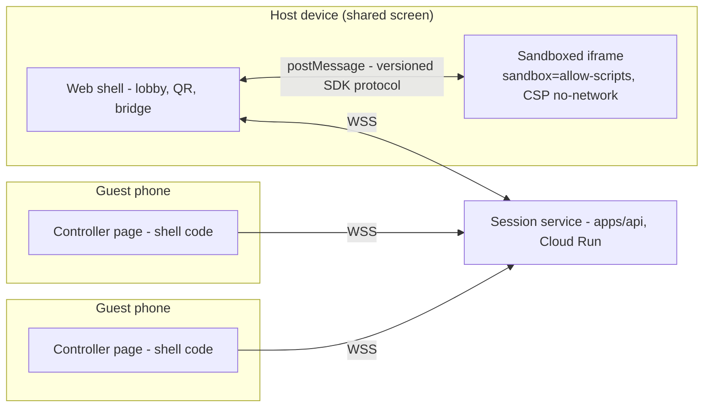

# Multiplayer games — design & implementation plan

Status: **proposed** (not started). The open questions at the bottom carry best-guess working
answers; owner can override any of them before M1 starts.

---

## 1. The core user journey (CUJ)

> 1. Friends are together in a room and want to play a game.
> 2. One of them prompts it (or picks one from the catalog).
> 3. The others scan a QR code with their phones.
> 4. They start playing.

This is the "Jackbox moment": one shared screen (laptop / TV), phones as controllers, zero
installs, zero accounts for the guests. The design below is optimized for this journey first;
remote play (not in the same room) falls out of the architecture for free but is not the
v1 target.

**Reality check on step 2**: creation is asynchronous (spec → agent → PR → publish takes
minutes, see [vision.md](./vision.md)). The CUJ therefore has two flavors:

- **Instant**: pick an existing multiplayer game from the catalog → lobby → QR → play.
  This must work perfectly and is the v1 exit criterion.
- **Prompted**: prompt a new game → the lobby can form _while the agent builds_ ("scan now,
  we start when it's ready") → play. This is a great party moment precisely _because_ the
  wait is shared, but it depends on the whole creation pipeline's latency. It ships after
  the instant flavor works.

To make the instant flavor real on day one, we seed **3–5 first-party multiplayer games**
(same approach as the existing templates in `packages/game-generator/templates`).

---

## 2. Product scope: multiplayer modes

| Mode                                     | What it means                                                                                                                                                                                 | Ships        |
| ---------------------------------------- | --------------------------------------------------------------------------------------------------------------------------------------------------------------------------------------------- | ------------ |
| **A. Shared screen + phone controllers** | The game runs on ONE device (the host's screen). Phones render a platform-provided controller (d-pad + buttons + name). Phones send inputs; the game never synchronizes state across devices. | **v1**       |
| B. Game-defined controllers              | Same as A, but the game supplies a custom controller layout (e.g., a drawing pad, a trivia answer sheet) rendered on phones.                                                                  | v2           |
| C. Each-device play                      | Every device runs the game with synchronized state (host-authoritative).                                                                                                                      | later, maybe |

**Why mode A first**: state synchronization is the hardest problem in multiplayer, and our
games are written by coding agents from prompts — they will get distributed state wrong
constantly, and the failures are invisible to validation. Mode A keeps the game a _single_
program with multiple input sources: the game runs in exactly one iframe, and the only new
concept a generated game must handle is "inputs arrive tagged with a player id." That is a
contract an agent can reliably implement and our CI can reliably validate. Modes B and C
reuse the same session plumbing, so nothing is thrown away.

---

## 3. UX design

### 3.1 Host flow (the shared screen)

1. **Entry point**: on a game page of a multiplayer-capable game, a primary
   **"Play together"** button (next to the existing play surface). Multiplayer-capable games
   also get a badge + filter in the catalog (`ArcadeCatalog.tsx`).
2. **Lobby overlay** (over the game area, game not started yet):
   - A **large QR code** (the star of the screen — scannable from across a table) plus the
     short room code (e.g. `GDPL-7K3M`) and the join URL for manual entry.
   - A live **player list**: each guest appears the moment they join, with nickname and a
     color/avatar chip. Their controller shows the same color so people can find themselves.
   - Player count vs. the game's `minPlayers`/`maxPlayers`; **Start** enables at min.
   - Host can kick a player (mis-scans, duplicates).
3. **In game**: small persistent strip showing players + connection dots. A guest
   disconnecting shows a toast and (if the game asks for it via the SDK) pauses.
4. **End / replay**: "Play again" keeps the room and controllers alive — no re-scanning.
   Room dies when the host leaves or after inactivity timeout.

For the **prompted** flavor: the Creator flow (and the planned creator Q&A,
[creator-qa-plan.md](./creator-qa-plan.md)) gets a "playable with friends" option that puts a
multiplayer block into the spec; the submission status view gains "start a lobby while you
wait" once that flavor ships.

### 3.2 Guest flow (the phone)

1. Scan QR → phone browser opens `https://<app>/join/<roomCode>#<joinToken>`.
2. **No account, no install.** One screen: pick a nickname (pre-filled with a fun default,
   e.g. "Green Fox") → **Join**.
3. Controller renders: the layout requested by the game (v1: from a small set of stock
   layouts — `dpad-2`, `dpad-1`, `buttons-4`, `tilt` later), in the player's assigned color,
   fullscreen-friendly, wake-lock requested so the screen doesn't sleep mid-game.
4. States the controller must handle honestly: _waiting for host to start_,
   _connected/playing_, _reconnecting…_ (auto-retry with the same player slot), _room ended_.

The join page is part of our own web shell (trusted code, normal origin) — **not** game code.

### 3.3 UX principles

- **The QR is the product.** Time from "Play together" click to a phone buzzing as a joined
  controller must be under ~10 seconds. No consent walls, no forms beyond the nickname.
- i18n en/pl for everything, same as the rest of the app.
- Latency expectations are honest: this is a couch platform (server round-trip ~30–80 ms in
  region). Games the agents write should be genre-guided toward latency-tolerant designs
  (party, trivia, turn-based, one-button reaction games) — that guidance lives in the games
  repo agent instructions, not enforced by code.

---

## 4. Technical architecture

### 4.1 The sandbox constraint decides the topology

The load-bearing invariant of this codebase: games run in an iframe with
`sandbox="allow-scripts"`, **no** `allow-same-origin` (`GameFrame.tsx`), and an injected CSP
with no `connect-src` — fetch/XHR/WebSocket are all blocked inside the game
([assemble.ts](../apps/api/src/assemble.ts)). Games are also validated to be offline-only
self-contained bundles ([games-repo-blueprint.md](./games-repo-blueprint.md) rule 6).

**Multiplayer must not weaken any of that.** Therefore: games never touch the network.
The trusted shell (our React app) owns the one WebSocket, and the game iframe communicates
with the shell exclusively via `postMessage`. CSP does not restrict `postMessage`, so the
restrictive CSP stays exactly as-is, including for multiplayer games.



### 4.2 Session service (in `apps/api`)

A room service inside the existing Fastify app (no new deployable) using
`@fastify/websocket`:

- `POST /api/mp/sessions` — host creates a room. **Requires a session** (the existing auth;
  the private-beta wall applies to hosts as normal). Body: `{ slug }` of the game. Returns
  `{ roomCode, joinUrl, hostToken }`. Rate-limited per user (reuse the existing per-IP/user
  limiter patterns).
- `GET /join/:roomCode` — serves the SPA shell (normal SPA fallback; the join route is a
  client route).
- `GET /api/mp/ws?token=…` → WebSocket upgrade. One endpoint for hosts and guests; the
  token says which.

**Room model**: in-memory (`Map<roomCode, Room>`), same pattern as the existing in-memory
rate limiter. A room: code, game slug, host connection, guest slots (id, nickname, color,
connection, last-seen), state (`lobby | playing | ended`), created/expires timestamps.
Rooms are **ephemeral by design** — nothing is persisted to Firestore. Caps: guests per
room (default 8, game can lower via spec), rooms per host (1–2), TTL ~2 h, idle reap ~10 min.

**Message protocol** (versioned, `v: 1`, JSON, size-capped ~4 KB, schema-validated with zod
server-side — malformed frames close the connection):

| Direction      | Messages                                                                                                                                  |
| -------------- | ----------------------------------------------------------------------------------------------------------------------------------------- |
| guest → server | `join { nickname }`, `input { seq, payload }`, `ping`                                                                                     |
| server → guest | `joined { playerId, color, layout }`, `roomState { phase, players }`, `feedback { payload }` (v2: rumble/prompts), `kicked`, `roomClosed` |
| host → server  | `start`, `kick { playerId }`, `toPlayer { playerId, payload }`, `end`                                                                     |
| server → host  | `playerJoined/Left { player }`, `input { playerId, seq, payload }`, `roomClosed`                                                          |

The server is a **relay with admission control**, not a game engine: it validates, tags with
`playerId`, rate-limits (per-connection input cap, e.g. 30 msg/s, token bucket), and
forwards. Input payloads are opaque to the server but size- and rate-bounded.

### 4.3 Join security (the QR that lets strangers in)

The join URL must let unauthenticated guests in **without weakening the beta wall**:

- `POST /api/mp/sessions` mints a **signed room join token** (HMAC, same discipline as
  `submission-token.ts`: signed payload `{ roomCode, exp }`, secret server-side). The QR
  encodes `https://<app>/join/<code>#<token>` — the token rides in the **fragment**, which
  never reaches server logs or Referer headers.
- The WS upgrade for guests requires a valid, unexpired token for that room. Guests get an
  ephemeral `playerId` — **no account, no user doc, no cookie**. Nickname lives only in room
  memory and dies with the room.
- Beta reconciliation: the SPA shell is already public (P0 shell fix); `/api/mp/ws` with a
  valid room token is the _only_ API a guest can reach — the beta `onRequest` wall exempts
  it explicitly (narrow, token-gated exemption; everything else stays walled). Hosting a
  room still requires an allowlisted signed-in user, so beta guests can only ever reach a
  room an allowlisted member opened for them.
- Room codes are short for humans but the token is the credential — guessing a code without
  its token gets you nothing. Reap tokens on room close.

### 4.4 The game-facing SDK (postMessage bridge)

Games get a tiny, versioned API. The SDK script is **injected by `assembleGameHtml`** (like
the CSP meta) when the game is multiplayer — game code never bundles it, so the platform
can evolve the wire protocol without touching published games:

```js
// Inside the game iframe (mode A, host side). Injected as window.GamedevParty.
GamedevParty.init({ onReady, onPlayerJoin, onPlayerLeave, onInput, onPauseRequest });
GamedevParty.players(); // [{ id, nickname, color }]
GamedevParty.sendToPlayer(id, payload); // v2: controller feedback
```

Bridge rules in the shell (`GameFrame` gains a `bridge` prop):

- The shell treats messages **from** the iframe as hostile input: zod-validated, size-capped,
  rate-limited, unknown types dropped. Nothing from a game message is ever rendered as HTML
  or eval'd, and game messages can never reach any API other than the room relay.
- Messages **to** the iframe carry only platform-constructed data (typed inputs, sanitized
  nicknames) — never raw client frames.
- `postMessage` uses `targetOrigin: '*'` of necessity (opaque origin) but the shell only
  listens on the specific iframe's `contentWindow` source — standard for this sandbox model.
- Single-player games are untouched: no bridge prop, no injected SDK, zero behavior change.
  A regression test asserts the sandbox attribute and CSP are byte-identical for
  single-player output.

### 4.5 Games-repo contract

- `SPEC.md` frontmatter gains an optional block; it flows into `catalog.json` (schema
  version bump) so the web app can badge/filter and the lobby knows the player bounds:

  ```yaml
  multiplayer:
    mode: controllers # v1: the only allowed value
    minPlayers: 2
    maxPlayers: 8
    layout: dpad-2 # stock controller layout id
  ```

- Validation (`validate.mjs`) additions: frontmatter schema; a multiplayer game must
  reference `GamedevParty` guardedly (feature-detect, so the game still boots to a sane
  "needs a lobby" screen when played solo); the offline-only rule is **unchanged** — no new
  network allowances of any kind.
- Agent instructions get an SDK reference + a complete example game + design guidance
  (latency-tolerant genres, input semantics per layout, handle join/leave mid-game).
- Seed games: 3–5 first-party controller games proving the contract before any agent writes
  one.

### 4.6 Cloud Run realities

- WebSockets work on Cloud Run; enable **session affinity** on the service so a room's
  connections land on the instance holding it. With beta-scale traffic (max a few instances)
  this is sufficient; the failure mode (affinity miss → "room not found") is handled
  client-side by surfacing "room ended — rescan to restart".
- WS connections cap at the request timeout (≤60 min): the shell and controllers
  **auto-reconnect with a resume token** (same slot, same color) — this also covers phones
  sleeping/backgrounding, which will be the #1 real-world event.
- Instance scale-down kills in-memory rooms: acceptable for ephemeral party sessions in
  beta. If multiplayer sticks, the upgrade path is externalizing room state
  (Memorystore/Redis pub-sub) — explicitly **out of scope** now; the protocol is designed so
  this swap is server-internal.
- Deploy: no new env/secrets beyond a `MP_ROOM_TOKEN_SECRET` (mint in Secret Manager, wire
  like `session-secret` incl. the accessor grant in `setup-gcp.sh`). Smoke gate: WS upgrade
  without token → 401; `POST /api/mp/sessions` anonymous → 401.

### 4.7 Alternatives considered

- **WebRTC P2P (host authoritative, server only signaling)**: best latency, but NAT/carrier
  quirks on guest phones make "scan → it just works" flaky, and debugging is brutal. The
  relay keeps one boring failure domain. Revisit only if relay latency actually hurts.
- **Firestore/Realtime-DB as transport**: write-per-input cost and latency are wrong for
  input streams; fine for lobbies only — not worth splitting the transport.
- **Third-party realtime (PartyKit, Ably, Liveblocks)**: new vendor, new credentials, new
  ToS surface — against the project's decentralization posture, and the relay is small.
- **Letting games open their own WebSocket** (relax CSP for multiplayer games): rejected
  outright — it would break the security model's core invariant and give untrusted generated
  code a network exfiltration path.

---

## 5. Security & privacy invariants (additions)

1. Game iframes stay exactly `sandbox="allow-scripts"`; the no-network CSP stays on for
   multiplayer games. The bridge is the only channel, and it is typed and rate-limited.
2. Everything from a game or a guest phone is untrusted data: schema-validate at the server
   edge AND in the shell; render nicknames escaped everywhere; nickname text goes through
   the moderation deny-list (reuse `moderation.ts` from the content-safety work) since
   nicknames appear on a shared screen.
3. Guests are anonymous and ephemeral: no user docs, no cookies, no analytics identity, no
   persistence of nicknames or inputs. Room tokens expire; nothing about a session outlives
   the room's memory.
4. Join tokens never appear in URL query/paths (fragment only), server logs, or Referer.
5. Room creation is authenticated + rate-limited; relay connections are per-connection
   rate-limited and size-capped (DoS containment).
6. The beta wall exemption is exactly one endpoint, token-gated (`/api/mp/ws`), and its test
   asserts everything else stays 401 for guests.

---

## 6. Implementation plan

Each milestone is independently shippable and gated by the full local gate + deploy smoke,
same discipline as everything else in this repo.

**M0 — Contracts on paper** _(this doc + protocol appendix)_
Freeze: wire protocol v1, SDK surface, spec frontmatter, catalog schema bump. Exit: owner
sign-off on open questions below.

**M1 — Session service** _(apps/api)_
`@fastify/websocket`, room store, join tokens, relay + admission control, rate limits, beta
wall exemption. Full unit-test matrix (join/leave/kick/reconnect/expiry/malformed frames/
token misuse). Exit: two `wscat` clients relay through a local room; anonymous non-token
probes all 401.

**M2 — Host lobby + phone controller** _(apps/web)_
"Play together" button, lobby overlay with QR (small client-side QR lib — vet + pin, or
vendored encoder; no CDN), `/join/:code` route, nickname screen, stock `dpad-2` controller
with reconnect + wake-lock, i18n en/pl. Exit: laptop + two real phones over the deployed
service reach a live lobby in <10 s from click.

**M3 — Bridge + SDK + first playable** _(apps/api assemble + apps/web + one seed game)_
SDK injection in `assembleGameHtml`, GameFrame bridge with hostile-input handling, one
first-party 2–4 player game (e.g. shared-screen "tag" or pong-party). Sandbox/CSP regression
tests. Exit: **the CUJ end-to-end on production hardware** — click → scan → play, latency
felt acceptable on phones over LTE.

**M4 — Games-repo contract + seeds** _(games repo + catalog)_
Frontmatter, `validate.mjs` rules, catalog schema + web badges/filter, agent instructions +
SDK docs + example, remaining seed games. Exit: an agent-built multiplayer game passes CI
and plays correctly with zero human code fixes.

**M5 — Prompted-flavor + polish**
"Playable with friends" option in the creator flow (and creator Q&A when it lands),
lobby-while-generating, play-again flow, kick UX, observability (room counts, join success
rate, reconnect rate, WS error taxonomy in Cloud Run logs). Exit: full CUJ including
"one of them prompts it".

Sequencing vs. the current queue: this starts **after** the in-flight beta/safety queue
(P0 shell fix → dep bumps → waitlist → safety slices → creator Q&A) — multiplayer touches
`app.ts` auth walls and `assemble.ts`, so landing it mid-queue would collide with AGY's work.

---

## 7. Open questions — working answers

Answered with best-guess defaults (Claude, 2026-07-23) so M0 isn't blocked; the owner can
override any of these before M1 starts. Each answer is the working assumption the milestones
build against.

1. **Seed games** — five titles, all latency-tolerant and 2+ player from the stock layouts:
   - _Party Pong_ (2–4, `dpad-1`): paddles on each screen edge; the classic proof that
     input relay feels good.
   - _Tag Arena_ (2–8, `dpad-2`): one player is "it", roles swap on touch; pure chase fun,
     trivially fair under latency.
   - _Quick Draw_ (2–8, `buttons-4`): reaction duels — wait for the signal, first press
     wins the round; timing is server-tagged so it's honest.
   - _Color Quiz_ (2–8, `buttons-4`): trivia-style prompts on the shared screen, answers on
     phones; the most latency-proof genre and the best demo of the "answer sheet" idea that
     motivates v2 custom layouts.
   - _Snake Royale_ (2–8, `dpad-2`): last snake alive on one board; showcases the max
     player count.
2. **Guest anonymity vs. beta optics** — **yes, anonymous guests are in**. Guests can only
   reach a room an allowlisted host opened, hold a token scoped to that one room, and touch
   exactly one endpoint. That preserves the spirit of the beta wall (an invited member vouches
   for the session) without forcing sign-ins on someone's phone mid-party, which would kill
   the CUJ. Revisit only if abuse shows up in the room-creation logs.
3. **Player cap** — **default 8 stands** (games can lower it via `maxPlayers`). Eight fits a
   living room, a distinguishable color palette, and one lobby row; anything higher strains
   both the palette and a single Cloud Run relay instance for no real party-size gain.
4. **QR library** — **small zero-dependency npm package, pinned exact** (e.g. `uqr` or
   equivalent: pure encoder, no transitive deps, renders to SVG string client-side). Pinning
   exact + zero transitive deps gives vendoring-grade supply-chain surface without taking on
   maintenance of crypto-adjacent encoder math ourselves; the lockfile + gitleaks/CI
   discipline already in place covers the rest. Vet the package at M2 (repo activity, no
   install scripts, no network code) before adding.
5. **Mode C (each-device sync)** — **formally out of scope** until modes A/B prove demand.
   No protocol work, no spec fields, no agent guidance for it; the only concession already
   in the design is that the relay protocol doesn't preclude it later.
