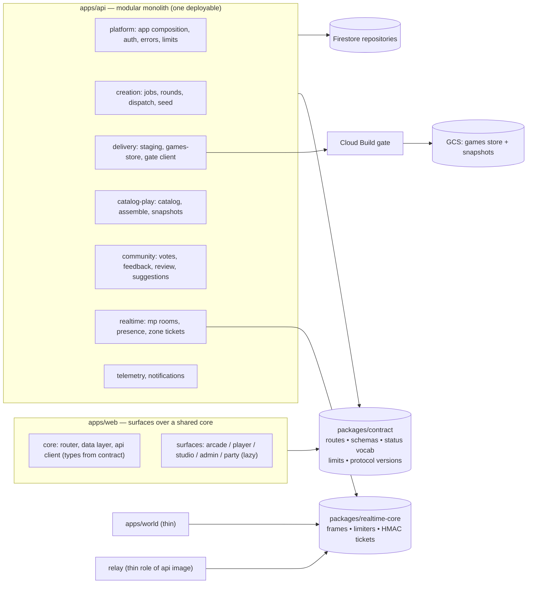

# North-star architecture

> **Status: 📋 Proposal — researched 2026-08-19.** This document records a full-repo
> architecture review (what the code actually is today, measured, with file references), a
> proposed north-star shape for the codebase, and a phased plan towards it. It is about
> **code structure and internal boundaries**, not product direction: the product
> architecture — games repo, sandbox, human publish gate, MCP delivery — is settled and this
> doc treats it as fixed (see "The settled spine"). [`architecture.md`](./architecture.md)
> describes a much earlier state of the system; until it is rewritten, this document is the
> closest thing to a current map.

---

## 1. What the system is today (verified 2026-08-19)

### Workspaces

| Workspace                 | Non-test LOC         | Test LOC | Files               | Role                                                                       |
| ------------------------- | -------------------- | -------- | ------------------- | -------------------------------------------------------------------------- |
| `apps/api`                | 77,339               | 68,579   | 204 src + 203 test  | Fastify backend: catalog, auth, jobs, agent channel, MCP, mp, telemetry    |
| `apps/web`                | 74,998 (+20,834 CSS) | 39,809   | ~210 src + 181 test | React SPA: arcade, player, Creator Studio, admin, review desk, party mode  |
| `apps/world`              | 976                  | 570      | 5                   | Zone host (Cloud Run `gamedev-world`): authoritative sims in `isolated-vm` |
| `apps/e2e`                | ~1,970               | —        | 11                  | Playwright deploy gate against a live deployment                           |
| `packages/zone-core`      | 1,759                | 1,199    | 7                   | Zone tickets, schema, deterministic cage, tick loop, sim contract          |
| `packages/game-generator` | ~190                 | 102      | 3 + templates       | Vestigial: mock generator behind one legacy dev route; `GameProject` type  |

### Deployed shape

Three Cloud Run services from two images, all in `europe-west1`; Firestore in
`europe-central2`; two GCS buckets (`…-games-store` = delivered sources system-of-record,
`…-games-snapshots` = published bake); the validation gate runs as an ad-hoc **Cloud Build**
job submitted inline by the API ([`gate-trigger.ts`](../apps/api/src/gate-trigger.ts),
[`infra/cloudbuild-gate.yaml`](../infra/cloudbuild-gate.yaml)).

| Service            | Image        | Deployed by                              | Notes                                                    |
| ------------------ | ------------ | ---------------------------------------- | -------------------------------------------------------- |
| `gamedev-app`      | `apps/api`   | `deploy.yml` (candidate → smoke → e2e)   | Web + API, same origin; max-instances derived from relay |
| `gamedev-mp-relay` | same image   | `deploy-relay.sh` create, CI image bumps | `MP_RELAY_ONLY=1`; websocket rooms, in-memory            |
| `gamedev-world`    | `apps/world` | `deploy-world.sh` **only — never CI**    | Inert until `ZONE_HOST_URL` is set on the app            |

### The creation pipeline the code actually implements

```
prompt → moderation → refine Q&A → job record (Firestore, keyed "issueNumber" — no issue exists)
  → round-0 seed (direct Vertex call, fail-open)
  → dispatch: platform builder (managed vendor adapters, MCP-only) | self-build (creator's own agent over /api/mcp)
  → agent loop: get_brief/get_kit → stage_* → submit_sources(preview|publish)
  → source-delivery → immutable version in GCS games store
  → Cloud Build gate (games-repo check chain @ pinned engine ref + serve-time policies)
  → verdict in GCS manifest → reconciled into job state on poll
  → human operator publish (registry pointer) → catalog merges games-repo lane + store lane
```

A pull request is never the delivery; GitHub-mediated dispatch was removed 2026-07-30.

### What is healthy — and must be preserved

The review found strong local engineering discipline; the plan below deliberately builds on
these rather than replacing them:

- **The sandbox invariant** is enforced in one small file
  ([`GameFrame.tsx`](../apps/web/src/GameFrame.tsx), 102 lines) with a regression test, and
  every realtime feature respects it via typed, size-capped postMessage bridges.
- **[`job-state.ts`](../apps/api/src/job-state.ts)** is a properly factored pure state
  machine — proof the codebase knows what good looks like.
- **The `fetch`-boundary fake** ([`local-games-repo.ts`](../apps/api/src/local-games-repo.ts))
  gives local dev the production code path instead of a second implementation.
- **Test discipline**: ~0.9:1 test-to-source in the API, mostly real integration tests
  through `buildApp()` + `app.inject` with `InMemoryStore`. Zero TODO/FIXME markers in
  77k lines. Refactoring here is unusually safe.
- **Incident-anchored comments and ratchets**: the comment-prose baseline ratchet, the
  contract check against the games repo, CSS revert-guard tests, the deploy pipeline's
  candidate → smoke → browser-gate sequence.
- **The gate's hostile-input posture** ([`infra/gate-hardening.md`](../infra/gate-hardening.md))
  and the telemetry privacy invariants (unjoinable streams, aggregates-only).

## 2. The structural debts (evidence, not opinion)

The codebase's macro structure has not kept up with its own growth. Seven debts, each
measured:

**D1 — Flat module space.** `apps/api/src` is 204 source files in one directory;
`apps/web/src` is ~210. Prefix conventions (`agent-*`, `mcp-*`, `gate-*`, `kit-*`,
`oauth-*`, `proposal-*`) encode a folder structure that was never created. Both real import
cycles in the API exist only because shared primitives have no home.

**D2 — God files are god _functions_.** [`store.ts`](../apps/api/src/store.ts) is 8,748
lines: a 234-method `Store` interface plus two full implementations sharing no code,
imported by 174 of 204 modules. `registerSubmissionRoutes` is a **5,227-line function**
(`submissions.ts:668–5894`); `registerMcpServerRoutes` 5,068 lines; `registerAgentChannelRoutes`
2,662; `buildApp` 947 lines with a 40-field options bag. Everything inside is a closure over
that bag, so extracting anything means threading 10+ parameters — the structure defends
itself. The web mirrors it: `SubmissionStatusView.tsx` 2,597, `CreatorStudioView.tsx` 2,177,
`styles.css` **20,834** lines, `App.tsx` importing 85+ modules as the app's only composition
point.

**D3 — Contracts stated in N places.** The 18 `/api/agent/build/*` paths are string
literals in both `agent-channel.ts` and `mcp-server.ts` (MCP tools call the channel via
`app.inject`). Preview-vs-publish delivery rules are restated in at least five files. The
web hand-mirrors every API response shape (`SubmissionStatus` in `submissionApi.ts` is a
~70-field structural copy) with drift policed only by comments. `zone-core/contract.ts`
carries 13 "mirrors games-repo X" comments, and the same constants appear a third time in
`apps/web/src/zone/protocol.ts`. The delivery allowlist has drifted across the repo boundary
three times in production, each time turning a finished game into a retry loop.

**D4 — Three realtime stacks, no shared kernel.** Party mode (`mp.ts`), zones
(`zone-core` + `apps/world`), and their web clients each independently implement sliding-window
frame limiting, 2 KB caps, HMAC capability tokens, zod frame unions, and reconnect. Protocol
versioning is nominal (`v: 1` everywhere, declared twice with no compile-time link).

**D5 — Creation state has no single home.** Gate verdicts live in GCS manifests; job state
is derived when someone polls (`reconcileGateVerdict` at `submissions.ts:3010`); the
`'gating'` job state is dead by its own comment; a closed tab genuinely slows down
cancellation; and `issueNumber` (328 uses in `submissions.ts`, 386 in `store.ts`) is the
primary key of a pipeline that stopped creating GitHub issues. "Published" means two
different things depending on lane (games-repo merge vs. store registry pointer).

**D6 — Web has no data layer.** ~29 hand-written `*Api.ts` fetch wrappers, no cache/dedup,
five independent pollers on overlapping studio endpoints (one documents itself as conscious
debt), 18 modules touching `localStorage` directly, two contexts and prop-drilling for
everything else, `GameTheater` mounted from six call sites each re-deriving props, and a
single bundle shipping admin + studio + both full locales to every anonymous visitor.

**D7 — Ops config duplication.** `deploy.yml` and `deploy-api.sh` independently
reconstruct the same ~200-line env map; `--set-env-vars` replaces the whole map, which
already silently reverted a production spend-leak fix (documented at
`deploy-api.sh:302`). Most Cloud Scheduler jobs live as copy-paste commands in plan docs,
monitoring is per-service and manual, and `gamedev-world` never passes through CI.

**D8 — The map is wrong.** [`architecture.md`](./architecture.md),
[`games-repo.md`](./games-repo.md) ("not built" — it is live),
[`games-repo-blueprint.md`](./games-repo-blueprint.md), [`vision.md`](./vision.md), and
[`roadmap.md`](./roadmap.md) all describe superseded mechanisms (games CDN, issue→PR
dispatch, "no accounts"). The truest current descriptions live in
[`.claude/skills/byoca-mcp/SKILL.md`](../.claude/skills/byoca-mcp/SKILL.md) and
[`agent-adapters.md`](./agent-adapters.md). A reader entering through the front door gets a
materially wrong model.

## 3. The settled spine (not up for re-litigation)

The north star keeps, unchanged:

1. **Sandboxed-iframe execution** — `sandbox="allow-scripts allow-pointer-lock"`, never
   `allow-same-origin`. Every capability is a typed bridge in the trusted shell.
2. **The separate, agent-maintained games repo** with the spec as source of truth.
3. **No self-hosted agent compute for third parties** (legal); vendor-hosted builders behind
   the narrow start/observe/stop seam; BYOCA over MCP.
4. **Delivery over MCP `submit_sources`, never a PR**; agents interchangeable at the
   repository boundary.
5. **The human publish gate** as the DSA/AI-Act moderation boundary — no path for
   autonomous work to publish itself.
6. **One same-origin service** for web + API; Cloud Run + Firestore + GCS; no Terraform by
   decision.
7. **Minimal dependencies** — no router/state/CSS framework adopted for its own sake; the
   repo vendors a QR encoder rather than take a dep. The north star adds **zero** new
   runtime frameworks.

## 4. North star

One sentence: **the same product, as a modular monolith with one home per concept —
every contract declared once, every boundary enforced by a ratchet, and every service
deployed and observed by CI.**



### N1 — Modular monolith with enforced boundaries (`apps/api`)

Keep one deployable. Introduce real directories along the seams the prefixes already name —
roughly: `platform/` (composition root, auth, errors, rate limits, shared primitives),
`creation/` (jobs, rounds, dispatch, seed, refine), `agent-surface/` (channel + MCP + kit),
`delivery/` (staging, games-store, gate), `catalog/` (github-client, snapshots, assemble,
play), `community/` (votes, feedback, review, proposals, suggestions), `realtime/` (mp,
presence, worlds, zones), `telemetry/`, `notifications/`. Import direction enforced by a
custom ESLint rule in [`eslint-rules/`](../eslint-rules/) (the repo already builds and
tests its own rules): domain modules may import `platform/` and `packages/contract`, never
each other's internals. `buildApp` becomes a composition root that mounts each module's
registrar; `submissions.ts` stops being the secret mount point for the agent channel and
MCP server.

### N2 — One contract, one home (`packages/contract`)

A new workspace holding, as code, everything currently stated ≥2 places:

- The **agent build channel route table** (path constants + zod schemas). The MCP server
  and the HTTP channel both consume it; a rename becomes a type error, not a runtime 404.
- The **status vocabularies** (`JobState`, creator-facing `SubmissionStatus`, gate status
  strings) and the preview/publish delivery rules — the five restatements collapse to one.
- **API response schemas shared with the web** (zod → inferred types), starting with
  `SubmissionStatus`, catalog entries, and studio status. The web imports types instead of
  hand-mirroring ~70-field shapes.
- **Limits and budgets** (byte caps, delivery allowlist, `GAME_KIT_MODULES`) — this repo's
  single copy; the games repo keeps checking against it via the existing contract check, so
  the cross-repo mirror count drops from three copies to two checked halves.
- **Protocol version registry** for mp/zone/party bridges — declared once, imported by
  `apps/web`, `apps/api`, `apps/world`.

### N3 — Store decomposition

Split the 234-method `Store` into per-domain repository interfaces matching N1's modules
(identity, jobs, publication, telemetry, review, social, notifications, tokens/OAuth,
saves/worlds). Both implementations split mechanically along the same lines (they share no
code today, so this is file surgery, not redesign); a `Stores` aggregate keeps `buildApp`
wiring trivial. Modules depend on their slice — a change to OAuth storage stops being a
change 174 files can see. The thin Firestore test coverage (671 lines guarding a 3,474-line
implementation) gets a per-slice contract suite run against both implementations.

### N4 — One realtime kernel (`packages/realtime-core`, grown from `zone-core`)

Frame limiter, byte caps, HMAC capability tickets, zod frame plumbing, reconnect-into-slot,
and the protocol version registry live once. `mp.ts`, the relay role, `apps/world`, and the
two web clients become thin consumers. `apps/world` and the relay stay separately deployed
(their scaling pins are real), but stop re-implementing the kernel.

### N5 — One creation ledger

- Gate completion becomes **push, not poll**: the gate's last step calls an internal
  reconcile endpoint (same idiom as the existing sweeps), so job state converges without a
  creator's tab open. Polling remains as fallback; the dead `'gating'` state is removed.
- `issueNumber` is renamed `jobId` at the API and type layer (storage field can lag behind
  an adapter — no data migration required to start).
- "Published" gets one meaning: a registry pointer. The games-repo lane becomes an importer
  that writes the same registry entry, so the catalog merge in `submissions.ts:5575` stops
  needing two vocabularies.

### N6 — Web: surfaces over a shared core

- **Data layer**: one small fetch-cache module (hand-rolled, ~200 lines, no dependency) with
  request dedup and invalidation; one studio-status store replaces the five parallel
  pollers; `localStorage` access goes through one persistence module.
- **Route-level code splitting**: admin, studio/code surface (CodeMirror already lazy),
  review desk, and party load on demand; locales load per-language.
- **One player shell**: the six `GameTheater` mounts collapse into one surface that takes a
  source descriptor; the five near-parallel play-view wrappers become one.
- **CSS**: `styles.css` splits per-surface with shared tokens, migrating the existing
  regex revert-guards file-by-file; the "write the shell once, outside every media query"
  rule from [`AGENTS.md`](../AGENTS.md) becomes reviewable because a surface's CSS fits in
  a reviewer's head.
- No router or state framework is adopted; `router.ts` and the contexts stay.

### N7 — Ops convergence

- **One env manifest** (a checked-in file naming every threaded variable and secret),
  consumed by both `deploy.yml` and `deploy-api.sh` — the documented
  "hand-set flag vanished under the next deploy" incident class becomes structurally
  impossible; CI asserts the two paths agree.
- Every Cloud Scheduler job and alert policy moves from plan-doc prose into the idempotent
  `infra/setup-*.sh` family; `gamedev-world` gets a CI deploy path with a smoke check.

### N8 — The map is the doc

[`architecture.md`](./architecture.md) is rewritten as the current-state map (deployed
shape, pipeline, module layout, invariants) and becomes the front-door doc;
superseded docs get 🗃️ banners at the top pointing at their replacements. This document
holds the target and the plan, and shrinks as phases complete.

### What the north star is **not**

- Not microservices: the modular monolith stays one deployable; relay/world remain the only
  split-outs, for their existing scaling reasons.
- Not a rewrite: every phase below is a series of small, green-gate PRs on `master`.
- Not a framework migration: no React Router, no state library, no CSS framework, no ORM.
- Not a change to any safety or privacy invariant.

## 5. Plan

Ordering rationale: **ratchets before surgery** (Phase 0 stops the debts growing while they
are paid), **contracts before decomposition** (N2 gives the split pieces something to
depend on), and the store split before the submissions split (the mega-functions close over
the store; smaller interfaces make extraction mechanical). Every phase leaves `master`
shippable; nothing blocks feature work. Given this codebase is largely agent-maintained
with a ~1:1 test ratio, the constraint is review bandwidth, not implementation effort —
phases are sized as strings of individually reviewable PRs.

### Phase 0 — Ratchets and the freeze (small, do first)

- Add a **module-size ratchet** to lint (baseline file, same pattern as
  [`comment-prose-debt.md`](./comment-prose-debt.md)): no file may grow past its current
  line count; new files cap at 500 lines.
- Add the **boundary ESLint rule** in permissive mode (warn) with the target module map, so
  every new import edge is visible in review.
- Declare the freeze: no new routes or logic land in `store.ts`, `submissions.ts`,
  `mcp-server.ts`, or `agent-channel.ts` — additions go in new modules wired from the
  composition points.
- Break the two real import cycles (move `isAdminSession`, move `MAX_BUILD_PREVIEW_BYTES`).
- **Exit:** ratchets red on regression in CI; cycles gone.

### Phase 1 — `packages/contract`

- Create the workspace; move the agent-channel route table + schemas first, and make
  `mcp-server.ts` consume it (killing the 18 duplicated path strings).
- Move the status vocabularies and the preview/publish rules; delete the five restatements.
- Publish `SubmissionStatus`, catalog, and studio-status schemas; switch `apps/web`'s
  `submissionApi.ts` to the inferred types.
- Fold `zone-core/contract.ts`'s mirrored constants and the protocol version registry in;
  point the games-repo contract check at the new home.
- Retire `packages/game-generator`: move `GameProject` into `contract`, delete the mock
  generator route it keeps alive, hand the templates to the games repo as seed content.
- **Exit:** `grep` finds exactly one declaration for every channel path, status value,
  byte budget, and protocol version in this repo.

### Phase 2 — Store split

- Carve `Store` into ~9 slice interfaces + a `Stores` aggregate; split both implementations
  along the same lines (mechanical); move the 47 record types beside their slices.
- Add a per-slice contract test suite run against `InMemoryStore` **and** `FirestoreStore`,
  closing the in-memory/Firestore divergence gap.
- Migrate importers module-by-module to their slice.
- **Exit:** `store.ts` deleted; no module imports a storage slice outside its domain;
  Firestore parity covered by the shared suite.

### Phase 3 — API decomposition

- Create the N1 directory structure; move files under their modules (git-mv PRs, no logic
  changes) and flip the boundary rule from warn to error, module by module.
- Dismantle the mega-functions along their internal seams: `createGame`, `dispatchBuild`,
  the reconcilers, catalog routes, and media routes leave `registerSubmissionRoutes`;
  the MCP tool handlers become imported functions over the shared route table (removing
  the `app.inject` self-call where practical).
- `buildApp` becomes a composition root mounting module registrars; the agent channel and
  MCP server mount from it, not from `submissions.ts`; add the app-wide error handler
  mapping typed domain errors to HTTP shapes.
- Land N5: gate push-reconcile, `'gating'` removal, `jobId` at the API/type layer, one
  publish meaning.
- **Exit:** no source file over 1,500 lines in `apps/api`; boundary rule enforced; gate
  verdicts reconcile with no client polling.

### Phase 4 — Web restructure

- Introduce `core/` (router, data layer, persistence, api client on contract types) and
  `surfaces/` directories; add route-level lazy loading for admin, studio, review, party;
  split locale loading.
- Replace the five studio pollers with one status store; consolidate the player shells.
- Split `styles.css` per surface with shared tokens, migrating each regex revert-guard to
  the file it guards; extend the module-size ratchet to CSS.
- **Exit:** anonymous-visitor bundle excludes admin/studio/second locale; one poller per
  endpoint; no `.tsx` over 800 lines; `styles.css` gone.

### Phase 5 — Realtime kernel

- Grow `zone-core` into `realtime-core` (or add alongside): frame limiter, caps, tickets,
  reconnect, version registry; migrate `mp.ts`, the relay role, `apps/world`, and both web
  clients.
- **Exit:** one implementation each of frame limiting, ticket mint/verify, and reconnect;
  protocol versions declared once.

### Phase 6 — Ops convergence

- The env manifest + CI assertion that both deploy paths thread it; scheduler jobs and
  alert policies into `infra/setup-*.sh`; CI deploy for `gamedev-world`; delete the dead
  `site-basic-auth` secret and other listed vestiges.
- **Exit:** a variable set in one deploy path cannot silently miss the other; every
  scheduled job and alert is reproducible from the repo.

### Continuous — docs truth (starts now, independent of phases)

Rewrite [`architecture.md`](./architecture.md); banner
[`games-repo.md`](./games-repo.md) / [`games-repo-blueprint.md`](./games-repo-blueprint.md)
statuses to match reality; reality-sync [`roadmap.md`](./roadmap.md) (Phase 6 is largely
built) and [`vision.md`](./vision.md). Cheap, high-leverage, and prevents every future
agent session from re-deriving the real architecture from git history.

### Ratchet summary

| Metric                                        | Today                  | North star |
| --------------------------------------------- | ---------------------- | ---------- |
| Largest `apps/api` source file                | 8,748 (`store.ts`)     | ≤ 1,500    |
| Declarations per channel path / status value  | 2–5                    | 1          |
| `Store` methods visible to a route module     | 234                    | its slice  |
| Web response types hand-mirrored from the API | all                    | 0          |
| Frame-limiter / HMAC-ticket implementations   | 3                      | 1          |
| Deploy env maps maintained by hand            | 2 (with drift history) | 1 manifest |
| Services deployed outside CI                  | 1 (`gamedev-world`)    | 0          |

## 6. Risks of the plan itself

- **Merge friction with feature work.** Mitigation: move-only PRs kept separate from logic
  PRs; the freeze plus ratchets mean the debts stop growing even when phases pause.
- **Behavioural drift during store/route splits.** Mitigation: the existing integration
  suites (57 `buildApp` tests, 82 `InMemoryStore` tests) run unchanged; splits are
  mechanical; the per-slice contract suite lands before migration.
- **Contract package becomes a dumping ground.** Rule: only things consumed by ≥2
  workspaces or ≥2 repos; everything else lives in its module.
- **`jobId` rename touching hot code.** Done as an adapter at the edges first; the storage
  field name migrates last, if ever.

## Self-improvement clause

If this document turns out to be wrong about the current state, or a phase completes,
update it in the same session — and when a phase's exit criteria are met, delete that
phase and move its ratchet line into the "Today" column above.
