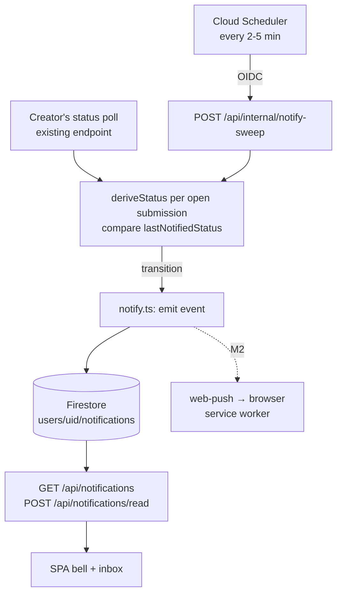

# Notifications: design & phased plan

> Status: **M0 + M1 + M1.5 shipped & verified in prod; M2 Web Push (desktop/Android) built**
> (2026-07-24). The Cloud Scheduler sweep is live and returning 200 every 2 min. Owner
> decisions folded in: email promoted to M1.5, provider = Resend (N4/N4b). Goal: tell players
> and creators when something they
> care about happens — game generation completed, a game they follow got an update — without
> forcing them to keep a tab open and poll. Builds on the M1 auth stack (Google sign-in,
> Firestore, sessions) from [`auth-and-usage-plan.md`](./auth-and-usage-plan.md).
>
> **Built so far:** `submission-status.ts` (extracted `deriveStatus`), notification storage
> on the `Store`, `notify.ts` (`emitSubmissionNotification` + `notifyOnTransition`),
> opportunistic poll-path detection in the status route, the OIDC-gated sweep endpoint
> `POST /api/internal/notify-sweep` (`internal-auth.ts`), the `GET/POST /api/notifications`
> read API, the in-app `NotificationBell`, and **M1.5 email**: bilingual notification email
> templates, best-effort email fan-out in `emitSubmissionNotification` (real send only when
> `RESEND_API_KEY` is set; skips unsubscribed/no-address; retries on failure via `emailedAt`),
> and the signed, wall-exempt one-click unsubscribe endpoint `GET /api/email/unsubscribe`.
> The in-app bell strings and the emails are both bilingual (en/pl).
>
> **M2 Web Push (built, 2026-07-24) — the "80/20" slice (desktop Chrome/Firefox/Edge +
> Android; iOS Safari's PWA-only path deferred):** the push seam `pusher.ts`
> (`WebPushPusher` over `web-push` HTTP, `NoopPusher` fake, env-gated
> `createPusherFromEnv`), push-subscription storage on the `Store`
> (`users/{uid}/pushSubscriptions/{hash-of-endpoint}`), the session-gated
> `GET /api/push/config` + `POST /api/push/{subscribe,unsubscribe}` routes
> (`push-routes.ts`), best-effort push fan-out in `emitSubmissionNotification` (fresh
> notifications only; prunes subscriptions the push service reports 404/410), the tiny
> notification-only service worker `apps/web/public/sw.js` (push + notificationclick,
> caches nothing), the client opt-in helper `pushApi.ts`, and a bilingual enable/on/blocked
> toggle in the `NotificationBell` panel. Real send only when a VAPID keypair is configured
> (`VAPID_PUBLIC_KEY` env + `vapid-private-key` secret); otherwise push is simply off and the
> UI hides the toggle. **Owner step to light it up:** create the `vapid-private-key` secret and
> set the `VAPID_PUBLIC_KEY` / `VAPID_SUBJECT` repo vars, then redeploy (commands below).
>
> **Remaining:** M3 player-facing events (`game.updated`, `catalog.new_game`) and, if wanted,
> the iOS PWA slice (manifest + install prompt) so iPhone Safari can receive push. Everything
> M0–M2 is built; the Cloud Scheduler sweep is live.
>
> **Cloud Scheduler setup (owner-run, after a deploy).** The sweep endpoint stays closed
> (deny-all) until `NOTIFY_SWEEP_AUDIENCE` + `NOTIFY_SWEEP_SA` are set on the service and a
> scheduler job posts to it with an OIDC token. Region-sensitive — the service runs in
> `europe-west1`:
>
> Set `NOTIFY_SWEEP_AUDIENCE` (and `NOTIFY_SWEEP_SA`) as repo variables, redeploy, then:
>
> ```bash
> ./infra/setup-sweeps.sh notify-sweep
> ```
>
> The endpoint no-ops fast when no submissions are open, so the 2-minute cadence keeps
> scale-to-zero economics. Until the job exists, the poll-path detection already delivers
> notifications whenever a creator views their status page.

## Problem

Today the only way to learn anything is to be looking at the site:

- A creator submits a spec, gets a status link, and the SPA **polls**
  `GET /api/submissions/:token` (tight while building, gentle otherwise —
  `SubmissionStatusView.tsx`). Close the tab and the "your game is live!" moment is lost;
  Copilot builds take long enough that most creators will close the tab.
- Status is **derived on demand** from GitHub state (issue → linked PR → catalog) inside
  `apps/api/src/submissions.ts`. There is no server-side record that a transition happened —
  no poll, no transition.
- Players have no way to hear about new games or updates to games they played.
- The Cloud Run service **scales to zero**; there is no resident process to watch anything.

So a notification capability needs three parts that don't exist yet: **detection** (notice a
transition without a browser attached), **storage** (a per-user record of what to tell them),
and **delivery** (in-app, push, email).

## Non-goals

- Real-time multiplayer signaling (invites/parties) — that's transport for
  [`multiplayer-plan.md`](./multiplayer-plan.md); notifications may _announce_ an invite
  later, but the QR-party flow doesn't depend on this.
- Notifying anonymous visitors. No anonymous interaction is an existing invariant; every
  notification is addressed to a `uid`.
- Marketing/broadcast email. Out of scope until there's a product reason and consent flow.

## Event taxonomy

| Event                       | Audience                   | Trigger source                                  | Milestone      |
| --------------------------- | -------------------------- | ----------------------------------------------- | -------------- |
| `submission.building`       | creator (owner)            | linked PR opened with game dir                  | M1             |
| `submission.published`      | creator (owner)            | PR merged + slug in published catalog           | M1             |
| `submission.needs_changes`  | creator (owner)            | issue/PR closed without merge                   | M1             |
| `submission.feedback_reply` | creator (owner)            | improvement-loop / QA reply on their submission | M2             |
| `game.updated`              | players following the game | new merge touches a game's directory            | M3             |
| `catalog.new_game`          | opted-in players           | new slug appears in catalog                     | M3             |
| `quota.reset` / system      | any                        | server-side                                     | later, if ever |
| `operator.waitlist_joined`  | operators (`ADMIN_UIDS`)   | `POST /api/waitlist` creates a new applicant    | closed beta    |

`submission.queued` and `in_review` are deliberately **not** notified — the creator just
performed the action or is mid-flow; notifying every micro-transition trains people to
ignore the channel. One notification per (submission, event type): transitions are
idempotent, dedup by deterministic doc id (see storage).

## Decisions

| #   | Decision               | Choice                                                                                                                                                                                                      | Why / alternatives                                                                                                                                                                                                                                                                                                                                                                                                                                                                                                                                                                                                                                                                                                                                                          |
| --- | ---------------------- | ----------------------------------------------------------------------------------------------------------------------------------------------------------------------------------------------------------- | --------------------------------------------------------------------------------------------------------------------------------------------------------------------------------------------------------------------------------------------------------------------------------------------------------------------------------------------------------------------------------------------------------------------------------------------------------------------------------------------------------------------------------------------------------------------------------------------------------------------------------------------------------------------------------------------------------------------------------------------------------------------------- |
| N1  | Detection mechanism    | **Cloud Scheduler sweep** (`POST /api/internal/notify-sweep`, OIDC-authenticated) over open submissions, reusing the existing status-derivation code; **plus opportunistic detection** on every status poll | GitHub webhooks rejected for M1: new public unauthenticated-ish surface, secret management, and the games-repo publish pipeline would need changes in a second repo. The sweep reuses `deriveStatus` logic verbatim and runs every 2–5 min only while any submission is open — negligible cost, no new inbound trust boundary. Webhooks can replace the sweep later without touching storage/delivery.                                                                                                                                                                                                                                                                                                                                                                      |
| N2  | Storage                | **Firestore**: `users/{uid}/notifications/{id}` + a `notificationState` doc per open submission for last-seen status                                                                                        | Already the datastore; per-user subcollection makes list + unread queries single-owner and cheap. Deterministic ids (`sub-{jobId}-{event}`) make emission idempotent — a crashed sweep can re-run safely.                                                                                                                                                                                                                                                                                                                                                                                                                                                                                                                                                                   |
| N3  | First delivery channel | **In-app notification center** (bell + unread badge + list), fetched on SPA boot and on a slow poll while the tab is open                                                                                   | Zero new consent, zero new infra, works for every signed-in user immediately. It is also the substrate every other channel links back to.                                                                                                                                                                                                                                                                                                                                                                                                                                                                                                                                                                                                                                   |
| N4  | Second channel         | **Transactional email at M1.5** (owner call, 2026-07-23), sent to the Google-verified address already on the user doc; per-category prefs + one-click unsubscribe from day one                              | Reaches closed-tab users with zero client-side opt-in friction: Google sign-in already gives us a verified address, so there is no verification flow to build and transactional "your game is ready" mail is expected, not spam. Costs: sending domain + SPF/DKIM/DMARC setup (one-time owner action) and a provider dependency — accepted.                                                                                                                                                                                                                                                                                                                                                                                                                                 |
| N4b | Email provider         | **Resend** (decided 2026-07-23), EU (Ireland) sending region, DPA signed; API key in Secret Manager, `mailer.ts` seam with an in-memory fake                                                                | Permanent free tier (3k/mo, 100/day) covers beta volume; custom-domain DKIM on free tier; single JSON-POST API fits the fetch-based client pattern (`github-client.ts`). SendGrid rejected: free plan retired 2025, trial-then-paid. Postmark rejected _for now_: best-in-class deliverability but 100/mo trial then paid — it's the swap target behind the seam if deliverability issues appear. US-jurisdiction caveat noted but not a differentiator: the whole stack already runs on GCP under the same DPA/SCC posture; Brevo (French, 300/day free) is the EU-native fallback if that posture changes. SMTP from Cloud Run is blocked/unreliable on default ports. Self-hosted/SES rejected for beta: IAM + reputation warm-up overhead for a handful of mails a day. |
| N4c | Third channel          | **Web Push (VAPID + service worker)** at M2, opt-in per browser                                                                                                                                             | Still worth having: instant, free, and reaches users who ignore email — but no longer the only closed-tab channel, so it can trail email.                                                                                                                                                                                                                                                                                                                                                                                                                                                                                                                                                                                                                                   |
| N5  | Preferences            | Per-category booleans on the user doc (`notifyPrefs`), default on for own-submission events, default off for catalog/broadcast categories                                                                   | Own-submission events are transactional (user asked for the build); broadcast categories must be opt-in from day one so the channel stays trusted.                                                                                                                                                                                                                                                                                                                                                                                                                                                                                                                                                                                                                          |
| N6  | Games cannot notify    | Generated games run in `sandbox="allow-scripts allow-pointer-lock"` iframes with no same-origin and get **no path** to the notification API                                                                 | Anything else hands arbitrary generated code a spam channel. Notifications originate only from server-side detection.                                                                                                                                                                                                                                                                                                                                                                                                                                                                                                                                                                                                                                                       |

## Data model (Firestore)

```
users/{uid}
  notifyPrefs: { submission: true, feedback: true, gameUpdates: false, newGames: false }
  emailPrefs:  { submission: true, feedback: true, gameUpdates: false, newGames: false }  # M1.5
  emailUnsubscribedAt: timestamp | null   # M1.5 — global kill switch from the unsubscribe link
  # email itself already on the doc from Google sign-in; existing fields unchanged

users/{uid}/notifications/{id}     # id deterministic, e.g. "sub-142-published"
  type: 'submission.published' | ...
  createdAt, readAt: timestamp | null
  emailedAt: timestamp | null      # M1.5 — set after successful send; retries are idempotent
  title, body                      # pre-rendered, both locales' keys — render client-side via i18n
  link                             # in-app route, e.g. "/status/<token>" or "/play/<slug>"

users/{uid}/pushSubscriptions/{hash-of-endpoint}      # M2
  endpoint, keys, createdAt, lastSuccessAt, userAgent

submissions/{jobId}          # existing doc gains:
  lastNotifiedStatus: SubmissionStatus   # sweep's last-seen state; transition = emit
  closedAt: timestamp | null             # sweep stops looking once terminal + notified
```

Cost posture (same discipline as dropping the usage-events collection): the sweep reads only
**open** submissions, writes only on **transitions**, and the unread badge is a single
`limit(20)` query on SPA boot — no fan-out writes until M3's `game.updated`, which is why
follows/fan-out are deferred until something needs them.

## Architecture



Detection is **dual-path on purpose**: the existing browser poll already computes status, so
when a poll observes a transition it emits inline (instant while the creator is watching);
the sweep is the backstop for closed tabs. Both paths converge on the same idempotent
`emit()`, so double-detection is a no-op.

## API changes

- `apps/api/src/notifications/notify.ts` (new): `emit(uid, event, payload)` — idempotent Firestore write;
  M1.5 adds email fan-out (checks `emailPrefs` + `emailUnsubscribedAt`, sends via the
  mailer seam, stamps `emailedAt` — a failed send leaves it null so the next sweep retries);
  M2 adds push fan-out with dead-subscription pruning (delete on 404/410 from the push
  service). Same seam pattern as `store.ts`: in-memory fake for tests.
- `apps/api/src/notifications/mailer.ts` (new, M1.5): provider HTTP client behind a `Mailer` interface +
  in-memory fake. Bilingual templates (en/pl chosen by the user's last-seen locale, stored
  on the user doc at login), `List-Unsubscribe` header, plain-text-first with minimal HTML.
- `GET /api/email/unsubscribe?token=` (M1.5) — **no session required**: signed HMAC token
  (same discipline as `submission-token.ts`) embedding uid + purpose, sets
  `emailUnsubscribedAt`, renders a confirmation page with a "manage preferences" link.
  Must work from a mail client on a device that has never signed in.
- `apps/api/src/notify-sweep.ts` (new): `POST /api/internal/notify-sweep` — rejects
  anything without a valid Cloud Run OIDC token from the scheduler SA; iterates open
  submissions, reuses the status derivation extracted from `submissions.ts` (extract
  `deriveStatus` into a shared module rather than duplicating it), emits on transition,
  updates `lastNotifiedStatus`, marks terminal submissions closed.
- `GET /api/notifications` — session-gated, `?after=` cursor, newest first, limit 20.
- `POST /api/notifications/read` — body `{ ids }` or `{ all: true }`.
- `GET/PUT /api/notifications/prefs` — session-gated prefs read/update.
- M2: `POST /api/push/subscribe`, `POST /api/push/unsubscribe` — session-gated;
  `GET /api/push/vapid-public-key` public.

## Web changes

- `NotificationBell.tsx` in `NavHeader` — unread badge; fetch on boot + 60s slow poll while
  visible (piggyback on the existing auth boot, no new websocket).
- `NotificationList.tsx` — dropdown/panel, mark-read on open, each item deep-links
  (status page, published game).
- i18n (en/pl) for all notification titles/bodies — store i18n keys + params in the doc,
  render in the client, so language switching works retroactively.
- M2: service worker (`apps/web/public/sw.js`) handling `push` + `notificationclick`;
  opt-in UI on the status page at the moment it's most wanted ("Get notified when your game
  is ready") — permission prompts on page load are hostile and get blanket-denied.

## Infra / CI/CD

- **Cloud Scheduler job** → Cloud Run URL with OIDC (scheduler SA gets `roles/run.invoker`);
  added idempotently to `infra/setup-gcp.sh`. Sweep cadence 2 min; the endpoint no-ops
  fast when there are no open submissions, so scale-to-zero economics survive.
- **M1.5 email**: provider API key → Secret Manager (`mailer-api-key`), wired into the
  existing `--set-secrets` list in `deploy.yml` + `infra/deploy-api.sh` — remember the
  bash 3.2 empty-array fix and the secretmanager IAM binding step that bit during M1 auth.
  **Owner actions**: pick provider account, add SPF/DKIM/DMARC DNS records for the sending
  domain (use a subdomain like `mail.gamedev.pl` so experiments can't damage the root
  domain's reputation), verify domain in the provider console. Document in
  `docs/deployment.md`. The unsubscribe endpoint must sit **outside** the Basic-Auth wall
  (same exemption mechanism as `/api/health`) — mail-client clicks can't answer a
  Basic-Auth prompt.
- **M2 secrets**: VAPID key pair → Secret Manager (`vapid-private-key`; public key is a
  plain env var). Same wiring as above.
- **CI**: unit tests on the store fake — transition detection matrix (each status pair →
  emit / no-emit), idempotent double-emit, sweep auth rejection (no token / wrong audience),
  prefs gating, email fan-out on the mailer fake (prefs off → no send, unsubscribe honored,
  failed send → `emailedAt` stays null → retried, success → not re-sent), unsubscribe-token
  forgery/expiry, push-subscription pruning on 410. No live Firestore/mail/push calls in CI.

## Milestones

- **M0 — seam & schema** (with M1, not separately shippable): extract `deriveStatus`,
  add `notify.ts` + fakes, Firestore fields. Pure refactor + tests.
- **M1 — creator transactional notifications, in-app**: sweep + scheduler, emission on
  `building`/`published`/`needs_changes`, bell + inbox + read state, prefs read-only
  (all-on). _Value: the "your game is live" moment survives a closed tab — visible next
  time the creator returns._
- **M1.5 — transactional email** (owner call: needed early): mailer seam + provider,
  sending-domain DNS, email fan-out for the three creator events, editable prefs UI,
  signed unsubscribe link outside the Basic-Auth wall. _Value: closed-tab creators are
  actually reached — this is the milestone that pays for the whole feature._ Transactional
  creator events only; no digests, no broadcast.
- **M2 — Web Push**: VAPID, service worker, opt-in on the status page, subscription
  lifecycle + pruning. _Value: instant delivery for users who ignore email; also the
  channel that will carry player-facing events cheaply at M3._
- **M3 — player-facing events**: `game.updated` for followed games and opt-in
  `catalog.new_game`. Depends on a follow/play-history feature that doesn't exist yet —
  scope that with the improvement loop, since "the game you played got better" is the
  improvement loop's re-engagement hook. Player events go to in-app + push by default;
  extending them to email means digest batching — a separate decision, not implied here.

## Risks & open questions

1. **Sweep vs. webhook long-term**: at large open-submission counts the sweep's GitHub API
   reads could pinch rate limits. The existing status cache in `submissions.ts` should be
   shared by the sweep; if volume grows, swap N1 to a games-repo `workflow_run` → API
   webhook without touching storage/delivery.
2. **Notification fatigue**: taxonomy starts minimal on purpose; any new event type needs
   the same "would the user thank us?" test, and broadcast categories stay opt-in.
3. **Multi-browser push**: one user, several subscriptions — fan out to all, prune dead
   ones. Session expiry doesn't invalidate push subscriptions; a **blocked** user's
   subscriptions must be dropped at the same re-read point that blocks their spends.
4. **Closed-beta interaction**: while Basic-Auth is the outer wall, email and push link
   clicks land on the Basic-Auth prompt in a fresh browser profile — and email makes this
   acute at M1.5 (mail is read on phones that never saw the wall). Mitigation: beta
   recipients already hold the shared credential, and the email body should say "sign in
   with the beta credentials" until cutover; the unsubscribe endpoint is exempted from the
   wall (see infra). Recheck the whole path at domain cutover
   ([`closed-beta-launch-plan.md`](./closed-beta-launch-plan.md)).
5. **Deliverability**: a new domain sending its first transactional mail can land in spam.
   Mitigations: dedicated `mail.` subdomain with SPF/DKIM/DMARC from day one, transactional
   volume only (no broadcast until M3+), provider with established shared-IP reputation,
   and the in-app inbox as the always-works fallback — email is additive, never the only
   record of an event.
6. **Locale drift**: storing i18n keys (not rendered text) means old notifications must
   tolerate missing keys after copy changes — client falls back to a generic label. Emails
   are rendered at send time, so they don't have this problem but do need the user's
   locale stored server-side (captured at login).
7. **AGY coordination**: another agent works this tree (`AGY_TO_CLAUDE.md` protocol). The
   `deriveStatus` extraction touches `submissions.ts`, which it also edits — announce in
   the channel file before starting M0.
