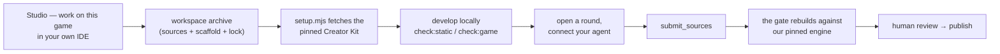

# Working on a game in your own IDE

> **Status: ✅ Live.** Both halves shipped 2026-08-04 and the round trip has been exercised
> against production. See [`games-repo.md`](./games-repo.md) for how a game is normally
> built and [`security-model.md`](./security-model.md) for the boundaries this respects.
>
> Not yet announced to creators, and the archive's README still carries a placeholder where
> the terms of use will go.

Most creators describe a game and let an agent build it. Some would rather open the code in
their own editor, with their own tools, their own Git history. This is that path.

It is a **checkout, not a handover.** The game's home stays here: gamedev.pl remains its
system of record, and the only place it publishes from. What a creator gets is a working
copy and a documented way back.

## The round trip

Nothing about the second half changes: delivery, gating and publication are the same path
every other build takes, which is what keeps one set of invariants rather than two.

## What is in the archive

`GET /api/me/studio/games/:slug/workspace` (session-authenticated, owner only) composes
three things from three owners:

| Part                | Owner      | Why there                                                           |
| ------------------- | ---------- | ------------------------------------------------------------------- |
| `games/<slug>/…`    | the store  | The same bytes the gate last read, so the copy matches what shipped |
| scaffold + `README` | games repo | It describes the kit's own commands, so it lives with the kit       |
| `gamedev.lock`      | this app   | Only the site knows the current engine and where to fetch that kit  |

**GameKit is not in the archive.** The engine is not published to any registry; `setup.mjs`
fetches the pinned kit against a short-lived signed URL, verifies its digest, and the
scaffold gitignores it. That is a licensing boundary, and it is also why a working copy is
not a fork: sources without the engine do not run.

Nothing built is accepted back, either — the site assembles the bundle, because that is
where serve-time policy lives (CSP, AI-Act provenance marking, the credential scan, the byte
budget). See `apps/api/src/platform/workspace-archive.ts`.

## Engine pinning and coming back after a while

The lock pins the checkout to one `engineRef`. The kit registry supports a window of the
current engine and the one before it, so a workspace left alone across a couple of engine
releases will get a `kit_outdated` verdict when it delivers.

That is a recoverable chore, not a dead end: re-run `setup.mjs` to fetch the current kit,
re-run `npm run check:game`, **read** the trace diff, accept it deliberately, and deliver.
`TRACE.json` and media freshness are functions of the assembled bundle, so they genuinely do
change when the engine does — an accepted diff should be a decision, not a reflex.

Start every returning session by pulling current sources and diffing. Platform-side lanes
(content edits in the Studio, improvement rounds) can move a game while a checkout sits on
someone's disk, and the checkout is not the source of truth.

The `gamedevpl` CLI records the platform version at checkout time (`.gamedev-base.json`)
and classifies later `diff` / `pull` / `submit` against that base: local-only, platform-only,
both, or a real path conflict. Ordinary local edits are not a conflict. `pull` will not
overwrite unsaved local files; if the same path changed on both sides it refuses and tells
you to copy those files aside first. Delivery is `gamedevpl submit`, which stages through
`/api/me/studio/games/:slug/sources/stage` and delivers through
`/api/me/studio/games/:slug/sources/deliver` — the same Code-surface path Studio uses.
Accepted sources, a started gate, a gate verdict, and publish are four different events.

## One delivery allowlist, not two

Which files a game may deliver used to be a literal here and a second literal in the games
repo's `tools/submit.mjs`. It drifted three times — `TRACE.json`, then `PLAYTEST.json`, then
`AGENT.json` — and each drift meant a correct game was refused at upload for sending a file
validation had just started requiring.

Both sides now read the games repo's `shared/delivery-contract.json`, and
`npm run contract:games-repo` fails on drift. The comparison is asymmetric on purpose:

- The games repo sends a path this side refuses → **drift, CI fails.** That is the failure
  creators feel.
- This side accepts a path the games repo does not list yet → **a note, CI passes.** That is
  the intended middle of a rollout, because the accepting side must always widen first.

Removals run the same rule in reverse: the games repo stops sending a file first, and this
side drops the entry last. The allowlist here is never the narrower of the two.
