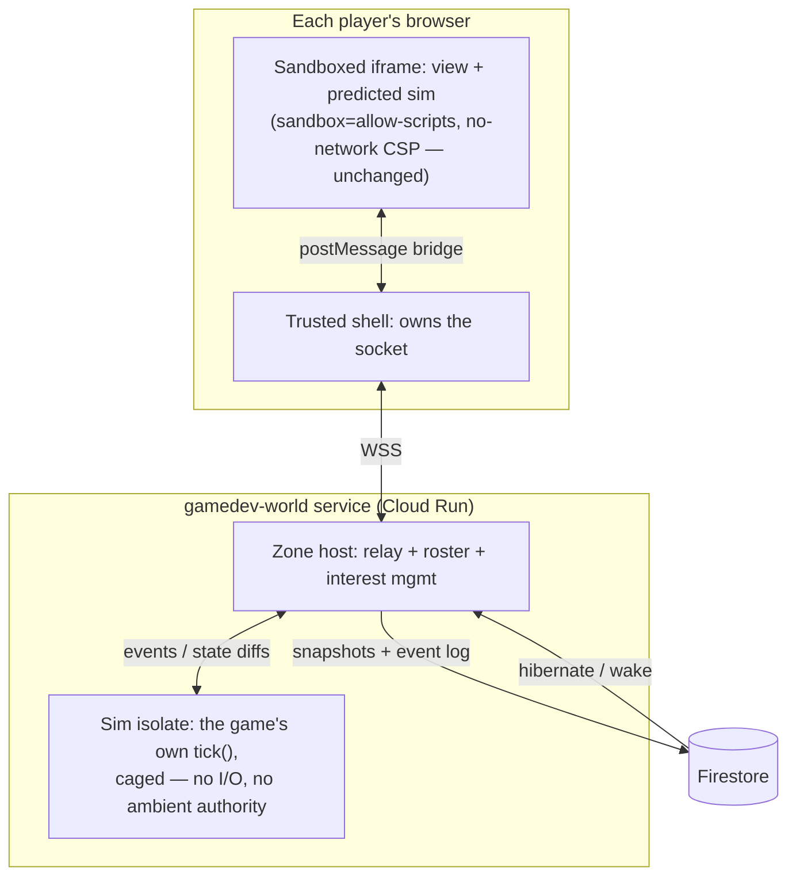

# Persistent shared worlds — concept exploration

Status: 💭 **Concept exploration, not scheduled.** This document answers the question
_"if we wanted a game like Ultima Online on this platform, how could we achieve it?"_ —
written 2026-07-28 against the shipped party-mode architecture
([multiplayer-plan.md](./multiplayer-plan.md)). Nothing here is committed roadmap; the value
is that the phasing below decomposes an MMO into steps that are each independently shippable
products, so the platform can walk toward this without betting on the destination.

---

## 1. What "Ultima Online" actually is, decomposed

An MMO with a shared persistent world is not one feature. It is five capabilities stacked,
and they have very different costs on this platform:

| #   | Capability             | What it means                                                              | UO example                                  |
| --- | ---------------------- | -------------------------------------------------------------------------- | ------------------------------------------- |
| 1   | **Durable identity**   | A character that survives sessions: inventory, skills, position            | Log out in Britain, log back in in Britain  |
| 2   | **Shared simultaneity**| Other players visibly act in real time in the same space                   | Watching someone chop a tree next to you    |
| 3   | **Independent world**  | The world evolves when you're not there                                    | Your house stands; crops grow; mobs respawn |
| 4   | **Scale via space**    | Zoning and interest management — you only receive what is near you         | Britain and Minoc don't share a netcode fate|
| 5   | **Social permanence**  | Chat, guilds, trade, reputation — durable player-to-player artifacts       | The player-run economy, and its scammers    |

Capability 1 is a persistence feature. Capability 2 is a networking feature (partly shipped —
see §2). Capability 3 is the genuinely new and hard one here, because it forces the question
_"who runs the simulation when no player is present?"_ Capability 4 is an architecture
pattern, not a technology. Capability 5 is mostly a **product and moderation** problem, and
on a platform whose games are public and anonymous-guest-friendly it is the one most likely
to bite first.

The phasing in §5 ships them roughly in this order, because each earlier capability is
useful to ordinary games long before anything UO-shaped exists.

---

## 2. What the platform already has

More than expected. The party-mode work ([multiplayer-plan.md](./multiplayer-plan.md),
shipped 2026-07-26) built several of the load-bearing pieces:

- **A realtime transport with rooms, admission control, and join tokens** —
  [`apps/api/src/mp.ts`](../apps/api/src/mp.ts): WebSocket relay, HMAC-signed join tokens,
  per-connection rate limits (40 frames/s, 2 KB frames), zod-validated wire protocol,
  room lifecycle. Today it relays only controller inputs for one shared screen, but the
  session plumbing (create/join/kick/reconnect-into-slot) is exactly what a "zone" needs.
- **The bridge pattern** — games never touch the network. The sandboxed iframe
  (`sandbox="allow-scripts"`, no-network CSP) talks `postMessage` to the trusted shell,
  which owns the socket. This is the platform's answer to "untrusted code in a multiplayer
  system" and it extends unchanged to everything below.
- **Durable storage with real discipline** — [`apps/api/src/store.ts`](../apps/api/src/store.ts)
  (Firestore), including document-size awareness, TTL policies, and — importantly — a
  working **data-erasure path** ([`erase-player-signals.ts`](../apps/api/src/erase-player-signals.ts)).
  Persistent character data would join an existing privacy regime, not invent one.
- **Identity for signed-in users** — Google sign-in, sessions, the beta allowlist. Guests
  are anonymous by design; §9 discusses the tension.
- **A deterministic runtime seam** — GameKit's core module already provides seeded RNG and
  deterministic timing in capture mode
  ([`shared/modules/core.ts`](https://github.com/gamedevpl/www.gamedev.pl-games) in the games
  repo), and every published game must pass a deterministic `CAPTURE.json` replay in CI.
  The platform already knows how to demand determinism from agent-written code and verify
  it mechanically. This is the single most valuable existing asset for §6.
- **A moderation seam** — [`moderation.ts`](../apps/api/src/moderation.ts) deny-lists
  nicknames that appear on shared screens. Persistent worlds multiply this surface (§9).
- **The CI philosophy** — guarantees are _derived from game source and enforced by
  validation_, not declared in specs (touch support is the precedent). Every new contract
  below is designed to be checkable the same way.

What does **not** exist: any way for game state to outlive a room (`mp.ts` rooms are
explicitly ephemeral, nothing persisted), any way for a game to run outside a player's
browser, and any server that understands game rules.

---

## 3. The problem that makes this platform different from Origin Systems

In UO, the authoritative world simulation runs on servers executing **trusted code written
by the studio**. Here, game code is written by coding agents and is **untrusted by
definition** — the entire safety model is "execution, not inspection"
([security-model.md](./security-model.md)): we don't audit game code, we cage it.

So the question "who simulates the persistent world?" has exactly three possible answers,
and the whole design space falls out of choosing among them:

| Option | The world is simulated by…                        | Trust story                                                                 | Fails at                                                                    |
| ------ | -------------------------------------------------- | --------------------------------------------------------------------------- | --------------------------------------------------------------------------- |
| **A**  | A player's browser (host-authoritative, persisted) | Same cage as today; host is a player, so the host can cheat                 | Cheating, world offline when nobody hosts, host-migration conflicts         |
| **B**  | The platform, via **generic typed primitives**     | No game code runs server-side at all; server enforces schema + quotas       | Can't express real game rules server-side; logic-level cheating possible    |
| **C**  | The game's **own sim code in a server-side cage**  | The iframe invariant gets a twin: an isolate with no I/O, message-only      | New trust surface; requires the deterministic-sim contract (§6); infra cost |

The platform's honest path is **A → B → C in that order**, because:

- A is nearly free (party mode + a save call) and is enough for co-op worlds among friends —
  the "Minecraft server your friend hosts" trust model, which is a real and beloved genre.
- B is enough for the _asynchronous_ half of UO — housing, farming, inventories, trade
  boards, guild bases — which is most of what "persistent world" means emotionally, and it
  never runs untrusted code on our servers.
- C is the only way to get authoritative real-time shared simulation (actual UO combat),
  and it only becomes worth its cost once A and B have proven demand.

Crucially, agent-written games **will get distributed systems wrong constantly** — the
multiplayer plan said this about mode C and it is even more true here. Every contract below
is therefore designed so the agent writes _single-machine, deterministic, pure_ code, and
the platform owns all distribution. The agent should never see a socket, a clock, or a
conflict.

---

## 4. Architecture overview

The end-state (Phase P3) looks like this; earlier phases are strict subsets:



- The **iframe invariant is untouched** in every phase: games never gain network access;
  the bridge grows new typed message kinds, nothing else.
- The **sim isolate** (P3 only) is the iframe's server-side twin: same philosophy —
  safety by execution environment, not code inspection. V8 isolate (or hardened worker),
  no imports, no timers, no `Date`/`Math.random`, CPU- and memory-metered, message-only.
- **Firestore holds truth at rest**: zone snapshots plus an event log between snapshots.
  Zones with no players **hibernate**; on wake the game's own code decides how elapsed
  wall-time applies (§6.3). This bounds infra cost to "zones people are actually in" —
  the difference between an MMO's server bill and a platform feature's.

---

## 5. The phases — each one a product on its own

### P1 — Durable per-player state (capability 1)

A `save` GameKit module: the game asks the bridge to persist a small versioned blob, keyed
`(uid, slug)`; the shell forwards to a new authenticated API route; Firestore stores it
(size-capped ~32 KB, schema-versioned, covered by the existing erasure path).

- Unlocks a whole genre the catalog quietly wants already — many SPECs say "no persistence"
  only because there was no way to have it (`four-seasons-farm` is persistence-shaped).
- CI check mirrors the party precedent: selecting the module requires calling it; the
  offline-only rule is unchanged (the _bridge_ is the channel, exactly like `party`).
- Signed-in players only; a game must degrade gracefully to sessionless play (the module
  reports `available: false`, same feature-detection pattern as `createParty`).

### P2 — Shared asynchronous worlds (capabilities 1+3+5, "Ultima-lite")

The platform, not the game, owns a **typed world store**: named zones holding a keyed
document set with a `GAME.json`-declared schema. Games mutate it through bridge commands;
the server enforces **generic** constraints only — schema validity, per-player rate/quota
caps, ownership rules ("only the writer may edit/delete"), size budgets, moderation of
string fields. Presence and light liveness ride the existing relay.

- This is option B: no game logic on the server, so logic-level cheating is possible —
  acceptable for **cooperative** worlds (shared gardens, town notice boards, guild bases,
  asynchronous trade stalls, message-in-a-bottle mechanics). The design stance is
  _trust the client, bound the blast radius_: quotas cap what any one player can do.
- Emotionally, this already delivers most of "persistent world": you build a thing, log
  off, and it is still there when strangers walk past it.
- It is also the cheapest possible way to learn the **moderation and griefing** lessons
  (§9) before any real-time engineering exists.

### P3 — Authoritative real-time zones (capabilities 2+3+4, "the real thing")

Option C: the game ships a **deterministic sim** (§6) that the platform runs in a caged
isolate per active zone. The relay evolves from input-forwarder into a zone host that feeds
player events to the sim, broadcasts state diffs with interest management, snapshots to
Firestore, and hibernates empty zones. Clients run the _same_ sim for prediction and render
through a separate view entry point.

- Server-authoritative, so competitive mechanics and real economies become possible.
- The world scales by zones, not by world: each zone is a room-sized problem, which is
  exactly the size `mp.ts` already handles.

---

## 6. The deterministic sim contract (the key idea)

The one contract that makes P3 achievable by coding agents: **the game is split into a pure
simulation and a view**, and CI proves the split mechanically.

### 6.1 Shape

```jsonc
// GAME.json
{ "engine": { "modules": ["…", "world-sim"] },
  "world": { "tick_hz": 10, "max_players_per_zone": 16 } }
```

```js
// sim.js — pure, deterministic, runs in the server isolate AND in every client for prediction
export function init(seed) { /* → initial zone state */ }
export function tick(state, events, rng) { /* → next state; events = [{slot, k, v}, join, leave] */ }
export function wake(state, elapsedMs, rng) { /* → state after hibernation (crops grew) */ }

// view.js — runs only in the sandboxed iframe; renders state, never mutates it
export function render(draw, state, myPlayerId) { /* … */ }
```

No DOM, no `Date`, no `Math.random`, no floating wall-clock in `sim.js` — the platform
provides the tick counter and a seeded `rng` (GameKit's capture mode already does exactly
this, so the runtime seam exists). Latency tolerance comes from the same steer as party
mode: 10 Hz ticks and designs where a 100 ms round trip doesn't hurt.

### 6.2 Why an agent can write this

Because it is **single-machine code**. The agent never sees networking, reconciliation,
or clocks — it writes `tick(state, events)`, which is the same mental model as the game
loop it already writes today. Everything distributed (transport, prediction, rollback,
snapshotting, hibernation) is platform code written once, tested once, shared by every game.

### 6.3 Why CI can verify it

- **Determinism check**: run the sim twice over a recorded event stream in the existing
  capture harness; assert identical state hashes per tick. Flaky = rejected. This is the
  same muscle as `CAPTURE.json` today.
- **Purity check**: execute `sim.js` in a bare worker with no DOM/network/clock globals;
  any reference throws. This _derives_ server-runnability from source — the touch-support
  precedent applied to netcode.
- **Budget check**: a tick must complete within a CPU/memory budget in the harness, since
  the same code will be metered in the server isolate.

---

## 7. Security invariants (extensions, no revisions)

1. The iframe stays exactly `sandbox="allow-scripts"` with the no-network CSP, all phases.
   New capability arrives only as typed, size-capped, rate-limited bridge messages.
2. The P3 sim isolate is governed by the same doctrine as the iframe: no ambient authority,
   no I/O, message-only, metered. It is a **second cage, not a second trust decision** —
   and it deserves the same "if you break it, report privately" status in
   [SECURITY.md](../SECURITY.md).
3. Everything from a client remains hostile input at both the server edge and the shell,
   unchanged from party mode.
4. Persistent data multiplies privacy surface: every new collection joins the erasure walk
   in `erase-player-signals.ts` the day it is created, not later.
5. Quotas everywhere: per-player write quotas (P2), per-zone CPU/memory budgets (P3),
   per-game storage budgets (P1). A runaway or malicious game degrades itself, not the
   platform.

---

## 8. Infrastructure reality

- **`--max-instances 1` must fall first.** Persistent zones cannot live in the memory of a
  process that Cloud Run reaps. The multiplayer plan already names the upgrade paths
  (§4.6 there); the one that fits zones best: a separate `gamedev-world` service plus a
  **zone directory** in Firestore mapping `zoneId → instance`, so the shell dials the right
  host. Hibernation makes instance loss survivable by design — an instance dying is just
  an unscheduled hibernate (snapshot + event log replay on wake).
- **Cost model**: active zone ≈ one room's worth of sockets + one metered isolate at
  10 Hz. Empty zone ≈ one Firestore document. The bill scales with concurrent play, not
  with how many worlds exist — this is what makes "everyone can prompt an MMO" survivable.
- **Isolate technology** is a real decision for P3 (V8 isolates via `isolated-vm`, workers
  with hardened realms, or a WASM-compiled sandbox); it needs a spike before any commitment.
  P1 and P2 need none of it.

---

## 9. Product questions (the honest hard part)

- **Identity vs. the guest ethos.** Party mode's guests are anonymous and ephemeral —
  correct for a couch. A persistent character requires durable identity. Proposed line:
  guests can *visit* a world anonymously (read-only or sandboxed presence), but persistence
  requires sign-in, with a "claim this character" upgrade moment. Never a sign-in wall in
  front of first play.
- **Moderation of persistent creations.** A griefer's obscene tower _stays built_. P2 needs
  owner/creator tools from day one: report, world-owner kick/ban lists, platform takedown,
  string fields through `moderation.ts`, and quotas that cap defacement speed. This is the
  main reason P2 should ship on cooperative genres first.
- **World ownership and lifecycle.** Does a world belong to the game, or does the creator's
  prompt spawn _their_ world with them as mayor? (The latter is a compelling product:
  "prompt a world, invite your guild.") Either way worlds need an end-of-life policy —
  archived after N months idle, exportable, erasable.
- **Economy and cheating.** P2 explicitly tolerates logic-level cheating (cooperative
  stakes); anything competitive or trade-based waits for P3's server authority. Saying
  this out loud in agent instructions steers generated designs to the right phase.
- **The catalog story.** A persistent-world game's card is not "Play" but "Enter world —
  12 online now." Presence counts, world browse, and "your character lives here" resume
  states are a real UX workstream that P2 already needs.

---

## 10. What to prototype first

1. **P1 spike** (small): `save` module + bridge + route + erasure coverage, retrofit one
   persistence-shaped game. Proves the bridge-to-Firestore seam end to end.
2. **P2 seed world** (the learning vehicle): one first-party cooperative world — e.g. a
   shared town garden with plots, planting, and a notice board. Small enough to build like
   `tactics-duel` was; enough to exercise schema, quotas, moderation, presence, and the
   "log off, come back, it's still there" magic that is the actual point.
3. **P3 paper spike only**: pick the isolate technology and write the determinism CI check
   against an existing captured game — _before_ designing anything else, because if
   agent-written sims can't reliably pass the determinism gate, P3's premise fails and we
   should know early.

The UO question, answered: yes — not by building an MMO server, but by extending the two
things this platform already believes in (the cage and the CI-derived contract) until a
world can live in them.
