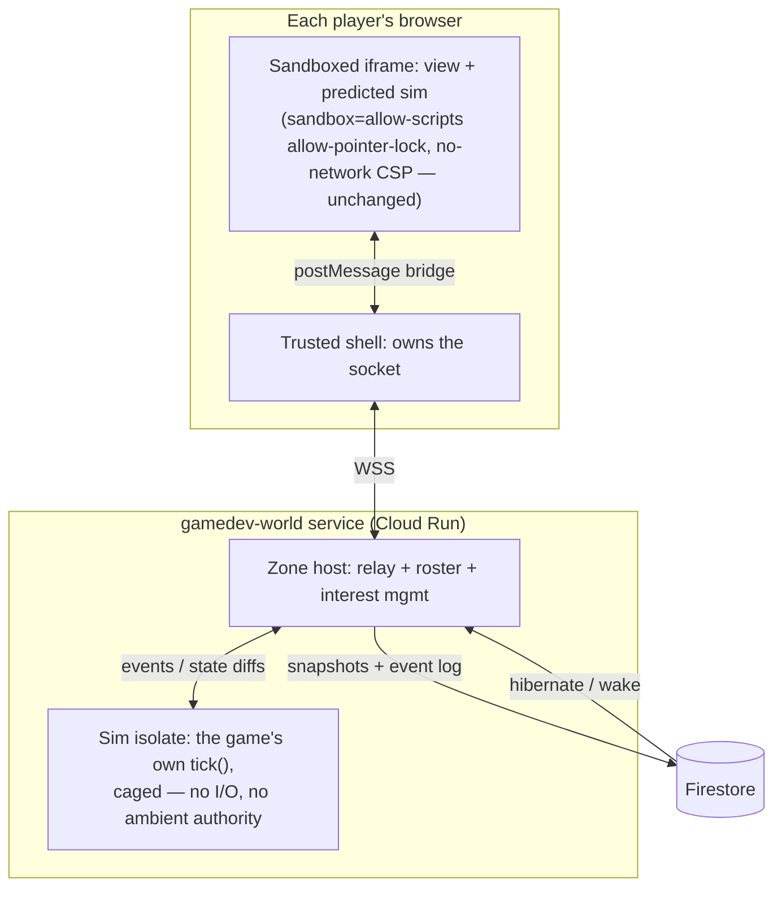

# Persistent shared worlds — concept exploration

Status: **P1, P2 and P2.5 built 2026-07-28. P3's spike is done and its premise survived
([p3-sim-spike.md](./p3-sim-spike.md)); the phase itself is not scheduled.**
This document answers the question
_"if we wanted a game like Ultima Online on this platform, how could we achieve it?"_ —
written against the shipped party-mode architecture
([multiplayer-plan.md](./multiplayer-plan.md)). The value is that the phasing below
decomposes an MMO into steps that are each independently shippable products, so the platform
can walk toward this without betting on the destination.

**P1 (durable per-player state), P2 (shared asynchronous worlds) and P2.5 (ambient
presence) are implemented and gated**, in both repos. P3 has been spiked but not built,
and nothing beyond P2.5 is committed roadmap.

---

## 1. What "Ultima Online" actually is, decomposed

An MMO with a shared persistent world is not one feature. It is five capabilities stacked,
and they have very different costs on this platform:

| #   | Capability              | What it means                                                        | UO example                                   |
| --- | ----------------------- | -------------------------------------------------------------------- | -------------------------------------------- |
| 1   | **Durable identity**    | A character that survives sessions: inventory, skills, position      | Log out in Britain, log back in in Britain   |
| 2   | **Shared simultaneity** | Other players visibly act in real time in the same space             | Watching someone chop a tree next to you     |
| 3   | **Independent world**   | The world evolves when you're not there                              | Your house stands; crops grow; mobs respawn  |
| 4   | **Scale via space**     | Zoning and interest management — you only receive what is near you   | Britain and Minoc don't share a netcode fate |
| 5   | **Social permanence**   | Chat, guilds, trade, reputation — durable player-to-player artifacts | The player-run economy, and its scammers     |

Capability 1 is a persistence feature. Capability 2 is a networking feature (partly shipped —
see §2). Capability 3 is the genuinely new and hard one here, because it forces the question
_"who runs the simulation when no player is present?"_ Capability 4 is an architecture
pattern, not a technology. Capability 5 is mostly a **product and moderation** problem, and
on a platform whose games are public and anonymous-guest-friendly it is the one most likely
to bite first.

The phasing in §5 ships them roughly in this order, because each earlier capability is
useful to ordinary games long before anything UO-shaped exists.

---

## 2. What the platform already has

More than expected. The party-mode work ([multiplayer-plan.md](./multiplayer-plan.md),
shipped 2026-07-26) built several of the load-bearing pieces:

- **A realtime transport with rooms, admission control, and join tokens** —
  [`apps/api/src/realtime/mp.ts`](../apps/api/src/realtime/mp.ts): WebSocket relay, HMAC-signed join tokens,
  per-connection rate limits (40 frames/s, 2 KB frames), zod-validated wire protocol,
  room lifecycle. Today it relays only controller inputs for one shared screen, but the
  session plumbing (create/join/kick/reconnect-into-slot) is exactly what a "zone" needs.
- **The bridge pattern** — games never touch the network. The sandboxed iframe
  (`sandbox="allow-scripts allow-pointer-lock"`, no-network CSP) talks `postMessage` to the trusted shell,
  which owns the socket. This is the platform's answer to "untrusted code in a multiplayer
  system" and it extends unchanged to everything below.
- **Durable storage with real discipline** — [`apps/api/src/store.ts`](../apps/api/src/store.ts)
  (Firestore), including document-size awareness, TTL policies, and — importantly — a
  working **data-erasure path** ([`erase-player-signals.ts`](../apps/api/src/erase-player-signals.ts)).
  Persistent character data would join an existing privacy regime, not invent one.
- **Identity for signed-in users** — Google sign-in, sessions, the beta allowlist. Guests
  are anonymous by design; §9 discusses the tension.
- **A deterministic runtime seam** — GameKit's core module already provides seeded RNG and
  deterministic timing in capture mode
  ([`shared/modules/core.ts`](https://github.com/gamedevpl/www.gamedev.pl-games) in the games
  repo), and every published game must pass a deterministic `CAPTURE.json` replay in CI.
  The platform already knows how to demand determinism from agent-written code and verify
  it mechanically. This is the single most valuable existing asset for §6.
- **A moderation seam** — [`moderation.ts`](../apps/api/src/moderation.ts) deny-lists
  nicknames that appear on shared screens. Persistent worlds multiply this surface (§9).
- **The CI philosophy** — guarantees are _derived from game source and enforced by
  validation_, not declared in specs (touch support is the precedent). Every new contract
  below is designed to be checkable the same way.

What does **not** exist: any way for game state to outlive a room (`mp.ts` rooms are
explicitly ephemeral, nothing persisted), any way for a game to run outside a player's
browser, and any server that understands game rules.

---

## 3. The problem that makes this platform different from Origin Systems

In UO, the authoritative world simulation runs on servers executing **trusted code written
by the studio**. Here, game code is written by coding agents and is **untrusted by
definition** — the entire safety model is "execution, not inspection"
([security-model.md](./security-model.md)): we don't audit game code, we cage it.

So the question "who simulates the persistent world?" has exactly three possible answers,
and the whole design space falls out of choosing among them:

| Option | The world is simulated by…                         | Trust story                                                            | Fails at                                                                    |
| ------ | -------------------------------------------------- | ---------------------------------------------------------------------- | --------------------------------------------------------------------------- |
| **A**  | A player's browser (host-authoritative, persisted) | Same cage as today; host is a player, so the host can cheat            | Cheating, world offline when nobody hosts, host-migration conflicts         |
| **B**  | The platform, via **generic typed primitives**     | No game code runs server-side at all; server enforces schema + quotas  | Can't express real game rules server-side; logic-level cheating possible    |
| **C**  | The game's **own sim code in a server-side cage**  | The iframe invariant gets a twin: an isolate with no I/O, message-only | New trust surface; requires the deterministic-sim contract (§6); infra cost |

The platform's honest path is **A → B → C in that order**, because:

- A is nearly free (party mode + a save call) and is enough for co-op worlds among friends —
  the "Minecraft server your friend hosts" trust model, which is a real and beloved genre.
- B is enough for the _asynchronous_ half of UO — housing, farming, inventories, trade
  boards, guild bases — which is most of what "persistent world" means emotionally, and it
  never runs untrusted code on our servers.
- C is the only way to get authoritative real-time shared simulation (actual UO combat),
  and it only becomes worth its cost once A and B have proven demand.

Crucially, agent-written games **will get distributed systems wrong constantly** — the
multiplayer plan said this about mode C and it is even more true here. Every contract below
is therefore designed so the agent writes _single-machine, deterministic, pure_ code, and
the platform owns all distribution. The agent should never see a socket, a clock, or a
conflict.

---

## 4. Architecture overview

The end-state (Phase P3) looks like this; earlier phases are strict subsets:



- The **iframe invariant is untouched** in every phase: games never gain network access;
  the bridge grows new typed message kinds, nothing else.
- The **sim isolate** (P3 only) is the iframe's server-side twin: same philosophy —
  safety by execution environment, not code inspection. V8 isolate (or hardened worker),
  no imports, no timers, no `Date`/`Math.random`, CPU- and memory-metered, message-only.
- **Firestore holds truth at rest**: zone snapshots plus an event log between snapshots.
  Zones with no players **hibernate**; on wake the game's own code decides how elapsed
  wall-time applies (§6.3). This bounds infra cost to "zones people are actually in" —
  the difference between an MMO's server bill and a platform feature's.

---

## 5. The phases — each one a product on its own

### P1 — Durable per-player state (capability 1) ✅ built

A `save` GameKit module: the game asks the bridge to persist a small versioned blob, keyed
`(uid, slug)`; the shell forwards to a new authenticated API route; Firestore stores it
(size-capped 32 KB, schema-versioned, covered by the existing erasure path).

- Unlocks a whole genre the catalog quietly wants already — many SPECs say "no persistence"
  only because there was no way to have it (`four-seasons-farm` is persistence-shaped).
- CI check mirrors the party precedent: selecting the module requires calling it; the
  offline-only rule is unchanged (the _bridge_ is the channel, exactly like `party`).
- Signed-in players only; a game must degrade gracefully to sessionless play (the module
  reports `available: false`, same feature-detection pattern as `createParty`).

**What shipped**, and the decisions worth knowing before extending it:

| Piece                             | Where                                                                                                                                   |
| --------------------------------- | --------------------------------------------------------------------------------------------------------------------------------------- |
| `GameKit.createSave({ version })` | games repo `shared/modules/save.ts` (+ `save` in `GAME_KIT_MODULES`, both copies of the lockstep contract)                              |
| Author rules and CI               | games repo `tools/validate.ts` **Check 21** — `saves: player` frontmatter, module, and `createSave(` must all agree, in both directions |
| Shell half of the bridge          | [`apps/web/src/gameSave.ts`](../apps/web/src/gameSave.ts), mounted by `GameTheater` on the published slug                               |
| API                               | [`apps/api/src/realtime/game-saves.ts`](../apps/api/src/realtime/game-saves.ts) — `GET`/`PUT`/`DELETE /api/games/:slug/save`            |
| Storage                           | `users/{uid}/gameSaves/{slug}` (`store.ts`), erasure in [`erase-player-signals.ts`](../apps/api/src/erase-player-signals.ts)            |

1. **The save is an opaque JSON string, not a parsed object.** Firestore rejects nested
   arrays outright, strips `undefined`, and constrains field names — a game saving a 2D
   grid is completely ordinary and would have failed at runtime, in production, for one
   game, long after the in-memory tests went green. Storing the string also makes the byte
   cap exact, because the thing measured is the thing stored. Pinned by a test in
   `store-firestore.test.ts` whose fake refuses nested arrays like the real client.
2. **Saves live under the player, not under the game.** Votes went
   `games/{slug}/votes/{uid}`, which is why erasing one person's votes needs a walk across
   the whole catalog. Saves are the same shape of data, so the layout was chosen to keep
   the erase path a single subcollection delete as the catalog grows.
3. **A stale-version save is never handed back as `data`.** It arrives as `staleData`, so
   a shape the game's current code did not write can never reach logic that has moved on.
   Migration is opt-in; the default is a clean start, which cannot crash a game.
4. **The bridge is on for every published game, not only for games flagged as saving.**
   Nothing happens until a game announces itself, and only a game that selected the module
   ever does — so the capability is derived from behavior rather than from a declaration
   that could have drifted, the same reasoning as touch support. The catalog's `saves`
   field is therefore advisory: it drives the "Saves progress" badge, never the bridge.
5. **Writes are serialized end to end.** The module coalesces (one write per few seconds,
   newest value only) and the shell keeps at most one request in flight — the failure a
   save system is never forgiven for is an older write landing after a newer one.
6. **Drafts cannot save.** A draft is rebuilt commit by commit and its save format may
   change under the player; the slug gate is the published catalog, like votes.

7. **Loading is a method, not only a boot-time effect.** `save.load()` re-reads the slot
   and returns the value. Without it a read that failed on a flaky connection would cost
   a player saving for the entire session, since the opening handshake happens once —
   so the shell now distinguishes "no slot for you" (signed out; permanent, never
   retried) from "could not reach the slot" (retried exactly once), and an unavailable
   slot can become available mid-session. Writes made while there was none are held
   rather than dropped.

**The first game that uses it** is `lantern-depths` in the games repo: a grid crawler
where signed-in players resume at their deepest floor and everyone else starts at floor
one, playing an identical game. It is worth reading as the reference for two reasons
beyond being a demo — its floors are generated from their number alone (a stored floor
number is only worth keeping if it names the same room next visit), and it reconciles
with the stored record at the end of a run via `load()` rather than blindly overwriting
a deeper run played elsewhere.

Not built, deliberately: no UI beyond the catalog badge — no "your progress is saved"
toast, and no per-game "delete my progress" control outside what a game offers itself.

### P2 — Shared asynchronous worlds (capabilities 1+3+5, "Ultima-lite") ✅ built

The platform, not the game, owns a **typed world store**: named zones holding a keyed
document set with a `GAME.json`-declared schema. Games mutate it through bridge commands;
the server enforces **generic** constraints only — schema validity, per-player rate/quota
caps, ownership rules ("only the writer may edit/delete"), size budgets, moderation of
string fields. Presence and light liveness ride the existing relay.

- This is option B: no game logic on the server, so logic-level cheating is possible —
  acceptable for **cooperative** worlds (shared gardens, town notice boards, guild bases,
  asynchronous trade stalls, message-in-a-bottle mechanics). The design stance is
  _trust the client, bound the blast radius_: quotas cap what any one player can do.
- Emotionally, this already delivers most of "persistent world": you build a thing, log
  off, and it is still there when strangers walk past it.
- It is also the cheapest possible way to learn the **moderation and griefing** lessons
  (§9) before any real-time engineering exists.

**What shipped**, and the decisions worth knowing before extending it:

| Piece                        | Where                                                                                                                                                                                             |
| ---------------------------- | ------------------------------------------------------------------------------------------------------------------------------------------------------------------------------------------------- |
| `GameKit.createCommons(...)` | games repo `shared/modules/commons.ts` (+ `commons` in `GAME_KIT_MODULES`, both copies of the lockstep contract)                                                                                  |
| Author rules and CI          | games repo `tools/validate.ts` **Check 22** — `world: shared` frontmatter, the module, a `createCommons(` call, and a typed field spec must all agree                                             |
| The declared shape           | each game's `GAME.json` `world` block, parsed by [`world-schema.ts`](../apps/api/src/realtime/world-schema.ts), fetched per slug by [`world-source.ts`](../apps/api/src/realtime/world-source.ts) |
| Shell half of the bridge     | [`apps/web/src/world.ts`](../apps/web/src/world.ts), mounted by `GameTheater` on the published slug                                                                                               |
| API                          | [`apps/api/src/realtime/worlds.ts`](../apps/api/src/realtime/worlds.ts) — public `GET /api/games/:slug/world`, session-gated `PUT`/`DELETE .../world/:key`                                        |
| Storage                      | `worlds/{worldId}/worldEntries/{key}` (`store.ts`), erasure in [`erase-player-signals.ts`](../apps/api/src/erase-player-signals.ts)                                                               |

1. **A world entry is stored as real fields, unlike a save.** The inversion is
   deliberate: a save's shape is the game's private business, so it is an opaque blob;
   a world entry is read by every other player, so its shape is declared in advance and
   validated field by field. Only scalars survive validation, which is also why
   Firestore's constraints never come up here.
2. **A declaration that does not fully parse yields no world at all.** Not a world with
   the good fields and no rules for the bad ones — failing open would mean an
   unvalidated free-text field shown to strangers, which is the exact outcome the
   declaration exists to prevent. The routes 404, the module reports `unavailable`, and
   the game stays playable.
3. **Reads are public; writes need an account.** A world nobody may look at until they
   have signed in shows an empty field to precisely the visitor deciding whether an
   account is worth having. `writable` is reported, so a game says "sign in to plant
   something" instead of letting a player act into a void.
4. **Games never learn who wrote an entry.** They get `mine` and `ownerTag`, a hash
   salted per world — enough to see that three plots belong to one stranger, not enough
   to learn anything about them, and different in every world so no game can correlate
   its visitors against another's.
5. **Ownership and quota are settled inside the write transaction.** Both are races that
   a check-then-write loses quietly: two players claiming one empty plot in the same
   second, and one player with two tabs spending their last quota slot twice.
6. **Erasure sweeps every world by collection group**, because nothing records which
   worlds a person built in. That needs a COLLECTION_GROUP index on `worldEntries.ownerUid`
   — provisioned in `infra/setup-gcp.sh`, and its absence was caught by
   `firestore-indexes.test.ts` rather than in production, which is the third time that
   guard has paid for itself. The erase report names the worlds, and says out loud that
   removing an entry changes what other players see.
7. **`worldId` is opaque and happens to equal the slug today.** Per-creator, seasonal or
   instanced worlds are then a new id rather than a migration of every stored path.

**The first game that uses it** is `wanderers-green` in the games repo: a walled green
where you tend wildflowers alone and may plant three things of your own for strangers to
find. Two things about it are worth copying rather than just reading. Its wildflowers are
generated from tile coordinates, so the green is worth walking before anybody has planted
in it — a game whose only content is other players' work shows an empty field to its
first visitor and cannot be captured in CI at all. And its entry key is the tile
(`tile.<col>.<row>`), so the platform's generic first-writer-owns-the-key rule _is_ the
game's "first person to plant here keeps it", with no game logic server-side.

Its greetings come from a fixed word bank rather than being typed. Text one stranger
writes and another reads is the hardest part of a shared world, and a bank makes every
possible message one somebody already read. The platform moderates the field regardless,
so a game that opens it up later changes nothing about the contract.

Left out of P2 deliberately, and built afterwards as its own phase: **presence**. Knowing
who is in a world _right now_ is the natural next thing to want, but it is a liveness
problem rather than a storage one, and building it inside P2 would have blurred the one
line P2 is meant to hold — that a world is a document set with rules, not a session. It
is now P2.5, below.

### P2.5 — Ambient presence (part of capability 2, without the authority) ✅ built

"Someone else is here now." A player in a world game sees how many others are in the same
world and roughly where, with **no server-authoritative simulation of any kind**. Nothing
validates a position, nothing collides, and two players cannot affect each other's round.
That restraint is the phase: presence is the part of capability 2 that can be delivered
under option B, and everything that needs an arbiter stays in P3.

| Piece                      | Where                                                                                                                                                                                                                 |
| -------------------------- | --------------------------------------------------------------------------------------------------------------------------------------------------------------------------------------------------------------------- |
| `GameKit.createPresence()` | games repo `shared/modules/presence.ts` (+ `presence` in `GAME_KIT_MODULES`, both copies of the lockstep contract)                                                                                                    |
| Author rules and CI        | games repo `tools/validate.ts` **Check 24** — `presence: live` frontmatter, the module, a `createPresence(` call and a `world.presence` grid must all agree, and only on a game that already declares `world: shared` |
| The declared grid          | each game's `GAME.json` `world.presence` block, parsed by [`world-schema.ts`](../apps/api/src/realtime/world-schema.ts)                                                                                               |
| Shell half of the bridge   | [`apps/web/src/presence.ts`](../apps/web/src/presence.ts), mounted by `GameTheater` on the published slug                                                                                                             |
| API                        | [`apps/api/src/realtime/presence.ts`](../apps/api/src/realtime/presence.ts) — public `GET`, session-gated `POST`/`DELETE /api/games/:slug/presence`                                                                   |
| Storage                    | **none** — an in-process `PresenceRegistry` with a TTL                                                                                                                                                                |

**Polling, not push, and the shell owns the clock.** The obvious alternative was a socket
on `mp.ts`, which already has rooms, admission control and join tokens. It was rejected on
two counts. A game cannot hold a socket — sandboxed, no `connect-src` — so the shell would
have to, which means a socket per player per world on a service still pinned at
`--max-instances 1`, for a fact that changes on a fifteen-second timescale. And P2's
`commons` already established that a shared world polls: one request every 12 seconds while
the tab is visible, none at all while it is hidden. Presence rides that same shape, with the
heartbeat and the roster read combined into one request rather than two.

What is genuinely new is **where the timer lives**. Saves and world writes happen because a
player did something; presence happens because time passed. A periodic request whose
interval was chosen by untrusted code inside an iframe is a denial-of-service surface with
a friendly name — so the game reports _where it is_ (`here(col, row)`, free to call every
frame) and the shell decides _how often anybody hears about it_. A game calling `here()`
sixty times a second produces exactly the same request rate as one calling it twice.

**Freshness.** A slot survives 40 s past its last heartbeat — three missed beats, long
enough that a phone switching networks mid-walk does not blink out, short enough that "here
now" is not reporting somebody who closed the tab a minute ago. The TTL is handed to the
game as `ttlMs` precisely so it can draw a peer as vaguely as the number deserves;
`wanderers-green` draws soft glows rather than sharp figures for that reason.

**Privacy: what a player's presence reveals, and for how long.** That _an account_ is in
this world, at the tile they last reported, under an eight-character tag — and nothing else.
For as long as they play, plus the 40 s window. Three specifics:

1. **No uid ever crosses the line**, pinned by a test that serialises the whole response and
   searches it rather than checking fields one at a time.
2. **The presence tag is not `worldOwnerTag`.** Different salt, deliberately. Equal tags
   would let a game tell its players that the wanderer standing over there is the one who
   planted this — where a real person is, right now, tied to what they have built. The
   presence salt is also random per process and never persisted, so a tag stops meaning
   anything on the next deploy, and nobody — including us later — can recompute what it was.
3. **The grid is capped at 64×64.** This is the number that keeps ambient presence ambient.
   A game free to declare a 4096-wide grid would be publishing a live movement trace of a
   real person at roughly pixel resolution, which is not what anybody agreed to when they
   walked into a world.

**Nothing is stored, and that is the privacy posture rather than a shortcut around it.**
§7's invariant 4 says every new collection joins the erasure walk the day it is created;
the cheapest way to honour an erasure obligation is to have nothing to erase. There is no
presence document, no presence index, no change to `erase-player-signals.ts`, and therefore
no new way for its indexed-reads-before-writes ordering to be broken. The registry takes no
`Store` at all, so the absence is in the type rather than only in a comment. Two costs,
both named rather than discovered: a deploy empties every roster (players reappear within
one heartbeat), and rosters do not survive a second instance — the same constraint `mp.ts`
rooms already live under, and when `--max-instances 1` falls (§8) presence needs the same
zone-directory work rooms do, not a database.

**Reads are public; appearing needs an account.** Straight from P2's lesson — a count
nobody may look at until they sign in shows an empty world to precisely the visitor
deciding whether an account is worth having. Requiring a session to _appear_ also settles
inflation for free: a slot is keyed by uid, so one account is one slot however many tabs it
opens, and there is no anonymous token anybody can mint a thousand of.

**The first game that uses it** is `wanderers-green` again, which is the point: presence had
to be something added to a world that was already worth walking alone. Its `TRACE.json`
moved by exactly one field — `company`, which is `0` at every sampled frame, because under
capture there is never anybody else on the green. That is the committed evidence that the
solo round is untouched.

Not built, deliberately: no catalog surface. §9 wants "Enter world — 12 online now" on a
game's card and this phase does not provide it, because a card-level count means reading
every world's roster on a page nobody has opened a game from yet.

### P3 — Authoritative real-time zones (capabilities 2+3+4, "the real thing") ✅ built

Option C: the game ships a **deterministic sim** (§6) that the platform runs in a caged
isolate per active zone. The relay evolves from input-forwarder into a zone host that feeds
player events to the sim, broadcasts state diffs with interest management, snapshots to
Firestore, and hibernates empty zones. Clients run the _same_ sim for prediction and render
through a separate view entry point.

- Server-authoritative, so competitive mechanics and real economies become possible.
- The world scales by zones, not by world: each zone is a room-sized problem, which is
  exactly the size `mp.ts` already handles.

**Built and live** (2026-07-29). `gamedev-world` is deployed, Ember Watch runs on it, and
a second game (biplane-skirmish) selects the module. What follows is kept because it is
the reasoning the build rests on, not a plan for work still to come.

**The spike came first** (2026-07-28) — see [p3-sim-spike.md](./p3-sim-spike.md) for the
measurements. Four of its results shaped everything after it:

1. **The premise holds.** Of 261 modules in the catalog, **two read a clock and none
   touch the DOM** — and one of those two is a cosmetic pulse inside a renderer. Checks 6
   and 17 have been enforcing most of the sim contract for years for entirely unrelated
   reasons, so the clause that sounded hardest was already satisfied. What is genuinely
   left is a per-game structural refactor, not a platform-wide rewrite.
2. **Cross-engine float drift is real, and this document did not mention it.** `sin`,
   `cos`, `atan2`, `exp`, `pow` and `hypot` are implementation-approximated by
   ECMAScript, and **7.19% of native transcendental results differ between V8 and
   QuickJS** — `cos(0.1)` among them. Since clients predict with the same sim the server
   arbitrates with, that is a desync on the first rotation. `shared/sim-math.ts`
   reimplements the set from spec-exact operations and differs on 0 of 28,603 probes.
3. **The isolate is `isolated-vm`**, measured at 0.136 ms/tick against 2.693 for a
   QuickJS-WASM interpreter, with a hard memory cap and preemptive CPU interruption.
   `node:vm` runs the CI gate and must never run production — it is not a security
   boundary. The choice is cheap to revisit, because the realm-scrubbing code is portable
   across all three candidates: an isolate buys safety, not determinism.
4. **Hibernation needs its own check, and §6.3 understated it.** Running a sim twice
   cannot see state kept in a module-level variable — that is perfectly reproducible, and
   vanishes the moment a zone empties. The gate therefore snapshots mid-run and resumes
   in a fresh realm. Relatedly, `init` takes the generator as well as the seed, so one
   random stream spans a zone's lifetime and a woken sim can be put back on it by
   counting draws.

The first task of P3 proper was a small one: inject that math shim into the client
bundle, closing the single gap the spike left open. That is done.

**The host is now built** — `packages/zone-core` (the cage, the tick loop, the
hibernation) and `apps/world` (the socket, the Firestore snapshots), with the shell half
in `apps/web/src/zone/`. See [p3-zone-protocol.md](./p3-zone-protocol.md) for what
travels between them and why a tick delta is an event list rather than a state diff.

The infra question §8 raises — where a stateful zone host with a lifetime actually runs,
given `--max-instances 1` and nothing pinned — is answered in
[p3-zone-host-infra.md](./p3-zone-host-infra.md): a separate `gamedev-world` Cloud Run
service, scale-to-zero, with hibernation as the thing that makes zero honest.

---

## 6. The deterministic sim contract (the key idea)

The one contract that makes P3 achievable by coding agents: **the game is split into a pure
simulation and a view**, and CI proves the split mechanically.

### 6.1 Shape

As built by the spike, which differs from the original sketch in three places — the
declaration is a `zone` block rather than an engine module, it names the event kinds the
server will accept, and `init` receives the generator as well as the seed:

In `GAME.json` — strict JSON, because that is what parses it:

```json
{
  "zone": {
    "tickHz": 10,
    "maxPlayers": 16,
    "inputs": [
      { "k": "move", "type": "enum", "values": ["n", "s", "e", "w"] },
      { "k": "douse", "type": "none" }
    ]
  }
}
```

`inputs` is the vocabulary a client may send, and the server accepts nothing outside it —
generic validation, exactly the stance P2's world schema takes for entries. An undeclared
event is one the sim can never actually receive, which is also what lets CI build a legal
event stream to test against.

```ts
// sim.ts — pure, deterministic; runs in the server isolate AND in every client for prediction
export function init(seed: number, rng: () => number): ZoneState;
export function tick(state: ZoneState, events: ZoneEvent[], rng: () => number): ZoneState;
export function wake(state: ZoneState, elapsedMs: number, rng: () => number): ZoneState;
```

The view is not a second entry point in the end — it is simply the rest of the game.
`game.ts` and the modules beside it import `sim.ts`, render whatever state it returns,
and decide nothing. One `sim.ts`, imported by both sides, is what stops the rules
drifting between what a player sees and what is true.

`init` taking the generator matters more than it looks: one random stream spans a zone's
whole lifetime, which is what lets the platform put a woken sim back on the sequence it
left by counting draws. A private generator inside `init` would make hibernation
unresumable.

No DOM, no `Date`, no `Math.random`, no floating wall-clock in `sim.ts` — the platform
provides the tick counter and a seeded `rng` (GameKit's capture mode already does exactly
this, so the runtime seam exists). Latency tolerance comes from the same steer as party
mode: 10 Hz ticks and designs where a 100 ms round trip doesn't hurt.

One thing this list was missing: **`Math` itself is not safe.** The spec leaves `sin`,
`cos`, `atan2`, `exp`, `pow` and `hypot` implementation-approximated, and engines really
do disagree — so `shared/sim-math.ts` replaces them, and the sim bundle receives it as a
parameter named `Math`. An author writes `Math.sin(angle)` and gets the portable one
without knowing any of this.

### 6.2 Why an agent can write this

Because it is **single-machine code**. The agent never sees networking, reconciliation,
or clocks — it writes `tick(state, events)`, which is the same mental model as the game
loop it already writes today. Everything distributed (transport, prediction, rollback,
snapshotting, hibernation) is platform code written once, tested once, shared by every game.

### 6.3 Why CI can verify it

Built, as `tools/validate.ts` Check 23 — the three checks below plus a fourth this
section originally missed.

- **Determinism check**: run the sim twice over the same event stream; assert identical
  state hashes per tick. Flaky = rejected. This is the same muscle as `CAPTURE.json`
  today. The stream is seeded and synthetic rather than recorded, generated from the
  game's declared `inputs` — it reaches far more of the state space than a captured
  human session does.
- **Purity check**: execute `sim.ts` in a bare realm with no DOM/network/clock globals;
  any reference throws. This _derives_ server-runnability from source — the touch-support
  precedent applied to netcode.
- **Budget check**: a tick must complete within a CPU/memory budget in the harness, since
  the same code will be metered in the server isolate. 8 ms at p99, 192 KiB of state.
- **Hibernation check** — the one that was missing, and the one that catches most real
  mistakes. Snapshot mid-run, restore into a _fresh_ realm, and continue: the hashes must
  match the run that was never interrupted. Running a sim twice in one process cannot see
  state kept in a module-level variable, because that state is perfectly reproducible
  right up until the zone empties and the process moves on — which is precisely when a
  hibernating world would lose it.

---

## 7. Security invariants (extensions, no revisions)

1. The iframe stays exactly `sandbox="allow-scripts allow-pointer-lock"` with the no-network CSP, all phases.
   New capability arrives only as typed, size-capped, rate-limited bridge messages.
2. The P3 sim isolate is governed by the same doctrine as the iframe: no ambient authority,
   no I/O, message-only, metered. It is a **second cage, not a second trust decision** —
   and it deserves the same "if you break it, report privately" status in
   [SECURITY.md](../SECURITY.md).
3. Everything from a client remains hostile input at both the server edge and the shell,
   unchanged from party mode.
4. Persistent data multiplies privacy surface: every new collection joins the erasure walk
   in `erase-player-signals.ts` the day it is created, not later.
5. Quotas everywhere: per-player write quotas (P2), per-zone CPU/memory budgets (P3),
   per-game storage budgets (P1). A runaway or malicious game degrades itself, not the
   platform.

---

## 8. Infrastructure reality

- **`--max-instances 1` must fall first.** Persistent zones cannot live in the memory of a
  process that Cloud Run reaps. The multiplayer plan already names the upgrade paths
  (§4.6 there); the one that fits zones best: a separate `gamedev-world` service plus a
  **zone directory** in Firestore mapping `zoneId → instance`, so the shell dials the right
  host. Hibernation makes instance loss survivable by design — an instance dying is just
  an unscheduled hibernate (snapshot + event log replay on wake).
  **Now decided and costed** in [p3-zone-host-infra.md](./p3-zone-host-infra.md): the
  separate service, min-instances 0, with the directory deferred behind a named trigger
  rather than built up front — at one instance it is the service URL.
- **Cost model**: active zone ≈ one room's worth of sockets + one metered isolate at
  10 Hz. Empty zone ≈ one Firestore document. The bill scales with concurrent play, not
  with how many worlds exist — this is what makes "everyone can prompt an MMO" survivable.
- **Isolate technology** was a real decision for P3, and it is now made and measured:
  **`isolated-vm`**, at 0.136 ms for a room-sized tick against 2.693 for a QuickJS-WASM
  interpreter, with a hard memory cap and preemptive CPU interruption. The WASM sandbox
  stays a viable fallback — 20× the CPU is still only ~2.7% of a core per zone at 10 Hz,
  and it installs without a build toolchain. `node:vm` is fast and is **not** an option
  here: it is not a security boundary and has no per-context memory cap, which is exactly
  why it is the right tool for the CI gate and the wrong one for a zone.
  See [p3-sim-spike.md](./p3-sim-spike.md) §2. P1 and P2 need none of it.

---

## 9. Product questions (the honest hard part)

- **Identity vs. the guest ethos.** Party mode's guests are anonymous and ephemeral —
  correct for a couch. A persistent character requires durable identity. Proposed line:
  guests can _visit_ a world anonymously (read-only or sandboxed presence), but persistence
  requires sign-in, with a "claim this character" upgrade moment. Never a sign-in wall in
  front of first play.
- **Moderation of persistent creations.** A griefer's obscene tower _stays built_. P2 needs
  owner/creator tools from day one: report, world-owner kick/ban lists, platform takedown,
  string fields through `moderation.ts`, and quotas that cap defacement speed. This is the
  main reason P2 should ship on cooperative genres first.
- **World ownership and lifecycle.** Does a world belong to the game, or does the creator's
  prompt spawn _their_ world with them as mayor? (The latter is a compelling product:
  "prompt a world, invite your guild.") Either way worlds need an end-of-life policy —
  archived after N months idle, exportable, erasable.
- **Economy and cheating.** P2 explicitly tolerates logic-level cheating (cooperative
  stakes); anything competitive or trade-based waits for P3's server authority. Saying
  this out loud in agent instructions steers generated designs to the right phase.
- **The catalog story.** A persistent-world game's card is not "Play" but "Enter world —
  12 online now." Presence counts, world browse, and "your character lives here" resume
  states are a real UX workstream that P2 already needs.

---

## 10. What to prototype first

1. ~~**P1 spike** (small): `save` module + bridge + route + erasure coverage, and one
   game that uses it~~ — **done** (see §5); `lantern-depths` is the game. Retrofitting an
   existing persistence-shaped title (`four-seasons-farm`, `tiny-empire`) is now an
   ordinary content change rather than a spike.
2. ~~**P2 seed world** (the learning vehicle): one first-party cooperative world — e.g. a
   shared town garden with plots, planting, and a notice board~~ — **done** (see §5);
   `wanderers-green` is the garden. It exercised schema, quotas, ownership and moderation;
   presence was deliberately left out, being a liveness problem rather than a storage one.
   The learning that cost the most: a shared world needs enough content of its own to be
   worth visiting empty, or its first visitor — and every CI capture run — sees a field
   with nothing in it.
3. ~~**Presence** (P2.5): who is in a world right now~~ — **done** (see §5's P2.5). The
   design question that turned out to matter was not polling versus push, which the
   sandbox settles on its own, but _which side owns the timer_ — and the answer that
   makes the feature safe is the shell, because a periodic request an iframe can set the
   interval of is a denial-of-service surface with a friendly name.
4. ~~**P3 paper spike only**: pick the isolate technology and write the determinism CI
   check against an existing captured game — _before_ designing anything else, because if
   agent-written sims can't reliably pass the determinism gate, P3's premise fails and we
   should know early.~~ — **done** ([p3-sim-spike.md](./p3-sim-spike.md)). It did not stay
   a paper spike: the gate is real, and `ember-watch` is the game split across it. The
   premise survived, and the surprise was which part was hard. Agent-written code was
   already almost entirely free of ambient authority — the catalog's existing checks had
   been enforcing that for years — while a hazard this document never mentioned, engines
   disagreeing about `Math.sin`, turned out to affect 7% of transcendental results and to
   be the one thing that would genuinely have desynced every prediction.

   The learning worth carrying into P3 proper: **write the gate before the host.** Two of
   the four findings above are things no amount of design discussion would have produced,
   and both came from running code against a check that was allowed to fail.

The UO question, answered: yes — not by building an MMO server, but by extending the two
things this platform already believes in (the cage and the CI-derived contract) until a
world can live in them.
