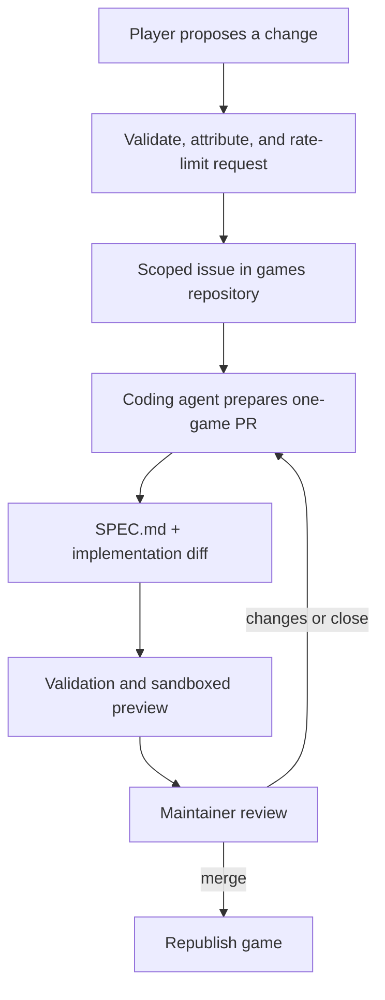

# Player Remix → Pull Request

> **Status: 📋 Not built.** This flow operates in the shared games repository and never runs an
> agent inside gamedev.pl infrastructure.

## User story

As a player, I want to request a change while playing a game so that maintainers can review a
concrete improvement without silently changing the published version.

## Trust decision

A remix changes both the game's source-of-truth spec and its implementation. Agent output is
untrusted and public requests can be malicious, so the result must be a pull request and must
never auto-merge.

## Flow

The PR should normally update `SPEC.md` first, then change the implementation to match it. A
pure bug fix may leave the spec unchanged when the existing spec already describes the intended
behavior.

## Requirements

| Requirement                             | Why                                                                         |
| --------------------------------------- | --------------------------------------------------------------------------- |
| Stable game slug and published revision | Identifies the exact target the player experienced                          |
| Attributed, rate-limited request        | Prevents anonymous PR/issue spam and supports moderation                    |
| One-game agent scope                    | Public text cannot authorize changes to tooling, workflows, or another game |
| Spec and implementation diff            | Keeps the source of truth and code aligned                                  |
| Existing games-repo validation          | Prevents publication of malformed, networked, or broken bundles             |
| Sandboxed preview                       | Lets reviewers exercise the candidate without trusting it                   |
| Human merge gate                        | Preserves editorial control and catches non-mechanical problems             |

## Open questions

- Who may request a remix and how is identity shown in the issue and PR?
- Does every request create an issue, or is there a moderated queue before repository writes?
- Can a creator veto remix requests for a game they submitted?
- How are duplicate, conflicting, or stale requests handled?
- How is the original requester notified when a PR opens, changes, or publishes?
