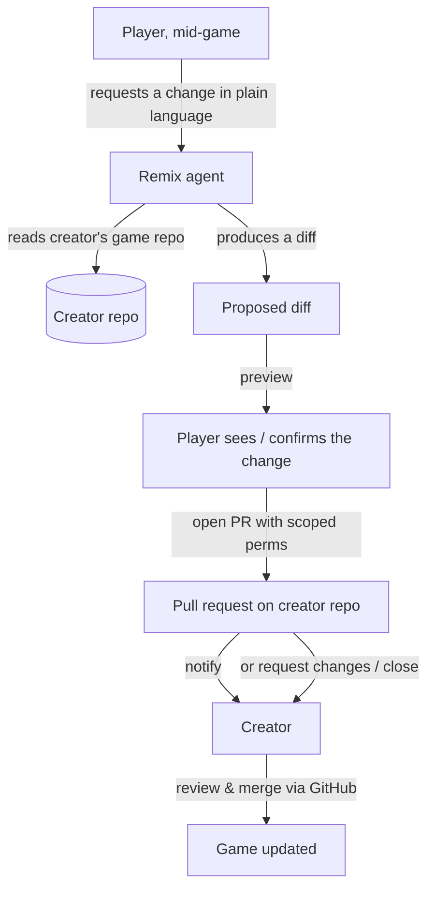

# Player Remix → Pull Request — Spec

> **Status: 📋 Not built.** Design spec for a Phase 4 feature. Depends on games living in real
> GitHub repos (Phase 3) and a real generation agent (Phase 1).

## User story

> _As a player, while I'm playing someone else's game, I want to request a change in plain
> language, so that an improved version can be proposed to the creator — without me needing to
> fork, code, or open a PR myself, and without changing the creator's game behind their back._

## Why the AI opens a PR but does **not** merge

This is the central trust decision. A remix touches **someone else's** repository.

- The player is **not** the owner of the creator's game. An agent auto-merging into a repo the
  requester does not own would violate the creator's control over their own work.
- Generated code is untrusted and cannot be safety-validated by schema; the creator must be
  able to **review the diff** before it becomes part of their game.
- A pull request is exactly the mechanism GitHub already provides for "a proposed change that
  the owner reviews and decides on." It fits the trust boundary perfectly.

> **Rule:** The agent may **open** a PR against the creator's repo. It must **never**
> auto-merge into a repo the requester does not own. The creator reviews and merges through
> normal GitHub review.

## Flow

1. Player requests a change while playing.
2. The remix agent reads the creator's game repo and produces a **diff** implementing the
   request.
3. A **diff/preview step** lets the change be inspected before anything is pushed.
4. The agent opens a **pull request** against the creator's repo using **scoped GitHub
   permissions**.
5. The creator is notified and reviews the PR through normal GitHub review — merge, request
   changes, or close. Nothing changes in their game until _they_ merge.

## What's needed

| Requirement                              | Why                                                                                                              |
| ---------------------------------------- | ---------------------------------------------------------------------------------------------------------------- |
| **Creator repo**                         | Each game lives in a real GitHub repo (Phase 3) so a PR is possible.                                             |
| **Agent with scoped GitHub permissions** | Enough to open a PR against the creator's repo, **not** to merge or push to protected branches. Least privilege. |
| **Diff / preview step**                  | The proposed change is shown before the PR is opened; no silent pushes.                                          |
| **Attribution & rate controls**          | Track who requested a remix; throttle to prevent PR spam on a creator's repo.                                    |
| **Notification path**                    | The creator learns a PR is waiting via GitHub's normal review flow.                                              |

## Open questions

- 📋 How the remix agent authenticates and how scoped tokens are issued/rotated.
- 📋 Abuse/spam controls: rate limits per player and per target repo.
- 📋 Whether previews run in the same sandboxed-iframe model before the PR is opened.
- 📋 How this composes with the container-orchestration layer (a remix is a kind of job).
