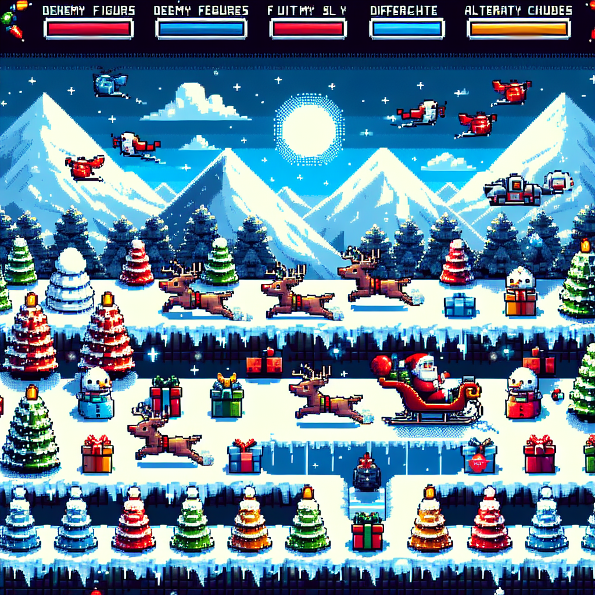
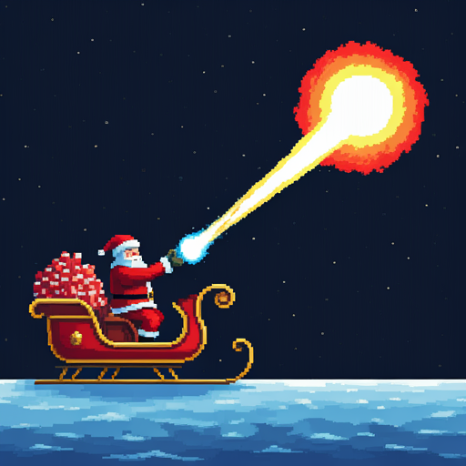
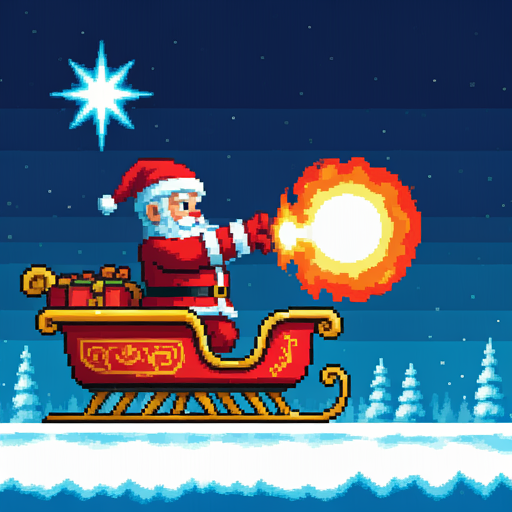

# Santa's Gift Battle - Enhanced Game Design Document

## Game Overview

A 2D side-scrolling arcade game where players control Santa Claus on a magical sleigh, delivering color-matched gifts to chimneys while competing with other AI-controlled Santas. The game combines gift delivery mechanics with combat elements inspired by Dragon Ball's energy mechanics, featuring advanced AI behaviors and strategic gameplay elements.

## Visual Style

- Pixel art aesthetic with vibrant colors
- Winter theme with snowy mountains and forests
- Dynamic day/night cycle affecting gameplay mechanics
- Multi-layered parallax scrolling for enhanced depth perception
- Weather effects (snow, wind) impacting gameplay dynamics

## Core Game Mechanics

### Santa Movement

- Physics-based flying movement on magical sleighs
- Full directional control with momentum and inertia
- Advanced acceleration-based movement with air resistance
- Strategic energy consumption for speed boosts
- Sophisticated collision detection with predictive avoidance
- Drift mechanics for advanced maneuverability

### Gift System

- Three primary gift colors: Red, Green, Blue
- Dynamic gift spawning system in clouds based on game balance
- Maximum carrying capacity: 3 gifts with weight considerations
- Trajectory-based gift throwing with wind influence
- Strategic gift stealing mechanics with counter-play options
- Combo system for multiple successful deliveries

### Chimney Mechanics

- Procedurally generated chimney layouts
- Color-coded matching system with combo potential
- Risk/reward system for wrong color deliveries
- Energy cloud generation based on delivery accuracy
- Special "rainbow" chimneys for bonus opportunities
- Time-based delivery challenges

### Energy System

- Starting energy: 0
- Maximum energy cap: 100 units
- Dynamic energy regeneration:
  - Base regeneration: 1 unit per 3 seconds
  - Successful delivery bonus: 5-15 units
  - Combo multipliers for consecutive deliveries
- Energy decay rate: 0.5 units per second when above 80%
- Strategic energy management:
  - Speed boost: 2 units per second
  - Fireball charging: Variable based on power
  - Shield generation: 1 unit per second
- Energy cloud behavior:
  - Float speed affected by weather conditions
  - Magnetic attraction to nearby Santas
  - Splitting mechanics when stolen

### Combat System

- Enhanced Fireball Mechanics:
  - Three charge levels with distinct properties
  - Size-to-speed ratio optimization
  - Energy consumption curve:
    - Small: 10 units
    - Medium: 25 units
    - Large: 50 units
  - Area of effect damage for larger fireballs
  - Element-based variations tied to gift colors
- Advanced Defensive Mechanics:
  - Directional dodging with energy cost
  - Perfect dodge timing bonus
  - Parry system for skilled players
  - Shield generation with energy trade-off
- Combo System:
  - Chain attacks for bonus damage
  - Counter-attack opportunities
  - Team-up moves with friendly AI
- Impact Effects:
  - Small fireball: Light knock-back, 10% energy drain
  - Medium fireball: Strong knock-back, 25% energy drain
  - Large fireball: Elimination with spectacular effects

## AI System Architecture

### Behavior Trees

- Decision Making Framework:
  - Priority-based action selection
  - Dynamic strategy adjustment
  - Resource management logic
  - Threat assessment system

### AI Personalities

1. Aggressive Santa

   - Prioritizes combat engagement
   - High-risk, high-reward playstyle
   - Aggressive energy usage
   - Combat-oriented decision tree

2. Strategic Santa

   - Focus on efficient delivery
   - Energy conservation
   - Opportunistic combat
   - Resource optimization

3. Defensive Santa
   - Prioritizes survival
   - Counter-attack specialist
   - Energy banking strategy
   - Evasive maneuvering

### AI Difficulty Scaling

- Easy:

  - Basic decision making
  - Delayed reactions
  - No complex combinations
  - Predictable patterns

- Normal:

  - Improved reaction time
  - Basic strategy implementation
  - Occasional combos
  - Adaptive behavior

- Hard:
  - Advanced decision making
  - Quick reactions
  - Complex combo execution
  - Dynamic strategy adaptation
  - Learning from player patterns

## Technical Implementation

### Performance Optimization

- Rendering Pipeline:
  - Sprite batching system
  - Texture atlasing
  - Efficient particle systems
  - Dynamic LOD system
- Memory Management:
  - Object pooling
  - Asset streaming
  - Garbage collection optimization
- Physics Optimization:
  - Spatial partitioning
  - Collision prediction
  - Simplified physics for distant objects

### Display and Graphics

- Adaptive resolution scaling
- Dynamic viewport management
- Hardware acceleration utilization
- Efficient particle system
- Weather effect optimization
- Multiple quality presets

### Controls

- Primary Input Methods:
  - Keyboard with customizable mapping
  - Touch screen with configurable zones
  - Gamepad support with force feedback
- Advanced Features:
  - Input buffering
  - Command queueing
  - Gesture recognition
  - Multi-touch support

## Multiplayer Architecture

### Network Infrastructure

- Client-Server Architecture:
  - Authoritative server model
  - Client-side prediction
  - Server reconciliation
  - Delta compression
- State Synchronization:
  - Interpolation/Extrapolation
  - Priority-based updates
  - Bandwidth optimization

### Latency Management

- Predictive Movement:
  - Client-side prediction
  - Server reconciliation
  - Input buffering
- Lag Compensation:
  - Rolling back hit detection
  - Time synchronization
  - Jitter buffer

### Session Management

- Matchmaking System:
  - Skill-based matching
  - Region-based servers
  - Session persistence
- Game State Handling:
  - State synchronization
  - Crash recovery
  - Reconnection handling

## Future Considerations

### Expandability

- New Game Elements:
  - Additional gift types
  - Special power-ups
  - Weather effects
  - Seasonal events
- Gameplay Modes:
  - Team battles
  - Tournament mode
  - Challenge modes
  - Custom game rules

### Content Updates

- Regular content additions:
  - New maps
  - Seasonal themes
  - Special events
  - Cosmetic items

## Outstanding Questions

### Gameplay Balance

1. Fine-tune energy-to-speed boost ratio based on playtesting
2. Optimize fireball damage scaling with charge time
3. Balance gift spawning rate with delivery opportunities
4. Adjust combo system multipliers
5. Fine-tune AI difficulty curves

### Technical Implementation

1. Implement efficient collision detection for various entity types
2. Optimize network code for minimal latency
3. Balance client-side prediction with server authority
4. Implement efficient particle systems
5. Optimize memory usage patterns

### Visual Design

1. Design clear energy level indicators
2. Create intuitive feedback systems
3. Implement distinctive visual effects
4. Design clear weather impact indicators
5. Create readable combat feedback

## Next Steps

1. Implement core movement system with physics
2. Develop gift and delivery mechanics
3. Create energy and combat systems
4. Design and implement AI behavior trees
5. Build networking infrastructure
6. Conduct extensive playtesting
7. Optimize performance
8. Polish visual feedback and UI

## Version History

- v2.0: Enhanced design with detailed AI, combat, and multiplayer specifications
- v1.0: Initial game design document
